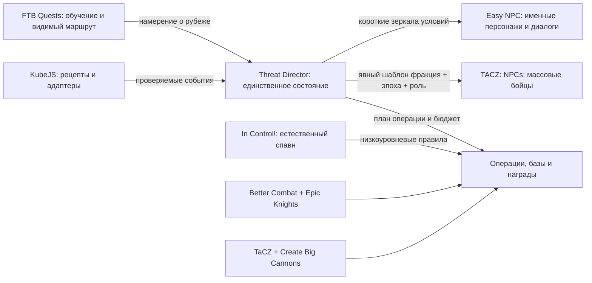
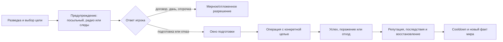

# Оружейные эпохи, фракции, операции и диалоговая архитектура

## Статус документа

| Поле | Значение |
|---|---|
| Проект | Recast |
| Статус | Архитектурная спецификация v0.1; контент ещё не внедрён |
| Дата аудита | 1 августа 2026 года |
| Платформа | Minecraft 1.20.1, Forge 47.4.22 |
| Область | Оружие, NPC, репутация, фракции, базы, плановые операции, испытания, торговля и будущие диалоги |
| Граница текущей работы | Проектирование и дорожная карта; готовые диалоги намеренно не пишутся |
| Граница тестирования | Codex не запускает Minecraft; все игровые и визуальные проверки выполняет владелец сборки |

Этот файл является подчинённой спецификацией [`MASTER_DESIGN_DOCUMENT.md`](MASTER_DESIGN_DOCUMENT.md). Если реализация расходится с этим документом, сначала обновляется архитектурное решение, затем данные, квесты и конфигурации.

---

## 1. Зафиксированное решение

### 1.1. Один стек без конкурирующих систем

| Роль | Решение | Зафиксированный кандидат для Forge 1.20.1 | Статус |
|---|---|---|---|
| Механика ближнего боя | Better Combat | `bettercombat-forge-1.9.0+1.20.1.jar` | `GATED → TARGET` после пользовательской проверки с TaCZ |
| Контент холодного оружия | Epic Knights | `epic-knights-1.20.1-forge-10.11.jar` | Единственный каталог; `GATED → TARGET` |
| Огнестрельное оружие | Timeless and Classics Zero | `tacz-1.20.1-1.1.8-hotfix.jar` | Единственная система огнестрела; `GATED → TARGET` |
| Массовые вооружённые NPC | TACZ: NPCs | `tacznpcs-2.1.0-1.20.1.jar` | Бойцы, патрули и рейдеры; `GATED → TARGET` |
| Дополнительные TaCZ-события | TaCZ JS | `taczjs-forge-1.4.2+mc1.20.1.jar` | `RESERVE`; добавляется только при доказанно отсутствующем штатном hook |
| Артиллерия | Create Big Cannons | `createbigcannons-5.11.4-mc.1.20.1-forge.jar` | Отдельная инженерная ветка; `GATED → TARGET` |
| Именные NPC и диалоги | Easy NPC | Core/Config UI `7.4.1` для Forge 1.20.1 | `TARGET`; не используется как массовый TaCZ-AI |
| Правила естественного спавна | In Control! | версия `1.20-9.4.6` для Forge 1.20.1 | `TARGET` как низкоуровневый фильтр, не директор сюжета |
| Авторитетное состояние и операции | Pack-native Threat Director | Собственный небольшой Forge-мод | `REQUIRED`; перед релизом публикуется и отслеживается на CurseForge |
| Связующий слой | FTB Quests + KubeJS | Уже принятый авторский стек | Гайд-книга, рецепты и узкие адаптеры; не второй источник истины |

Обязательные зависимости также проходят CurseForge-учёт: Cloth Config и PlayerAnimator для Better Combat, Architectury API и Cloth Config для Epic Knights, Ritchie’s Projectile Library для Create Big Cannons, а также Core и Config UI для Easy NPC. Точный dependency closure повторно фиксируется перед установкой каждой волны.

### 1.2. Что не складываем в сборку

- **Simply Swords и Spartan Weaponry** не добавляются: они создают второй каталог холодного оружия и размывают материальную прогрессию Epic Knights.
- **Epic Fight и другие полные combat-overhaul** не добавляются поверх Better Combat.
- Случайные TaCZ gunpack-паки не складываются коллекцией. Будет один курируемый pack-native gunpack/набор профилей с понятной эпохой, рецептом, локализацией и NPC-loadout для каждого принятого образца.
- **CustomNPCs-Unofficial** остаётся только запасной полной заменой Easy NPC. Одновременная установка создаст параллельные квесты, фракции, репутацию и диалоговое состояние.
- **The Hordes `1.6.3g`** не является ядром фракционных операций: его штатная модель — календарные/ночные волны и заражение, а не адресные операции TaCZ-фракций с переговорами, командными участниками и несколькими целями. Он способен породить настроенную сущность, но не добавляет обычному мобу TaCZ-AI и не предоставляет полный `warning → objective → success/failure → cooldown` lifecycle.
- **GameStages `15.0.2` / TeamStages `1.2.0`** не становятся владельцами эпохи: набор stage-флагов рядом с `tech_epoch` создал бы второй источник прогресса и добавил Bookshelf. Они могут быть пересмотрены только как однонаправленный совместимый мост, если конкретный принятый мод действительно потребует их API.
- **Gateways to Eternity `4.2.6`** не входит в mainline. Его можно отдельно пилотировать для добровольных арен/полигонов, только если жёсткая цель kill-all, визуальный стиль и зависимости Apothic Attributes/Placebo оправдают уникальную роль.
- **Majrusz’s Progressive Difficulty, Improved Mobs и подобные системы возрастающей от времени сложности** исключаются: они способны выдать миру поздние угрозы независимо от промышленного развития игрока.
- Отдельные илладжер-фракции, Recruit/Guard-наборы и дополнительные raid-overhaul не добавляются, пока те же роли закрывают наши фракции, TACZ: NPCs, MineColonies и Threat Director.

### 1.3. Разделение ответственности



Главное правило: моды NPC показывают и исполняют состояние, но не владеют им. Scoreboard, tags, FTB-команда, диалоговая кнопка и TaCZ-шаблон являются интерфейсами, а не базой данных.

---

## 2. Единственный авторитетный параметр технологического развития

### 2.1. Определение

Канонический параметр называется `industrial_frontier:tech_epoch`.

| Свойство | Контракт |
|---|---|
| Тип | Целое число `0…9` |
| Значение | Ровно одна из эпох P0–P9 мастер-документа |
| Область | Промышленная команда игрока, идентифицируемая стабильным UUID FTB Team |
| Хранилище | Серверный SavedData/Capability собственного Threat Director |
| Изменение | Только валидированная операция `tryAdvanceEpoch`; прямое редактирование из диалога/квеста запрещено |
| Направление | Монотонно возрастает; откат возможен только административной миграцией |
| Зеркало | Read-only scoreboard `if_epoch` и, при необходимости, теги/advancement для условий сторонних модов |
| Не является причиной роста | Возраст мира, количество прожитых дней, случайно найденный/подаренный предмет, одно убийство, посещение измерения само по себе |

Именно этот параметр одновременно ограничивает рецепты вооружения, NPC-loadout, максимальный уровень новых баз, классы операций, ассортимент торговли, лут и доступные сюжетные ветви. Ни один из этих потребителей не вычисляет «свою эпоху» отдельно.

### 2.2. Соответствие P0–P9

| Значение | Эпоха | Проверяемая способность, а не случайный предмет |
|---:|---|---|
| 0 | P0 — Экспедиция | Безопасный лагерь, полевая карта, базовая пища и разведанная жила |
| 1 | P1 — Механизированное поселение | Воспроизводимая механическая линия, вода и первое перемещение предметов |
| 2 | P2 — Промышленное тепло и металлургия | Стабильная сталь, паровой контур и базовая переработка руды |
| 3 | P3 — Электрифицированный район | Надёжное LV-производство, кабельная дисциплина и специализированные ячейки |
| 4 | P4 — Химический город | Кислоты/щелочи/удобрения, водоподготовка и выполненный коммунальный контракт |
| 5 | P5 — Региональная фабрика | Массовая переработка, магистральная логистика и автоматизированный склад |
| 6 | P6 — Атомная индустрия | Безопасный топливный цикл, промышленная АЭС и обращение с отходами |
| 7 | P7 — Стратегический и аэрокосмический комплекс | Первый запуск, специальные материалы и защищённая стратегическая зона |
| 8 | P8 — Орбитально-планетарная сеть | Постоянный межпланетный грузопоток и жизнеспособная колония |
| 9 | P9 — Межпланетная цивилизация | Устойчивая распределённая экономика и финальный мегапроект |

Каждый переход описывается datapack-записью `epoch_definition`: обязательный FTB-рубеж, доказательства инфраструктуры, версия схемы миграции и задержка безопасности после перехода. Квест лишь отправляет запрос; Threat Director повторно проверяет условия на сервере.

### 2.3. Команды, одиночная игра и защита от понижения угрозы

- Одиночный игрок автоматически получает персональную промышленную команду.
- Общая фабрика и город означают общую эпоху команды: нельзя иметь P2-рейдера против одного участника P2 и P7-рейдера против его напарника на той же базе.
- Вступающий в более развитую команду получает явное предупреждение и наследует её эпоху, контекст операций и договоры.
- Threat Director хранит личный `epoch_floor` — максимальную уже пережитую игроком эпоху. Выход и пересоздание команды не позволяют искусственно вернуть каменные рейды и низкоуровневый лут.
- `epoch_floor` является только антиэксплойтной записью для операции смены команды: рецепты, NPC, торговля и диалоги никогда его не читают. После перехода весь контент снова видит только текущий командный `tech_epoch`.
- Слияние команд принимает максимальную эпоху и требует подтверждения владельцев; разделение не копирует ресурсы, награды или активные контракты.
- На сервере с несколькими командами операция всегда имеет конкретный `target_team`. Состав её вооружения выбирается по эпохе этой команды, а не по максимальной эпохе мира.

### 2.4. Эпоха, угроза и репутация — разные оси

`tech_epoch` отвечает только на вопрос «какая технология допустима». Отдельный `threat_pressure` отвечает за численность, частоту и сложность цели, а `reputation[faction]` — за намерение конкретной фракции.

Пример: на P3 заклятый враг может прислать больше хорошо организованных бойцов P3 и устроить блокаду, но не получает автоматы P5. Уважающая игрока фракция на той же P3 может прислать торговый конвой или совместный патруль с тем же технологическим потолком.

---

## 3. Оружейная лестница по эпохам

### 3.1. Технологический потолок

| Эпоха | Холодное оружие и защита | Огнестрел TaCZ | Артиллерия CBC | Производственный смысл |
|---|---|---|---|---|
| P0 | Дерево, камень, простые копья/дубины, ванильный лук; минимум металлической брони | Запрещён | Запрещена | Выживание и разведка, а не поиск случайного автомата |
| P1 | Медные, бронзовые и железные мечи, копья, топоры, булавы, щиты и арбалеты | Запрещён | Запрещена | Литьё, ковка, кожа, древки, тетивы и ремонт |
| P2 | Стальное холодное оружие, полевые щиты, тяжёлые арбалеты и павезы | В финале эпохи — редкие однозарядные/ручные чёрнопороховые образцы; не массовый автоматический огонь | Ограниченные дульнозарядные чугунные/бронзовые полевые орудия | Сталь, точение ствола, чёрный порох, безопасное хранение |
| P3 | Серийная сталь, специализированные инструменты сапёра | Револьверы, магазинные/рычажные/болтовые винтовки, дробовики | Ранние стальные казнозарядные орудия с ручным расчётом | LV-станки, латунная гильза, капсюль, допуски и контроль качества |
| P4 | Защитное снаряжение химического производства | Надёжные пистолеты, карабины, ранние пистолеты-пулемёты; дымовые и инженерные боеприпасы | Улучшенные заряды и снаряды без бесконтрольного разрушения города | Азотная/серная химия, бездымный порох, лаки, резина, серийные партии |
| P5 | Индустриальная бронезащита и средства экипажа | Самозарядные/штурмовые винтовки, пулемёты, снайперские комплексы и развитая оптика | Полноценная полевая артиллерия и ограниченные автопушки | MV/HV, массовые детали, оптика, ленты/короба, железнодорожное снабжение |
| P6 | Радиационно-стойкая охрана объектов | Тяжёлые системы поддержки и контролируемые бронебойные боеприпасы | Оборона атомных объектов; стратегические боеприпасы не являются лутом | Спецсплавы, керамика, контроль доступа и учёт боезапаса |
| P7 | Композиты и защищённые комплекты стратегических команд | Высокоточные и противоматериальные системы, сложные прицелы; только по лицензии/чертежу | Высокоточные позиции с жёстким бюджетом разрушений | Электроника, сенсоры, аэрокосмические материалы, защищённые производства |
| P8 | Внеземные материалы для специализированной защиты | Ограниченные планетарные прототипы внутри TaCZ, а не второй gun-mod | Оборона космодромов и внеземных объектов | Колониальная логистика и невоспроизводимые без космоса компоненты |
| P9 | Финальные стандартизованные комплекты цивилизационной защиты | Стратегические образцы как мегапроект/наследие, не случайная награда | Системная оборона инфраструктуры, а не «самая большая пушка ради пушки» | Все домены, обслуживание, снабжение и политическая ответственность |

Эта таблица задаёт классы, а не обещает конкретный реальный образец. Каждый предмет проходит отдельный паспорт: эпоха, роль, урон, бронепробитие, материал, станки, боеприпас, NPC-шаблоны, лут, торговля, локализация и лицензия ассетов.

### 3.2. Интеграция с материалами и химией

- Самостоятельный рецепт стали Epic Knights удаляется. Сталь, бронза, олово, серебро и медь поступают из утверждённых паспортов GTCEu/федерации материалов.
- Ствол, затвор, пружина, ствольная коробка, магазин, крепление и оптика являются разными промышленными узлами, но не превращаются в десятки одноразовых микродеталей без производственного смысла.
- Базовая цепочка патрона: `гильза → капсюль → метательный состав → пуля/сердечник → контроль → партия патронов`.
- Химия капсюлей, чёрного и бездымного пороха, взрывчатых веществ и стабилизаторов связывается с GTCEu, HBM и экологическими правилами; параллельные бесплатные рецепты удаляются.
- Боеприпасы выпускаются коробками, пачками и лентами. После одной–трёх учебных ручных партий игрок получает реалистичную возможность автоматизации; ручная сборка каждой пули не является игровым циклом.
- Возврат латуни/гильз используется, только если он не превращает бой в уборку каждого предмета. Предпочтительны контейнерный возврат, групповой сбор или технологическая скидка.
- CBC получает бронзу, чугун, сталь, взрывчатку и механику подачи из общей экономики. Отдельный «материальный остров» Create не создаётся.
- Код и ассеты TaCZ имеют разные условия использования. Штатные ассеты не изменяются и не перепаковываются в авторский gunpack; поставка идёт через CurseForge-manifest, а собственные модели/звуки получают отдельную запись происхождения и лицензии.

### 3.3. Политика выдачи и добычи

- Высокоуровневое исправное оружие почти не выпадает. Победа даёт информацию и производственную возможность, а не пропуск нескольких эпох.
- Основной ценный лут: разведданные, чертежи, повреждённые узлы, пружины/затворы, редкая оптика, инструменты, фракционная валюта и образцы материалов.
- Найденный поздний компонент может запустить исследовательский квест, но не повышает `tech_epoch` и не обязан быть пригоден к сборке до нужных станков.
- NPC-loadout всегда задаётся явным шаблоном `faction + epoch + role`. Автоматический выбор «любого оружия из тега» допускается только внутри уже ограниченного эпохой loot table.
- Сюжетные базы не содержат контейнер с оружием следующей эпохи. Редкий прототип выдаётся только контролируемой наградой с ограничением ремонта, боеприпасов и воспроизводства.

---

## 4. Threat Director и плановые операции

### 4.1. Почему собственный небольшой мод необходим

Проверенные готовые моды решают отдельные части задачи, но ни один не объединяет командную эпоху, отдельную репутацию по шести фракциям, принадлежность, городские показатели, реестр баз, предупреждение, переговоры, несколько целей операции, cooldown и атомарную выдачу наград. Поэтому Threat Director принимается как минимальный pack-native оркестратор.

Он **не** реализует собственные оружие, баллистику, боевой AI, редактор диалогов, квестбук или генератор строений. Его задача — состояние, условия, планирование и адаптеры.

### 4.2. Каноническое состояние

| Поле | Назначение |
|---|---|
| `tech_epoch` | Единственный технологический уровень команды P0–P9 |
| `epoch_floor[player]` | Защита от искусственного понижения после выхода из команды |
| `reputation[player][faction]` | Личная социальная репутация `-100…100` |
| `affiliation[player]` | Формальное членство и ранг; отдельно от репутации и scoreboard-team |
| `treaty[team][faction]` | Перемирие, союз, дань, торговый договор и срок действия |
| `story[arc]` | Стадия сюжетной линии |
| `contract[id]` | `offered/accepted/success/failed/betrayed/expired` |
| `fact[id]` | Решения, посещённые базы, убитые командиры, спасённые NPC и открытые сведения |
| `base[id]` | Фракция, уровень, эпоха-снимок, координаты, состояние и лут-семя |
| `operation[id]` | Цель, участники, этап, бюджет, cooldown и исход |
| `city[metric]` | Снабжение, вода, энергия, санитария, оборона, загрязнение и ключевые производства |
| `threat_pressure` | Отдельный регулятор частоты/численности; никогда не повышает технологический потолок |

Данные версионируются. Scoreboard и теги содержат только короткие read-only зеркала, необходимые Easy NPC, FTB Quests или командам. Любое изменение проходит через валидируемую команду намерения, например `threat dialogue choose`, `threat contract accept`, `threat reputation add` или `threat operation resolve`.

### 4.3. Data-driven реестры

Threat Director читает авторские JSON/SNBT-реестры:

- `epochs` — условия перехода и технологические потолки;
- `factions` — отношения, репутационные правила, валюты и визуальные ключи;
- `loadouts` — фракция × эпоха × роль, с явными TaCZ/Epic Knights loot tables;
- `base_tiers` — допустимые шаблоны, комнаты, лут и защитные зоны;
- `operations` — условия, предупреждение, цели, волны, исходы, восстановление и cooldown;
- `contracts` — предложения, срок, вклад, награда и последствия;
- `dialogue_facts` — стабильные сюжетные флаги без хранения текста в логике.

Это позволяет менять баланс данными и проверять ссылки статически, не переписывая Java-код.

### 4.4. Жизненный цикл операции



Обязательные правила:

- враждебная операция запускается только когда целевая команда онлайн;
- у команды одновременно не более одной крупной враждебной операции;
- после повышения эпохи действует окно безопасности, чтобы игрок перестроил защиту;
- предупреждение раскрывает тип риска и даёт время подготовиться, договориться или один раз попросить отсрочку;
- число бойцов, цель и тактика зависят от `threat_pressure`, но loadout и база жёстко ограничены `tech_epoch`;
- стандартные цели разнообразны: разведать, украсть ящик, удержать узел, сопроводить, прорвать блокаду, защитить специалиста, эвакуировать, отключить связь, а не только «убить всех»;
- разрушение блоков по умолчанию выключено или ограничено списком восстановимых/сценарных целей; у артиллерии есть боезапас, зона применения и бюджет ущерба;
- поражение создаёт поправимую проблему — потерю груза, временный договор, повреждённый узел, репутационный долг — но не стирает десятки часов строительства;
- после операции выдаётся понятный отчёт: что произошло, почему, что изменилось и как восстановиться.

### 4.5. Роль готовых событийных модов

- **In Control!** владеет естественным спавном, ограничениями мобов и точечными низкоуровневыми правилами. Он не хранит сюжет, эпоху или репутацию и не выдаёт итог операции.
- **TACZ: NPCs** создаёт конкретных массовых бойцов и исполняет их боевую принадлежность. Его встроенные «фракции» используются как combat IFF, а не социальная репутация.
- **Easy NPC** показывает предупреждающего посыльного, командира, дипломата, инженера или торговца. Он не порождает массовые штурмовые группы.
- **FTB Quests** объясняет механику, показывает контракт и результат, но не является базой сюжетного состояния.
- **KubeJS/LootJS** связывают рецепты и лут; они не запускают параллельный планировщик событий.
- **The Hordes** остаётся отклонённым для mainline. Если когда-либо понадобится отдельный зомби-кризис, он проходит новый аудит как самостоятельный сценарий и не получает право изменять эпоху или фракционную репутацию.

### 4.6. Операции по эпохам

| Эпоха | Допустимые операции | Запрещённое опережение |
|---|---|---|
| P0 | Следы, разведчики, переговоры у костра, пропавший курьер, мелкая кража припасов | Огнестрельные патрули, бетонные базы, осады |
| P1 | Налёт на караван, защита частокола, спор за воду/поле, арбалетная засада | Пулемёты, моторизованные рейды, радиоразведка |
| P2 | Блокада дороги, захват склада, диверсия паровой мастерской, редкое полевое орудие | Автоматы, воздушные удары, укреплённый HV-бункер |
| P3 | Вооружённый досмотр, налёт на подстанцию, защита поезда, похищение инженера, контрразведка | Штурмовое оружие P5, стратегические боеприпасы |
| P4 | Химический шантаж, борьба за водоочистку, диверсия трубопровода, карантин, городской мятеж/медиация | Атомный террор и поздние композиты |
| P5 | Железнодорожная блокада, промышленный саботаж, комбинированная оборона района, ограниченная артиллерия | Космические силы и P7-точность |
| P6 | Защита топлива/ОЯТ, попытка захвата лаборатории, радиационная эвакуация, контрабанда изотопов | Случайное применение стратегического оружия |
| P7 | Контрразведка космодрома, рейд за телеметрией, диверсия запуска, высокоточная операция | Орбитальные силы до появления P8-сети |
| P8 | Оборона колонии, перехват внеземного груза, орбитальная контрабанда, эвакуация экспедиции | Финальные P9-системы как обычный лут |
| P9 | Многофракционный стратегический кризис, защита мегапроекта, договор о цивилизационной безопасности | Бесконечная эскалация после финала |

---

## 5. Репутация, принадлежность и дипломатия

### 5.1. Шкала `-100…100`

| Диапазон | Статус | Типичное поведение |
|---:|---|---|
| `-100…-76` | Заклятый враг | Операции высокого давления в рамках эпохи, торговля закрыта, переговоры только через особые условия |
| `-75…-41` | Враждебность | Рейды, блокада, дорогой выкуп; нейтральные посредники ещё возможны |
| `-40…-11` | Недоверие | Ограниченная торговля, проверки, залог, мало сведений |
| `-10…+10` | Нейтралитет | Базовые цены, простые контракты и осторожные разговоры |
| `+11…+40` | Уважение | Расширенные товары, специалисты, совместные задания |
| `+41…+75` | Союз | Взаимная защита, лучшие контракты, доступ к части инфраструктуры |
| `+76…+100` | Особый статус | Уникальный титул/допуск, фракционная сюжетная развязка и редкие чертежи |

Значение ограничивается диапазоном и изменяется серверно. Порог не является автоматическим членством: игрок может иметь `+70` у Содружества, но формально состоять в Лиге. Scoreboard-team используется только для технической совместимости и не заменяет ни репутацию, ни `affiliation`.

### 5.2. Источники изменения

| Действие | Базовый порядок величины | Защита от эксплуатации |
|---|---:|---|
| Значимое диалоговое решение | `±1…8` | Однократно для узла/факта |
| Выполнение контракта | `+3…12` | По риску, эпохе и качеству результата |
| Провал без предательства | `-1…8` | Учитывает предупреждение и частичный результат |
| Регулярная торговля | Небольшой плюс | Дневной/контрактный cap и убывающая отдача |
| Передача требуемых ресурсов | `+1…10` | Только объявленный запрос; мусор не фармит репутацию |
| Защита поселения/конвоя | `+8…20` | Участие и сохранённые цели проверяются сервером |
| Убийство бойца | `-2…12` | Контекст самообороны, маскировки и активной войны учитывается |
| Убийство мирного/именного NPC | `-8…30` | Дополнительный постоянный сюжетный факт |
| Нападение на базу | `-15…30` | Однократно за операцию, не за каждый блок |
| Поддержка стороны в конфликте | `±5…20` | Изменения у связанных фракций заранее объявлены или логически объяснимы |
| Предательство договора/союза | `-25…60` | Постоянный флаг, который нельзя стереть мелкой торговлей |

Числа являются стартовым балансом, а не окончательной настройкой. В интерфейсе игрок видит не только новое значение, но и причину изменения. Сквозные последствия между фракциями описываются явной матрицей отношений; скрытая «магическая телепатия» не применяется, если свидетелей и канала передачи сведений не было.

### 5.3. Дипломатические состояния

Помимо личной репутации существуют:

- `affiliation` — одна основная принадлежность, ранг и клятвы игрока;
- договор команды с фракцией — торговый договор, дань, перемирие, союз, совместная оборона;
- межфракционные отношения мира — союз, конкуренция, холодная война, открытый конфликт;
- сюжетные факты — предательство, спасение командира, передача пленного, раскрытая ложь;
- временная активная угроза — операция, ультиматум или кризис.

Эти сущности не сворачиваются в одно число. Высокая репутация облегчает договор, но не создаёт его автоматически; формальное членство может, наоборот, ухудшить отношение соперника.

---

## 6. Шесть фракций

Фракции различаются не цветом формы, а производственной моделью, отношением к городу, способом принятия решений, архитектурой, логистикой, набором операций и тем, что они считают победой.

### 6.1. Содружество Полисов «Землемер»

| Поле | Проектное решение |
|---|---|
| Название | Содружество Полисов «Землемер» |
| Происхождение | Союз фермерских коммун, городских мастерских и геодезических служб, объединившихся вокруг воды, дорог и взаимной обороны |
| Идеология | Муниципальное самоуправление, право поселения на базовые службы, ответственность собственника перед соседями |
| Экономическая модель | Кооперативы, местные рынки, натуральные и денежные налоги на инфраструктуру, публичные подряды |
| Отношение к промышленности | Поддерживает распределённую и безопасную промышленность; сопротивляется монополии, токсичным выбросам и реквизиции |
| Отношение к городам и колониям | Город — общее дело и сеть служб; новая колония легитимна после обеспечения воды, пищи, жилья и дороги |
| Отношение к игроку | Сначала видит независимого подрядчика; затем защитника, опасного промышленника либо полноправного гражданина |
| Боевая доктрина | Территориальная оборона, глубина рубежей, эвакуация мирных, укрепление узлов воды/еды и контратака после истощения врага |
| Предпочитаемое оружие | Копья, луки, щиты и арбалеты; позднее дробовики, болтовые винтовки, карабины и ограниченное оружие поддержки |
| Материалы | Дерево, полевой камень, кирпич, железо, конструкционная сталь и обычный бетон |
| Архитектура баз | Читаемая уличная сетка, колодец/водонапорный узел, амбар, мастерская, совет, сторожевые башни и укрытия |
| Форма и стиль | Рабочие куртки, практичные шлемы, муниципальные печати, нарукавные знаки профессии; ремонтируемость важнее парадности |
| Командование | Выборный совет → смотритель района → капитан стражи; чрезвычайные полномочия ограничены сроком |
| Типичные роли | Дозорный, страж, арбалетчик/стрелок, сапёр, санитар, интендант, инженер коммунальных сетей |
| Товары и ресурсы | Пища, семена, очищенная вода, кирпич/камень, карты, бытовые инструменты, муниципальные заказы |
| Квесты | Запуск орошения, ремонт водопровода, снабжение квартала, защита поселения, восстановление дороги, выбор между бюджетом и экологией |
| Возможные союзы | Естественный союз с Лигой; сотрудничество с умеренным Пепельным Корнем; проектные сделки с Меридианом |
| Причины вражды | Налёты Шрама, корпоративное подчинение Меридиана, реквизиции Гелиоса, загрязнение и отказ игрока защищать гражданских |
| Уникальные награды | Городская хартия, муниципальные специалисты, проекты сирен/убежищ, скидка на массовые стройматериалы, право совместной обороны |

Игровая идентичность: фракция превращает строительство красивого города в проверяемую гражданскую инфраструктуру. Её победа — не уничтоженный враг, а работающие вода, жильё и снабжение после кризиса.

### 6.2. Индустриальный консорциум «Меридиан»

| Поле | Проектное решение |
|---|---|
| Название | Индустриальный консорциум «Меридиан» |
| Происхождение | Потомки инженерных гильдий, владельцев заводов, железнодорожных компаний и стандартизационных бюро |
| Идеология | Порядок через измеримость, контракт, собственность, производительность и единый технический стандарт |
| Экономическая модель | Вертикально интегрированные предприятия, концессии, корпоративный кредит/скрип, квоты и долгосрочные поставки |
| Отношение к промышленности | Тяжёлая индустрия — основа цивилизации; экологические меры принимаются как стандарт риска и стоимость, а не как моральный запрет |
| Отношение к городам и колониям | Предпочитает company town и промышленную колонию, спроектированную вокруг потока сырья, работников и экспорта |
| Отношение к игроку | Потенциальный поставщик, лицензиат, должник, конкурент или партнёр по мегапроекту |
| Боевая доктрина | Стандартизованные отделения, крепкая логистика, подавление огневых точек, защита железных дорог и контролируемая артиллерия |
| Предпочитаемое оружие | Серийные древковые/арбалетные комплекты; затем служебные винтовки, пулемёты, сапёрное оружие и CBC-артиллерия |
| Материалы | Красный кирпич, конструкционная сталь, латунь, рельс, армированный бетон, позднее композиты |
| Архитектура баз | Прямоугольные заводские сетки, рампы, склады, железнодорожная ветка, проходная, диспетчерская, котельная и периметр |
| Форма и стиль | Серийная рабочая/охранная экипировка, номерные таблички, сигнальная маркировка опасностей и стандартизованные контейнеры |
| Командование | Совет держателей долей → региональный директор → начальник производства/безопасности → бригадир |
| Типичные роли | Инспектор, мастер, охранник, стрелок, пулемётчик, сапёр, артиллерийский расчёт, связист, инженер |
| Товары и ресурсы | Станочные узлы, моторы, сталь, кокс, компоненты боеприпасов, лицензии, чертежи и оптовые контракты |
| Квесты | Восстановление комбината, аудит качества, поставка по квоте, ремонт линии, промышленный арбитраж, борьба со шпионажем |
| Возможные союзы | Торговое партнёрство с Лигой, технологические программы с Гелиосом, коммунальные концессии с Полисами |
| Причины вражды | Саботаж Пепельного Корня, хищения Шрама, нарушение патентов/контрактов и отказ игрока выполнить обязательства |
| Уникальные награды | Производственные лицензии, объёмные заказы, специалист-технолог, проекты станочных узлов и ограниченные чертежи артиллерии |

Игровая идентичность: Меридиан предлагает быстрый рост через стандарты и крупные контракты, но требует надёжности, контроля отходов и политической цены зависимости.

### 6.3. Лига Вольных Караванов

| Поле | Проектное решение |
|---|---|
| Название | Лига Вольных Караванов |
| Происхождение | Союз сухопутных караванов, речных перевозчиков, железнодорожных артелей, картографов и независимых факторий |
| Идеология | Свобода маршрута, неприкосновенность контракта, нейтральные рынки и ценность проверенной репутации |
| Экономическая модель | Посредничество, страхование, фрахт, складские расписки, торговые комиссии и арбитраж |
| Отношение к промышленности | Не стремится владеть тяжёлой фабрикой, но связывает её с рынком; любит ремонтопригодность, стандартизованную тару и топливо |
| Отношение к городам и колониям | Город ценен как узел; поддерживает открытые порты и смешанные кварталы, избегает территориальной администрации |
| Отношение к игроку | Сначала неизвестный риск; затем клиент, перевозчик, гарант маршрута, конкурент или нарушитель слова |
| Боевая доктрина | Разведка маршрута, мобильная охрана, дым/укрытие, спасение груза, быстрый отход вместо затяжной осады |
| Предпочитаемое оружие | Луки/арбалеты и короткое оружие охраны; позднее револьверы, карабины, дробовики и точные оборонительные винтовки |
| Материалы | Дерево, кожа, парусина, латунь, рельсовая сталь, лёгкие сплавы и модульные контейнеры |
| Архитектура баз | Линейные стоянки, фактории, склады, ремонтный двор, причал/ветка, наблюдательная вышка и несколько путей выхода |
| Форма и стиль | Слоистая дорожная одежда, знаки маршрута и профессии, качественные сумки/ремни; экипировка собрана из разных регионов |
| Командование | Совет маршрутов → фактор → караван-мастер/капитан → старший охраны; решения зависят от груза и риска |
| Типичные роли | Проводник, ездовой/машинист, охранник, разведчик, брокер, механик, радист, полевой врач |
| Товары и ресурсы | Карты, редкие образцы, импортные компоненты, оптика, инструменты, сведения о ценах, фракционная валюта |
| Квесты | Сопровождение, открытие маршрута, спасение конвоя, поиск пропавшего груза, таможенный спор, арбитраж и разведка рынка |
| Возможные союзы | Полисы как безопасные узлы; Меридиан как крупный клиент; умеренный Корень как поставщик редких ресурсов |
| Причины вражды | Пиратство Шрама, блокада маршрута, конфискация груза, поддельная расписка и предательство гарантии игроком |
| Уникальные награды | Пропуск маршрута, расширенный рынок, услуги навигатора, разведкарта, страхование груза и логистические чертежи |

Игровая идентичность: Лига превращает расстояние, транспорт и информацию в экономику. Её сила — не завод и не территория, а возможность доставить нужное вовремя.

### 6.4. Директорат «Гелиос»

| Поле | Проектное решение |
|---|---|
| Название | Директорат «Гелиос» |
| Происхождение | Наследники изолированных исследовательских, оборонных и космических программ, переживших распад внешнего снабжения |
| Идеология | Выживание через контролируемое знание, секретность, проверку допуска и предотвращение технологических катастроф |
| Экономическая модель | Реквизиции внутри анклавов, исследовательские кредиты, обмен доступа на образцы/данные и стратегические соглашения |
| Отношение к промышленности | Ценит точную высокотехнологичную отрасль, но считает неконтролируемую массовую индустрию источником распространения опасных технологий |
| Отношение к городам и колониям | Большой открытый город воспринимает как уязвимость; предпочитает защищённые анклавы и миссионные колонии с протоколами |
| Отношение к игроку | Наблюдаемый фактор → проверяемый актив → допущенный партнёр либо угроза распространения |
| Боевая доктрина | Разведка, связь, малые профессиональные группы, точечное обезвреживание, захват данных и карантин вместо массовой войны |
| Предпочитаемое оружие | Ранние полевые ячейки используют только доступное эпохе местное снаряжение; истинные точные, тяжёлые и стратегические комплексы появляются не раньше P7 |
| Материалы | Закалённая сталь, свинцовая защита, техническая керамика, титан, композиты и герметичные панели |
| Архитектура баз | Скрытые наблюдательные посты, шлюзы, разделённые зоны допуска, сенсорные мачты, бункеры, лаборатории и резервная энергия |
| Форма и стиль | Геометрические знаки допуска, герметичные комплекты, чистые поверхности, минимум личных отличий и цветовое кодирование функций |
| Командование | Директорат → руководитель программы → командир сектора → автономная ячейка; информация выдаётся по необходимости |
| Типичные роли | Наблюдатель, аналитик, связист, специалист сдерживания, охранник, исследователь, медик РХБЗ, точный стрелок |
| Товары и ресурсы | Сенсоры, дозиметры, фильтры, зашифрованные данные, редкая оптика, образцы материалов и ограниченные допуски |
| Квесты | Возврат чёрного ящика, локализация утечки, карантин, проверка реактора, контрразведка, охрана телеметрии и спор о раскрытии знаний |
| Возможные союзы | Проектный союз с Меридианом; экстренная защита Полисов; временный договор с игроком против общей стратегической угрозы |
| Причины вражды | Распространение HBM/атомных технологий без контроля, захват лабораторий, кража данных, радикалы Корня и мародёры Шрама |
| Уникальные награды | Уровень допуска, специалист-учёный, сенсорные/защитные чертежи, точная оптика, координаты стратегического или орбитального объекта |

Игровая идентичность: Гелиос не получает «автомат в каменном веке». До поздних эпох игрок видит снабженчески ограниченные наблюдательные ячейки; настоящие объекты и арсенал открываются вместе с технологической способностью мира взаимодействовать с ними.

### 6.5. Движение «Пепельный Корень»

| Поле | Проектное решение |
|---|---|
| Название | Движение «Пепельный Корень» |
| Происхождение | Переселенцы из районов промышленных аварий, лесные общины, агрономы, медики и ремонтные артели; внутри есть умеренное и радикальное крыло |
| Идеология | Местная автономия, восстановление экосистем, право общины остановить опасное производство и недоверие к концентрации власти |
| Экономическая модель | Общинные запасы, обмен семенами/лекарствами, ремонт, сбор вторсырья и небольшие распределённые мастерские |
| Отношение к промышленности | Принимает чистые замкнутые процессы и полезные инструменты; борется с открытыми разрезами, сбросом отходов и стратегическим производством без согласия |
| Отношение к городам и колониям | Поддерживает зелёные самодостаточные районы; считает корпоративные колонии механизмом захвата земли и воды |
| Отношение к игроку | Оценивает не размер фабрики, а выбросы, воду, обращение с поселениями и готовность исправлять ущерб |
| Боевая доктрина | Маскировка, разведка, ловушки, нарушение снабжения, точечный саботаж и уход; умеренные ячейки предпочитают предупреждение и доказательства |
| Предпочитаемое оружие | Луки, копья, ножи и ловушки; позднее захваченные болтовые винтовки/карабины и ограниченное скрытное оружие строго в рамках эпохи |
| Материалы | Дерево, лён, кожа, природные смолы, керамика, переработанная сталь и биоматериалы |
| Архитектура баз | Скрытые земляные/лесные убежища, водосбор, лечебница, семенной склад, ремонтная ячейка, наблюдательные тропы и запасные выходы |
| Форма и стиль | Перешитая рабочая одежда, фильтрующие маски, ботанические/географические знаки; единая форма намеренно отсутствует |
| Командование | Совет общин и автономные ячейки; временный координатор операции, отдельные радикальные лидеры способны расколоть движение |
| Типичные роли | Следопыт, агроном, травник-медик, сапёр, наблюдатель, переговорщик, стрелок и специалист очистки |
| Товары и ресурсы | Редкие семена, лекарства, фильтрующие материалы, культуры биоремедиации, природные смолы и экологическая разведка |
| Квесты | Очистка реки, поиск источника выбросов, восстановление почвы, защита общины, разоблачение подлога, медиация между умеренными и радикалами |
| Возможные союзы | Полисы при соблюдении экологической хартии; Лига как нейтральный канал; ситуативный союз с игроком против катастрофы |
| Причины вражды | Загрязнение Меридиана, секретные объекты Гелиоса, выжигание земель Шрамом, ложь игрока о выбросах и насильственное переселение |
| Уникальные награды | Биоремедиация, редкие культуры, специалист-эколог, скрытые безопасные маршруты, экологический договор и улучшенные фильтры |

Игровая идентичность: это не однозначные «луддиты». Умеренные предлагают сложную чистую промышленность, радикалы — быстрый саботаж; игрок может изменить внутренний баланс фракции.

### 6.6. Вольная артель «Шрам»

| Поле | Проектное решение |
|---|---|
| Название | Вольная артель «Шрам» |
| Происхождение | Разорившиеся старатели, дезертиры, экипажи погибших колоний, контрабандисты и сборщики промышленного лома |
| Идеология | Верность своей артели, право сильного на бесхозное, оплаченная договорённость выше закона; разные капитаны радикально различаются |
| Экономическая модель | Разбор лома, чёрный рынок, выкуп, охранные услуги, наёмничество, контрабанда и доля от добычи |
| Отношение к промышленности | Умеет ремонтировать и приспосабливать, но редко поддерживает полный цикл; стремится захватить узкое место чужой фабрики |
| Отношение к городам и колониям | Видит источник дани, кадров, заказов и добычи; некоторые артели готовы стать легальной городской охраной |
| Отношение к игроку | Сначала добыча или потенциальный наниматель; затем конкурент, уважаемый капитан, должник либо цель мести |
| Боевая доктрина | Разведка слабых мест, ложные атаки, засады, быстрый захват груза/заложника и отход; избегает дорогой войны на истощение |
| Предпочитаемое оружие | Импровизированное холодное и арбалеты; затем револьверы/дробовики, ПП и захваченное тяжёлое оружие, но никогда выше эпохи цели |
| Материалы | Лом, кожа, дерево, рифлёный металл, краденая сталь/бетон и поздние трофейные композиты |
| Архитектура баз | Нерегулярная крепость из повторно использованных модулей, тайники, ремонтный двор, оружейная, узкие зоны огня и несколько путей бегства |
| Форма и стиль | Индивидуальная трофейная броня, метки экипажа, ремонтные заплаты, личные украшения; опознание идёт по знаку капитана и силуэту |
| Командование | Капитан → квартирмейстер/совет долей → командиры экипажей; власть держится на добыче, долге и личной репутации |
| Типичные роли | Разведчик, налётчик, взломщик, стрелок, пулемётчик поздней эпохи, сапёр, скупщик, полевой медик и переговорщик по выкупу |
| Товары и ресурсы | Повреждённые детали, контрабанда, сведения, карты тайников, услуги наёмников, трофейные инструменты и ремонтные наборы |
| Квесты | Выкуп, поиск тайника, контракт на охрану, возвращение долга, побег перебежчика, внутренняя борьба капитанов и легализация артели |
| Возможные союзы | Только договорные: отдельные факторы Лиги, теневые подрядчики Меридиана, игрок как наниматель; союзы зависят от капитана |
| Причины вражды | Отказ платить, захват тайника, убийство капитана, защита Полисов/каравана и предательство доли |
| Уникальные награды | Доступ к чёрному рынку, временный наёмный отряд, карты лома, полевые ремонтные рецепты, проход по опасному маршруту и вербовка перебежчика |

Игровая идентичность: Шрам создаёт раннее внешнее давление, но не является безликой армией зла. С конкретными артелями можно торговать, раскалывать их, нанимать или превращать в постоянного врага.

---

## 7. Уровни баз

### 7.1. Общий контракт B0–B6

| Уровень | Допустимая эпоха появления | Материальный язык | Обязательная функция |
|---:|---|---|---|
| B0 — ранний лагерь | P0–P1 | Дерево, земля, ткань, необработанный камень | Сон, костёр/пища, один склад, наблюдение и путь отхода |
| B1 — укреплённый лагерь | P1–P2 | Частокол, камень, ранний кирпич, железная фурнитура | Ворота, оружейная ниша, мастерская, дозор и резервный выход |
| B2 — постоянная база | P2–P3 | Кирпич, тёсаный камень, сталь, защищённый склад | Казарма/жильё, снабжение, полноценная мастерская и командный пункт |
| B3 — промышленный аванпост | P3–P4 | Сталь, фермы, трубы, ранний бетон, прожекторы | Электроэнергия, производственная функция, радио/связь, погрузка и огневые точки эпохи |
| B4 — военный комплекс | P5–P6 | Армированный бетон, бункеры, броневые двери, железнодорожное снабжение | Казармы, раздельные склады, медпункт, защищённое командование и эшелонированная оборона |
| B5 — высокотехнологичный объект | P7 | Броневые блоки, керамика, композиты, автоматические системы | Контроль доступа, резервная энергия, сенсоры, защищённая лаборатория/хранилище |
| B6 — космический/стратегический центр | P8–P9 | Герметичные модули, внеземные материалы, энергозащита только при доказанной технологии | Космопорт/стратегическая связь, замкнутое жизнеобеспечение, многоуровневая безопасность |

Каждая база обязана иметь логичную численности функцию: спальные места, запас пищи/воды, склад, мастерскую, оружейную, командный пункт, оборонительные позиции, входы и пути отступления. Начиная с B3 показывается реальный источник энергии; декоративный генератор без топлива и сетей не засчитывается.

### 7.2. Выражение уровней у каждой фракции

| Фракция | B0 | B1 | B2 | B3 | B4 | B5 | B6 |
|---|---|---|---|---|---|---|---|
| Землемер | Сезонный полевой стан | Посёлок с частоколом и колодцем | Ратуша, амбар и квартал мастерских | Коммунальный узел с водой/энергией | Региональный центр обороны и убежища | Устойчивый командный город служб | Внеземный гражданский анклав с замкнутыми службами |
| Меридиан | Геологоразведочный лагерь | Охраняемый склад/депо | Заводская колония у ветки | Рабочий промышленный аванпост | Оборонно-производственный комбинат | Укреплённый исследовательский завод | Орбитальная логистическая дирекция/верфь |
| Лига | Караванная стоянка | Укреплённая фактория | Торговая станция с ремонтным двором | Интермодальный порт/узел | Охраняемый свободный порт | Зашифрованная биржа и архив маршрутов | Космопорт-фактория и межпланетный рынок |
| Гелиос | Скрытый наблюдательный пост | Герметичный редут местной ячейки | Секторная база с разделением допуска | Сенсорный/карантинный аванпост | Подземный командный бункер | Высокотехнологичная лаборатория с резервами | Стратегический или орбитальный центр управления |
| Пепельный Корень | Скрытый бивак | Земляное убежище и водосбор | Лесная коммуна с семенным складом | Сеть ремонтных/очистных мастерских | Убежище сопротивления и лечебница | Защищённый биокупол/карантинный сад | Семенной ковчег и экспедиционный экокомплекс |
| Шрам | Лагерь сборщиков лома | Частокол с тайниками | Крепость из разобранных модулей | Чёрный рынок и ремонтно-разборный двор | Наёмническая крепость с трофейной техникой | Хранилище захваченных прототипов | Корсарский док/стратегическая база трофейного снабжения |

### 7.3. Генерация, сохранение эпохи и лут

- Уровень новой базы выбирается по эпохе конкретной целевой команды и сюжетному условию. Один глобальный B6 не появляется потому, что на сервере прошло сто дней.
- При создании база получает `epoch_snapshot`; существующий ранний лагерь не превращает старые сундуки в поздний лут после повышения эпохи.
- Высокоуровневая фракция может быть известна в лоре раньше, но её поздний объект не генерируется и не становится целью до соответствующей эпохи.
- B0–B2 не содержат исправных автоматов, композитной брони, реакторных деталей или космических материалов.
- Ценный лут во всех уровнях преимущественно информационный/компонентный. Чем выше база, тем лучше качество и специализация компонента, а не вероятность бесплатного полного производственного комплекса.
- У каждой базы есть минимум один правдоподобный вход снабжения и один путь эвакуации. «Коробка со спавнерами» не считается базой.
- Сюжетные и городские зоны получают защиту от необратимого CBC/взрывного ущерба. Восстановление оформляется контрактом и набором материалов, а не откатом всей истории без объяснения.

---

## 8. Диалоговая система — только архитектурная задумка

### 8.1. Назначение компонентов

- **Easy NPC**: именные торговцы, дипломаты, командиры, инженеры, идеологи, специалисты и квестодатели; диалоги, условия, кнопки, торговля и presets.
- **TACZ: NPCs**: массовая охрана, патрули, рейдеры и боевые подразделения. Не используется для литературно значимых персонажей.
- **Threat Director**: эпоха, репутация, принадлежность, договоры, факты, контракты, операции и серверная проверка выбора.
- **FTB Quests**: подробная гайд-книга, видимые цели/последствия и журнал выполненных арок.
- **KubeJS**: узкие технические адаптеры; никакой второй базы сюжетных переменных.

Easy NPC не назначается главным массовым пользователем TaCZ, пока владелец не докажет корректную работу магазинов, боеприпасов, перезарядки и AI. Для боя используется профильный TACZ: NPCs.

### 8.2. Что должен уметь будущий диалоговый узел

Условие может учитывать:

- `tech_epoch` команды;
- личную репутацию и формальную принадлежность;
- завершённые задания, стадию контракта и предыдущие ответы;
- исходы операций, убитых/спасённых командиров и посещённые базы;
- предметы, чертежи, валюту и доказательства у игрока;
- состояние города, снабжение, защиту, загрязнение и конкретные производства;
- договоры, поддержку стороны, предательство и активную угрозу.

Варианты действия должны позволять:

- запросить сведения;
- принять контракт или отказаться;
- торговаться и предложить альтернативный ресурс;
- попросить отсрочку;
- выплатить дань;
- заключить перемирие;
- предупредить союзников;
- передать ложную информацию с проверяемым будущим последствием;
- сдать пленного;
- завербовать специалиста;
- купить чертёж;
- договориться о совместной защите;
- перейти на сторону другой фракции;
- спровоцировать конфликт между фракциями.

Сейчас **не создаются** ни готовые реплики, ни варианты конкретных сюжетных сцен. Сначала фиксируются персонажи, факты, условия и последствия, затем тексты проходят отдельную ручную редактуру.

### 8.3. Схема будущих данных

Каждый узел получит поля:

```text
id
speaker_id
persona_id
ru_text_key
en_text_key
conditions[]
choices[]:
  ru_label_key
  en_label_key
  consequence_hint_key
  intent_command
  next_node
fallback_node
once | cooldown
```

Логика никогда не зависит от буквального текста. Easy NPC посылает узкую команду намерения; Threat Director повторно проверяет условия, один раз применяет последствия и только затем открывает следующий узел/квест.

### 8.4. Голоса персонажей

До написания реплик для каждого именного NPC создаётся `persona card`: происхождение, образование, цель, страх, отношение к риску, допустимая грубость, длина фраз, терминология, запретные шаблоны и изменение после успеха/поражения/предательства.

- Командир говорит о времени, риске, людях и задаче; не читает лекцию как инженер.
- Инженер объясняет причинно-следственные связи, допуски и отказ оборудования.
- Торговец формулирует цену, гарантии, альтернативы и выгоду.
- Идеолог связывает решение с ценностями и помнит компромиссы игрока.
- Налётчик оценивает силу, долг, статус и путь отхода.
- Дипломат оставляет сторонам возможность сохранить лицо и точно фиксирует обязательства.

Генеративный AI не является runtime-основой диалогов. Ключевые реплики пишутся, редактируются и тестируются вручную, чтобы персонаж и изменение состояния были предсказуемы.

### 8.5. Русский и английский

- В preset-файлах хранятся стабильные translation keys, а не готовые строки.
- `ru_ru.json` и `en_us.json` имеют одинаковый набор ключей, но тексты пишутся отдельно, не буквальным машинным переводом.
- Русский является обязательным release-gate: естественная речь, отсутствие канцелярита, повторов и одинаковых шаблонов.
- Вариант ответа краток и однозначен; непосредственная цена/риск обозначается явно либо логически следует из уже данных сведений.
- Автоматическая проверка сверяет ключи, placeholders, сырые строки, длину кнопок, недостижимые узлы и повторяющиеся формулировки.
- Встроенная локализация интерфейсов Easy NPC, TaCZ, TACZ: NPCs, Better Combat и CBC проверяется отдельно; наличие `ru_ru` у мода не считается доказательством полного покрытия.

---

## 9. Связь с городом, торговлей и испытаниями

### 9.1. Город как объект внешней политики

Threat Director не сканирует каждую стену. Город предоставляет небольшое число проверяемых сигналов:

- запас и стабильность пищи;
- доступность очищенной воды;
- резерв и надёжность энергии;
- жильё/население;
- санитария и обращение с отходами;
- загрязнение;
- транспортная связность;
- оборонные узлы;
- наличие ключевых производств: сталь, химия, боеприпасы, медикаменты, топливо, радио, атомная/космическая инфраструктура.

Сигналы подтверждаются контрактами, поставками, специальными блоками/advancement и ограниченными интеграционными триггерами. Они влияют на переговоры и цели операций: фракция атакует или защищает водоочистку, склад, станцию, радиомачту или космодром, а не случайную стену дома.

### 9.2. Торговля

- Ассортимент определяется `фракция + репутационный порог + tech_epoch + договор + факт мира`.
- Торговля не продаёт законченный технологический пропуск. Основные товары — партии сырья, сервис, карта, повреждённый компонент, лицензия или чертёж, который всё равно требует фабрики.
- Высокая репутация даёт предсказуемость, объём, кредит и редкие услуги, а не бесплатный бесконечный ресурс.
- Арбитраж, страхование, дань, выкуп и долг являются разными контрактами и имеют явный срок/последствие.
- Убийство торговца или разграбление склада не заменяет торговую ветку: содержимое базы ограничено и помечено происхождением.

### 9.3. Испытания

Испытания должны проверять инженерную систему, а не только DPS:

- пережить оборону с ограниченным боезапасом и работающим снабжением;
- удержать водоочистку/подстанцию, не допустив остановки города;
- эвакуировать NPC и груз;
- обнаружить диверсанта через связь/сенсоры;
- восстановить узел после атаки;
- решить кризис переговорами или поставкой;
- защитить поезд/конвой по реально построенному маршруту;
- провести РХБЗ/космическую операцию с подходящими материалами и протоколом.

Kill-all допускается как один тип цели, но не становится универсальным шаблоном.

---

## 10. Интеграция в квестбук

Создаётся группа **45 — Дипломатия и безопасность** между городом и миром/экспедициями.

| Глава | Содержание |
|---|---|
| 45.00 — Внешний мир | Объяснение эпохи, репутации, принадлежности, договоров, предупреждений и восстановления |
| 45.10 — Безопасность производства | Better Combat, броня, укрытия, безопасность оружия и первый оборонный узел |
| 45.20 — Оружейное производство | Материалы, детали, боеприпасы, автоматизация, контроль качества и ремонт |
| 45.30 — Досье фракций | Открываемые сведения, лидеры, экономика, базы и известные отношения; неизвестное не показывается заранее |
| 45.40 — Контракты и торговля | Переговоры, цены, сроки, залог, репутационные последствия и поставки |
| 45.50 — Операции | Предупреждение, подготовка города, цели, союзники, исход и восстановление |
| 45.60 — Командование и дипломатия | Принадлежность, договоры, совместная оборона, конфликт сторон и предательство |
| 45.70 — Стратегическая безопасность | P6–P9: РХБЗ, атомные объекты, космодромы, колонии и мегапроект |

Каждая новая система получает учебную цепочку мастер-документа: контекст → подготовка → сборка/настройка → интерфейс → безопасный первый контакт → проверка → автоматизация/организация → масштабирование → диагностика → межмодовый выход.

Обязательная магистраль не требует стать убийцей всех фракций. Для ключевых конфликтов проектируется хотя бы один небоевой или оборонительный путь: договор, поставка, эвакуация, разведка, арбитраж либо защита третьей стороны.

---

## 11. Дорожная карта внедрения

| Milestone | Боевой/фракционный результат | Квесты и тексты | Gate владельца |
|---|---|---|---|
| M0 — фиксация | Закрепить точные CurseForge-файлы/зависимости; финально утвердить стек и исключения | Обновить терминологию и реестр источников | Нет установки неизвестных JAR; manifest видит каждый сторонний мод |
| M1 — авторский фундамент | Спецификация и каркас Threat Director; схема SavedData, UUID команды, команды намерений, read-only зеркала; один Easy NPC sandbox-preset | Глава 45.00 и диагностическая справка без сюжетных реплик | Проверка сохранения, прав доступа, команды/одиночная игра и RU-интерфейса |
| M2 — паспорта | Паспорта оружия/боеприпасов, material tags, реестр loadout/base/operation; удалить обход стали Epic Knights | Эталонные уроки холодного оружия, ремонта и безопасного хранения | JEI-diff, отсутствие бесплатной стали и недостижимых рецептов |
| M3 — P0–P3 | Better Combat + Epic Knights; ограниченный TaCZ P2/P3; Threat Director v1; ранние шаблоны шести фракций и B0–B2; простые разведка/защита/доставка | Первые знакомства, досье, репутация и ручные контракты; без готовой большой сюжетной арки | Совместимость Better Combat/TaCZ, NPC 20/40, эпоха команды, отсутствие современного оружия в раннем мире |
| M4 — P4 | Серийные боеприпасы и химия; Easy NPC торговля/дипломатия; городские метрики; B3; рейды на коммунальные узлы | Главы 45.20–45.50, объяснение торговли, отсрочки, договора и восстановления | Перезапуск, серверная проверка кнопок, мягкий grind, город остаётся восстановимым |
| M5 — P5 | Полные TACZ: NPCs-патрули, комбинированные операции, CBC с лимитом ущерба, B4 и железнодорожные/региональные сценарии | Фракционные контракты, совместная оборона, арбитраж и расколы | NPC 20/40/80, friendly fire, pathfinding, ammo/reload, CBC performance/damage |
| M6 — P6 | Атомные операции, охрана топлива/отходов, РХБЗ, B4–B5 по фракции | Глава стратегической безопасности без романтизации случайной ядерной эскалации | Радиация, лут, fail-state и восстановление проверены владельцем |
| M7 — P7 | Поздние шаблоны Гелиоса/Меридиана, точные операции, космодром, B5 | Контрразведка, допуски, договоры раскрытия технологии | Ни один P7-предмет не попадает в ранний лут/торговлю |
| M8 — P8–P9 | B6, колониальные операции, межфракционный финальный кризис и защита мегапроекта | Космическая дипломатия и несколько политических развязок | Устойчивая логистика важнее одноразового боя |
| M9 — визуальный слой | Эмблемы, форма, архитектурные палитры, карты/радиосообщения и UI репутации | Отдельная редактура голосов и RU/EN без буквального перевода | Владелец проверяет читаемость, силуэты и разрешения экрана |
| M10 — релиз | Баланс cooldown, ущерба, экономики, производительности и multiplayer; миграции состояния | Полная вычитка, отсутствие повторов, недостижимых ветвей и сырых ключей | Полный пользовательский регресс; Codex игру не запускает |

Threat Director должен существовать до первого публичного фракционного среза.

**Решением владельца от 3 августа 2026 года ограничение на реализацию снято.** Прежняя формулировка допускала прототип на KubeJS «только как исследование без релизного мира», что вместе с требованием публикации на CurseForge делало компонент невыполнимым в принципе. Теперь Threat Director реализуется тем средством, которое доступно, и его состояние живёт в релизном мире.

Неизменным остаётся главное ограничение, ради которого правило и писалось: **источник состояния всегда один**. Эпоха, репутация, принадлежность, договоры и операции хранятся в одном месте; никакая другая система их не пишет, а миграции между двумя одновременно активными источниками не будет. Если позже появится JAR-реализация, переход выполняется разовой миграцией с сохранением тех же ключей, а не параллельной работой двух хранилищ.

---

## 12. Обязательные пользовательские проверки

### 12.1. Боевой стек

- Better Combat: анимации, дальность, двуручность и явные JSON-профили каждого класса Epic Knights.
- Better Combat + TaCZ: переключение, отображение оружия, атака/прицеливание, конфликт клавиш и известный риск отображения TaCZ-оружия на спине.
- TaCZ: gunpack, рецепты, магазины, боеприпасы, перезарядка, звуки, серверная синхронизация и RU/EN.
- TACZ: NPCs: эпохальные loadout, дружественный огонь, укрытия/pathfinding, взрывное оружие, смерть/дроп, выгрузка чанка и перезапуск.
- Последовательные сценарии с 20, 40 и 80 массовыми бойцами с логом производительности.
- CBC: дальность, фрагментация, загрузка чанков, лимит боезапаса, ущерб городу и восстановление.

### 12.2. Состояние и сюжет

- Одиночная команда, две независимые команды, вступление в более развитую команду, выход и повторное вступление.
- Монотонность `tech_epoch`, работа `epoch_floor` и отсутствие роста от подаренного позднего предмета/возраста мира.
- Сохранение репутации, принадлежности, договоров, баз и активной операции после перезапуска.
- Идемпотентность наград и диалогового выбора; скрытая кнопка не должна обходиться командой клиента.
- Операция не запускается офлайн, не дублируется, корректно отменяется при аварии и не оставляет вечных NPC.
- Каждый B0–B6 соответствует эпохе, имеет функции и не выдаёт запрещённый лут.
- Состояние города влияет на заявленные цели без тяжёлого постоянного сканирования блоков.

### 12.3. Тексты и доступность

- Естественность русского, отдельное качество английского, совпадение ключей/placeholders.
- Читаемость вариантов и ясность непосредственных последствий.
- Различимость голосов ролей без повторяющегося шаблона.
- Наличие небоевого/оборонительного пути там, где он предусмотрен.
- Понятная помощь после поражения и процедура восстановления сломанного флага/операции.

---

## 13. Первичные источники аудита

### Оружие и бой

- [Better Combat — CurseForge для 1.20.1](https://www.curseforge.com/minecraft/mc-mods/better-combat-by-daedelus/files/all?page=1&version=1.20.1)
- [Better Combat — официальный GitHub и datapack API](https://github.com/ZsoltMolnarrr/BetterCombat)
- [TaCZ — CurseForge для 1.20.1](https://www.curseforge.com/minecraft/mc-mods/timeless-and-classics-zero/files/all?page=1&version=1.20.1)
- [TaCZ — официальный GitHub](https://github.com/MCModderAnchor/TACZ)
- [TaCZ — официальная документация gunpack](https://tacwiki.mcma.club/zh/gunpack/01_before_start.html)
- [TaCZ JS — CurseForge, только условный адаптер](https://www.curseforge.com/minecraft/mc-mods/tacz-js/files/all?page=1&version=1.20.1)
- [Epic Knights — CurseForge](https://www.curseforge.com/minecraft/mc-mods/epic-knights-armor-and-weapons)
- [Epic Knights — Modrinth и заявленная поддержка Better Combat](https://modrinth.com/mod/epic-knights-shields-armor-and-weapons)
- [Epic Knights — официальный GitHub](https://github.com/Magistu/Epic-Knights)
- [TACZ: NPCs — CurseForge](https://www.curseforge.com/minecraft/mc-mods/tacz-npcs)
- [TACZ: NPCs — официальный GitHub](https://github.com/Corrinedev/tacz-npcs)
- [TACZ: NPCs — Modrinth versions](https://modrinth.com/mod/tacz-npcs/versions)
- [Create Big Cannons — CurseForge](https://www.curseforge.com/minecraft/mc-mods/create-big-cannons)
- [Create Big Cannons — официальный GitHub](https://github.com/Cannoneers-of-Create/CreateBigCannons)
- [Create Big Cannons — Modrinth versions](https://modrinth.com/mod/create-big-cannons/versions)
- [Ritchie’s Projectile Library — CurseForge](https://www.curseforge.com/minecraft/mc-mods/ritchies-projectile-library)

### NPC и диалоги

- [Easy NPC — CurseForge](https://www.curseforge.com/minecraft/mc-mods/easy-npc)
- [Easy NPC — официальный GitHub](https://github.com/MarkusBordihn/BOs-Easy-NPC)
- [Easy NPC — Modrinth versions](https://modrinth.com/mod/easy-npc/versions?g=1.20.1)
- [Easy NPC — диалоги](https://github.com/MarkusBordihn/BOs-Easy-NPC/wiki/Dialogs)
- [Easy NPC — действия](https://github.com/MarkusBordihn/BOs-Easy-NPC/wiki/Actions)
- [Easy NPC — торговля](https://github.com/MarkusBordihn/BOs-Easy-NPC/wiki/Trading)
- [Easy NPC — presets](https://github.com/MarkusBordihn/BOs-Easy-NPC/wiki/Preset)
- [Easy NPC — переводы](https://github.com/MarkusBordihn/BOs-Easy-NPC/wiki/Translations)
- [CustomNPCs-Unofficial — CurseForge, запасная альтернатива](https://www.curseforge.com/minecraft/mc-mods/customnpcs-unofficial)
- [CustomNPCs-Unofficial — Modrinth versions](https://modrinth.com/mod/customnpcs-unofficial/versions)
- [CustomNPCs-Unofficial — scripting API 1.20.1](https://goodbird-git.github.io/CNPC-Unofficial-1.20.1-ScriptingDoc/)

### События и интеграция

- [In Control! — CurseForge](https://www.curseforge.com/minecraft/mc-mods/in-control)
- [In Control! — официальный GitHub](https://github.com/McJtyMods/InControl)
- [In Control! — официальная документация правил 1.20](https://mcjty.eu/docs/mods/control-mods/control-mods-20)
- [The Hordes `1.6.3g` — точный CurseForge-файл](https://www.curseforge.com/minecraft/mc-mods/the-hordes/files/8527818)
- [The Hordes — официальная документация datapack](https://github.com/SmileycorpMC/The-Hordes/wiki/Datapack-Support-The-Hordes-version-1.2.0)
- [GameStages — CurseForge](https://www.curseforge.com/minecraft/mc-mods/game-stages)
- [TeamStages — CurseForge](https://www.curseforge.com/minecraft/mc-mods/team-stages)
- [Gateways to Eternity — CurseForge](https://www.curseforge.com/minecraft/mc-mods/gateways-to-eternity)
- [FTB Quests — команды](https://docs.feed-the-beast.com/mod-docs/next/mods/suite/Quests/Developer/Commands/)
- [KubeJS — серверные команды](https://kubejs.com/wiki/events/ServerEvents/basicCommand)

---

## 14. Definition of Done этого направления

Направление не считается готовым, пока одновременно не выполнено следующее:

- существует ровно один авторитет `tech_epoch`, а все потребители используют его или read-only зеркало;
- шесть фракций различаются экономикой, архитектурой, логистикой, тактикой, отношением к городу и сюжетными компромиссами;
- для каждой фракции реализованы B0–B6, но мир создаёт только допустимые эпохой уровни;
- ни один ранний NPC, сундук, торговец или квест не выдаёт позднее вооружение;
- Better Combat, Epic Knights, TaCZ, TACZ: NPCs и CBC не дублируют роли и связаны с общей металлургией/химией;
- операции предупреждаются, имеют переговоры или подготовку, несколько типов целей, конечный lifecycle и восстановимый исход;
- репутация, принадлежность, договор и combat-faction остаются разными сущностями;
- Easy NPC отвечает за именных персонажей, TACZ: NPCs — за массовый бой, Threat Director — за состояние;
- все обязательные тексты естественно написаны по-русски, английский создан отдельно, а raw keys отсутствуют;
- каждый сторонний мод и зависимость скачаны из точного CurseForge-файла и зарегистрированы по project/file ID, CDN URL и SHA-256; релизный JAR pack-native Threat Director также устанавливается только после публикации точного файла на CurseForge;
- Codex выполнил статические проверки, владелец выполнил перечисленные игровые проверки и передал результаты для исправлений.
