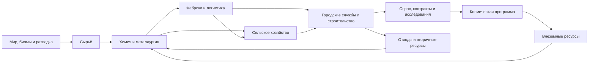

# MASTER DESIGN DOCUMENT

## Рабочее название: Recast

| Поле | Значение |
|---|---|
| Статус | Архитектура v1.2 — M0–M6 статически собраны (74 из 74 пунктов плана в [`registries/milestone_status.json`](registries/milestone_status.json)), пользовательские gate-прогоны ожидаются |
| Дата исследования | 2 августа 2026 года |
| Платформа | Minecraft 1.20.1, Forge 47.4.22 |
| Базовая Java | 17; Java 21 — отдельный пользовательский compatibility-gate |
| Технологический каркас | Федерация самостоятельных доменов: механика, химия, атомная индустрия, стратегические технологии, город, цифровая фабрика и космос |
| Язык релиза | Полное русское покрытие обязательно; английская локализация вторична и не может задерживать исправление русского текста |
| Ответственность Codex | Архитектура, конфигурации, рецепты, скрипты, квесты, тексты, ресурсы и статические проверки |
| Ответственность владельца сборки | Любой запуск Minecraft, создание/загрузка мира, визуальная и игровая проверка, передача логов и наблюдений |

> Этот файл — единая точка истины для разработки сборки. Любое значимое изменение модлиста, прогрессии, рецептов, квестов или визуального языка сначала отражается здесь либо сопровождается обновлением этого документа.

Текущая реализация M0–M2 зафиксирована в [`M2_IMPLEMENTATION_REPORT.md`](M2_IMPLEMENTATION_REPORT.md); статус билда и порядок ручной проверки — в [`VERSION_LOG.md`](VERSION_LOG.md) и [`M2_BUILD_TEST_PROTOCOL.md`](M2_BUILD_TEST_PROTOCOL.md). Исторический срез M0–M1 сохранён в [`M1_IMPLEMENTATION_REPORT.md`](M1_IMPLEMENTATION_REPORT.md).

### Текущий контрольный срез `IF-M4-0001`

- 108 активных JAR: волна M4–M7 установлена владельцем одним заходом. Обязательные зависимости закрыты, происхождение CurseForge подтверждено для всех, кроме одного зарегистрированного исключения.
- Главная линия P0–P4 состоит из 48 обязательных квестов в пяти главах; 449 русских и 449 английских ключей имеют полный паритет.
- Боевой слой установлен и заперт эпохой: три обхода общей металлургии закрыты, вход в огнестрельный домен перенесён за сталь P2.
- Коммунальная водная линия замкнута целиком — от сырой воды до компоста и биогаза, без свободного сброса.
- Реестры: 89 веществ, 41 форма, 10 доменов, 16 процессов, 22 маршрута, 53 стадии, 238 зависимостей, 112 производственных рёбер.
- Кислотные линии P4 и курируемая рудопереработка ждут реестрового дампа GregTech: его runtime-ID статически недоказуемы и не выдумываются.

#### Поправка к срезу от 3 августа 2026

Срез выше описывает 108 JAR. `audit_instance.ps1` на 3 августа 2026 считает **114 JAR**: происхождение известно для всех, неизвестных источников `0`, провалов обязательных зависимостей `0`, зарегистрированных исключений из правила CurseForge-only `1` (CC: Tweaked, SHA-256 сверен). Среди установленного есть три мода, ранее числившихся отсутствующими или не упомянутых: `MTR-forge-4.0.5+1.20.1.jar` (городской пассажирский транспорт M5), `tacznpcs-2.1.0-1.20.1.jar` и `createbigcannons-5.11.4-mc.1.20.1-forge.jar`. Числа среза не переписаны целиком: они относятся к контрольной точке `IF-M4-0001` и остаются её историческим значением.

### Исторический срез `IF-M2-0001`

- 51/51 активных JAR имеют CurseForge project/file ID, допустимый CDN URL, опубликованный source-хэш и локальный SHA-256; обязательные зависимости закрыты.
- Авторский слой содержит 24 русских квеста (`7 + 7 + 10`), два M1-рецепта, M2-контракт латуни, Ponder-урок, Paxi packs и неисполняемую спецификацию внешнего мира.
- Девять M2-реестров фиксируют 89 веществ, 41 форму, 10 доменов, 16 процессов, 21 производственный маршрут, 51 стадию, 8 контрактов, семь энергетических сетей, 235 типизированных зависимостей, 106 производственных рёбер, 5 ограниченных контуров возврата, 21 критический компонент и 21 anti-grind-цепочку.
- Расширенный слой связывает 161 типизированный material/category concept, строительные палитры, пищевые и коммунальные контракты, 40 боевых паспортов, 27 loadout-архетипов, шесть фракций × десять эпох и семь уровней баз, не устанавливая будущие моды и не выдумывая runtime-ID.
- Runtime-срез удаляет ранние Create-обходы, стандартизирует нагретую латунь, резервирует AE2 за P5 и добавляет 12 pack-тегов допустимых M2-входов.
- Language-key gate закрыт без отсутствующих, пустых, повреждённых или необъяснимо несовместимых строк.
- Non-lang корпуса закрыты статически: AE2 GuideME `119/119`, Alex’s Mobs `91/91` с 90 Paxi-overrides, Citadel `2/2` и две общие подписи.
- `FULL_RU_GATE=OPEN` только из-за трёх hardcoded-заголовков GuideME и визуального QA владельца; `BUILD_STATUS=STATIC_COMPLETE / USER_GATE_PENDING` до M2-A…M2-G.

---

## 1. Видение продукта

### 1.1. Фантазия игрока

Игрок проходит путь от полевого лагеря и ручной разведки местности до самодостаточной межпланетной промышленной цивилизации. Он не просто получает более дорогие машины: он проектирует связанные производственные системы, строит городскую инфраструктуру, управляет потоками сырья и побочных продуктов, осваивает химию, автоматизирует логистику и превращает новые планеты в продолжение общей экономики.

Краткая формула сборки:

**разведать → спланировать → построить → стабилизировать → автоматизировать → масштабировать → урбанизировать → исследовать → запустить → колонизировать**.

### 1.2. Пять несущих столпов

1. **Химия.** Реальные узнаваемые процессы, понятные объяснения, сырьё, условия, побочные продукты, переработка отходов и связь с другими отраслями.
2. **Фабрики.** Производительность, логистика, резервирование, масштабирование и доказуемая автоматизация вместо бесконечного ручного крафта.
3. **Города.** Энергия, вода, пища, транспорт, строительство, отходы и общественные проекты создают постоянный спрос на продукцию фабрик.
4. **Космос.** Ракетная программа требует всей предыдущей промышленной базы, а внеземные ресурсы открывают следующую технологическую эпоху.
5. **Живой мир.** Сезоны, биомы, структуры, пища, фауна, звук и погода дают контекст строительству, но не превращают техническую игру в случайное наказание.

### 1.3. Продуктовое обещание

Сборка должна ощущаться не как папка популярных модов, а как одна игра. У каждого контентного мода есть:

- уникальная функция;
- точка входа в общей прогрессии;
- связь минимум с двумя другими системами;
- понятная точка освоения;
- выход в следующий технологический слой;
- квестовое и справочное сопровождение;
- отсутствие дешёвого обхода уже существующих цепочек.

### 1.4. Что означает «уровень S-tier»

Цель — не копировать GT New Horizons по продолжительности или сложности, а повторить главное качество: целостность. Игрок должен понимать, зачем существует каждый процесс, куда пойдёт его продукт и какую новую возможность он создаёт. Сложность строится на проектировании и взаимозависимости, а не на слепом гринде.

---

## 2. Неприкосновенные правила разработки

### 2.0. Правила отчётности

Отдельный обязательный документ: [`REPORTING_RULES.md`](REPORTING_RULES.md). Он введён решением владельца от 3 августа 2026 года после случая, когда этапы M3 и M4 были названы закрытыми при закрытой лишь самой заметной их части.

Кратко: точность выше скорости; ни одно утверждение не делается без проверяемого основания; числа приводятся вместе со способом подсчёта; при неуверенности она называется прямо. Готовность этапа определяется не словами, а построчным подсчётом по [`registries/milestone_status.json`](registries/milestone_status.json), и этап считается закрытым только когда ни один его пункт не имеет статуса `PARTIAL` или `NOT_DONE`.

Блокировка не равна выполнению: заблокированная работа остаётся незакрытой, а препятствие называется отдельно вместе с тем, что и кто может его снять.

### 2.1. Граница тестирования

Codex **никогда не запускает Minecraft, Forge, игровой сервер, лаунчер, игровой Java-процесс или мир**. Допустимы только неигровые проверки:

- инвентаризация файлов;
- чтение конфигураций и метаданных JAR;
- проверка JSON, YAML, TOML, JavaScript и SNBT статическими средствами;
- проверка ссылок, идентификаторов и структуры каталогов;
- анализ предоставленных владельцем логов и скриншотов;
- сравнение изменений.

Игровую проверку всегда выполняет владелец сборки. Для каждого тестового пакета изменений ему передаются точные шаги, ожидаемый результат и список диагностических материалов.

### 2.2. Авторское право и происхождение контента

- Из других сборок заимствуются **архитектурные принципы**, а не тексты, изображения, квестовые файлы или уникальные схемы расположения узлов.
- Любой текст квестов пишется заново.
- Визуальные ресурсы создаются специально для проекта либо используются на условиях совместимой лицензии с указанием авторства.
- Особенно важно не копировать ресурсы All The Mods: их репозиторий прямо отмечает квесты, KubeJS и PackMenu-материалы как All Rights Reserved.

### 2.3. Стабильность мира

- Генерация мира замораживается как можно раньше.
- Удаление мода с блоками, сущностями или измерениями требует плана миграции.
- Идентификаторы квестов, материалов и собственных предметов после публичного использования не переименовываются без таблицы миграции.
- Изменения рецептов не должны молча уничтожать рабочие фабрики: несовместимые изменения документируются.

### 2.4. Сложно, но не изнурительно

- Новый компонент можно потребовать вручную один-два раза для обучения; массовое использование означает доступную автоматизацию.
- Нельзя делать тысячи повторных кликов главным источником сложности.
- Дорогой рецепт обязан иметь технологическое объяснение или балансную функцию.
- Мощные строительные и логистические инструменты выдаются достаточно рано, чтобы масштаб проекта не вызывал выгорание.
- Случайность не может быть единственным воротом обязательной прогрессии.

#### Бюджет гринда

Каждая эпоха и производственная линия получает отдельный grind-audit. Он учитывает:

- число одинаковых ручных крафтов;
- число вложенных промежуточных деталей;
- время пассивного ожидания;
- объём обязательного перемещения без транспорта;
- зависимость от случайного лута или редкой генерации;
- объём строительных материалов;
- момент, когда становится доступна автоматизация;
- возможность выполнять несколько целей параллельно.

Рабочие ограничения:

- обучающий рецепт обычно требует один результат;
- ранняя ручная партия обычно укладывается в 1–8 одинаковых операций;
- если до доступной автоматизации необходимо более 16 одинаковых операций, рецепт или порядок открытия пересматривается;
- объёмы выше 32 единиц допустимы только после открытия понятного автоматического маршрута либо для осознанного городского мегапроекта;
- квест по умолчанию **обнаруживает**, а не поглощает произведённые предметы;
- ожидание машины не считается игровым процессом: у игрока должны быть параллельная задача, улучшение скорости или способ масштабирования;
- увеличение сложности через дополнительные винты, пластины и инструменты ограничивается: промежуточная деталь обязана чему-то учить или связывать системы;
- редкий обязательный ресурс всегда имеет детерминированный путь;
- любое исключение из этих ограничений записывается в балансную таблицу с объяснением.

Основная формула баланса: **один раз сделать руками, понять процесс, автоматизировать до массового спроса, затем масштабировать**. Цель — средний уровень гринда: достаточно труда, чтобы фабрика имела ценность, но без усталости, заставляющей бросить прохождение.

### 2.5. Полная русская локализация

> **Решение владельца от 2 августа 2026 года: перевод сторонних модов выполняется одной волной перед релизом, а не вместе с каждой волной установки.**
>
> Причина практическая. Модлист ещё меняется: волны M4–M7 добавляют домены целиком, и переведённые ключи мода, который позже заменят или откатят, — потерянная работа. Поэтому счётчики отсутствующих русских ключей остаются **известным и допустимым долгом** до релизной волны локализации; они больше не считаются блокером приёмки промежуточного milestone.
>
> Что продолжает действовать без отсрочки:
>
> - авторские строки `industrial_frontier` создаются сразу по-русски и всегда имеют паритет RU/EN — это условие любой волны;
> - квесты, Ponder-сцены и справочные тексты сборки пишутся по-русски в момент создания;
> - `audit_instance.ps1` по-прежнему считает покрытие каждой волной, чтобы объём долга был виден, а не забыт;
> - `FULL_RU_GATE` остаётся релизным блокером: без него сборка не выпускается.

- К релизу переводятся все видимые игроку строки всех установленных модов, авторских систем и интерфейсов.
- Покрытие включает названия и описания предметов, блоков, сущностей, эффектов, биомов, достижений, конфигурационных экранов, JEI-категорий, GuideME/внутриигровых руководств, Ponder-сцен, подсказок, сообщений, меню и квестов.
- Названия брендов модов могут сохранять оригинальное написание; это единственное штатное исключение, а не повод оставлять английский интерфейс.
- Отсутствующие штатные переводы дополняются авторским resource pack через `assets/<modid>/lang/ru_ru.json`.
- Для каждой версии строится отчёт покрытия: ключи `en_us` сравниваются с `ru_ru` внутри JAR и с авторскими override-файлами.
- Релизный критерий — ноль необъяснённых отсутствующих пользовательских RU-ключей.
- Термины фиксируются в едином русском глоссарии: один материал, машина или электрическое понятие не получает несколько конкурирующих переводов.
- Текст пишется живым русским языком, а не дословной калькой; шрифты обязаны полноценно отображать кириллицу.

### 2.6. CurseForge-only для модов

- Каждый добавляемый JAR должен иметь страницу проекта и выбранный файл на CurseForge.
- Отображение дополнения в CurseForge App не обязательно по решению владельца от 2 августа 2026 года; обязательны точные CurseForge project/file ID, имя, URL, опубликованный source-хэш и локальный SHA-256 в воспроизводимом реестре.
- JAR разрешено напрямую поместить в экземпляр только после скачивания exact-файла со страницы CurseForge или `edge.forgecdn.net`; GitHub Releases, Discord, Modrinth-only и неизвестные зеркала для сторонних модов запрещены.
- Если необходимого инструмента нет на CurseForge, ищется функциональный аналог; исключение возможно только после отдельного решения владельца, но стандарт проекта — без исключений.
- Собственные KubeJS-скрипты, конфигурации, квесты, переводы и изображения поставляются как `overrides`: это авторский контент, а не сторонние моды.
- После каждого изменения модлиста проводится сверка `mods/*.jar ↔ CurseForge source registry/App metadata ↔ опубликованный source-хэш ↔ локальный SHA-256`; `installedAddons` используется как дополнительный источник метаданных уже известных приложению файлов.

---

## 3. Исторический исходный аудит экземпляра

### 3.1. Метод и границы аудита

Выполнена полная инвентаризация видимых файлов экземпляра. Текстовые конфигурации и манифест прочитаны содержательно; JAR-файлы не запускались и рассматривались как бинарные поставки, для них читались имена и встроенные метаданные. Пользовательские логи просмотрены только как исторический материал и не считаются проверкой текущего состава, поскольку модлист менялся после их создания.

Это практическое значение требования «ознакомиться со всеми файлами»: каждый файл учтён по назначению, но сторонний машинный код не декомпилируется построчно без конкретной причины.

### 3.2. Исходная платформа

- Minecraft 1.20.1.
- Forge 47.4.22.
- Название экземпляра CurseForge: `main1.20`.
- На момент исходного аудита это был ранний каркас: авторских рецептов, квестов, локализации, меню и ресурс-пака ещё не было. Текущее состояние описано в контрольном срезе в начале документа.

### 3.3. Наблюдавшийся состав модов

Список ниже — **снимок 2026-08-01 21:52 MSK**, а не зафиксированный релиз: во время аудита владелец продолжал добавлять JAR-файлы. На этой отметке `minecraftinstance.json` и каталог `mods` согласованно содержали 37 записей/JAR.

| Слой | Установленные компоненты |
|---|---|
| Технологии | GregTech CEu Modern, Create, Applied Energistics 2, GuideME |
| Авторский скриптовый слой | KubeJS, Rhino, KubeJS Additions, Ponder for KubeJS, Architectury API |
| Просмотр рецептов и информации | JEI, Just Enough Resources, Jade, AppleSkin |
| Карты и управление | Xaero's Minimap, Xaero's World Map, Mouse Tweaks, Carry On, Gravestone |
| Живой мир | Serene Seasons, Alex's Mobs, Aquaculture, Fast Leaf Decay |
| Производительность и графика | Embeddium, Sodium/Embeddium Dynamic Lights, Sodium/Embeddium Options API, AI Improvements |
| Структуры | YUNG's API, Better Caves, Better Dungeons, Better Desert Temples, Better End Island, Better Jungle Temples, Better Nether Fortresses, Better Ocean Monuments, Better Strongholds, Better Witch Huts |
| Библиотеки | GlitchCore и библиотеки, встроенные в отдельные JAR |

Требование выполнено: перед первым авторским вертикальным срезом создан и закреплён Build ID `IF-M1-0001` с 51 активным JAR.

### 3.4. Авторские файлы в исходном снимке

В просмотренном снимке существуют только базовые конфигурации:

- `config/create-client.toml`;
- `config/create-common.toml`;
- `config/flywheel-client.toml`;
- `config/fml.toml`;
- `config/forge-client.toml`;
- `config/gtceu.yaml`;
- `config/ponder-client.toml`.

Каталоги `defaultconfigs`, `resourcepacks`, `saves` и `schematics` не содержали авторского содержимого. После первоначальной инвентаризации владелец добавил JAR KubeJS/Rhino/KubeJS Additions/PonderJS, но авторского каталога `kubejs` ещё не наблюдалось; `config/ftbquests` также отсутствовал. Это позволило заложить чистую файловую архитектуру без миграции старых скриптов; она реализована в M1.

### 3.5. Уже заданный характер GregTech

В `gtceu.yaml` включены или сохранены важные экспертные настройки:

- усложнённые стержни, железные и стеклянные рецепты;
- усложнённый уголь и бумага;
- сталь для огнива и удалённый ванильный TNT;
- обслуживание машин, чистые комнаты и исследования;
- GT6-подобные трубы и опасности материалов;
- удалена ванильная генерация руд, активна сеточная генерация жил GT;
- включена совместимость с Create;
- включён нативный вывод EU в FE, но отдельные конвертеры отключены.

Это хорошая основа экспертной сборки, но энергетическое соглашение EU/FE необходимо формализовать до подключения большого числа FE-модов.

### 3.6. Выявленные риски текущего снимка

1. **[RESOLVED в `IF-M1-0001`]** В метаданных Alex's Mobs заявлена обязательная зависимость Citadel, но отдельного JAR Citadel в просмотренном снимке не было. Установлен Citadel `2.6.3` из CurseForge file `331936/7476570`.
2. Модлист менялся во время анализа, поэтому старый `latest.log` не доказывает работоспособность текущего набора.
3. Одновременно встроенные библиотечные версии Create и GTCEu обычно разрешаются механизмом JarJar Forge, но реальное решение версий подтверждает только пользовательский запуск.
4. Большой набор структур YUNG's повышает ценность исследования, однако обязательные редкие находки нельзя использовать как единственный прогрессионный ключ.
5. **[RESOLVED в `IF-M1-0001`]** KubeJS-стек уже был добавлен владельцем, но не имел авторских скриптов; FTB Quests отсутствовал. M1 добавил authoring layer и 14 квестов в двух главах.

---

## 4. Что берём из лучших сборок

### 4.1. GT New Horizons

Используем:

- один отчётливый технологический позвоночник;
- предметные главы вокруг него: энергия, химия, переработка руд, логистика, космос, строительство;
- квест как справочник и маршрут, а не только список предметов;
- строгие правила оформления предупреждений, переходов и информационных узлов;
- долгие производственные цепочки с возвратом ранних материалов в позднюю игру.

Не переносим:

- устаревшие интерфейсные ограничения;
- ручную рутину только ради времени;
- тексты и точную структуру квестов;
- длину ради длины.

### 4.2. TerraFirmaGreg Modern

Используем:

- переходы между квестовой книгой и подробным внутриигровым руководством;
- отдельный химический справочник по элементам, источникам и применению;
- наблюдательные и опциональные задания;
- переходные узлы между главами;
- визуальное разделение основного пути, подсказок и альтернатив.

Главный урок: подробное объяснение мира и материалов может быть частью прогрессии, не превращаясь в стену обязательного текста.

### 4.3. Nomifactory, Nomi CEu и Monifactory

Используем:

- главы, организованные вокруг производственных проблем: масштабирование, возобновляемость, энергия, сборочные линии и моделирование ресурсов;
- раннее уважение ко времени строителя;
- явные доказательства автоматизации;
- деление KubeJS по предметным областям и интеграциям;
- поздние ресурсы как результат инфраструктуры, а не охоты за единичным предметом.

Главный урок: «greggification» полезна для логики, но массовые компоненты нельзя чрезмерно усложнять, если это лишь умножает клики.

### 4.4. All The Mods

Используем:

- удобную обзорность большой книги;
- вводные главы, крупные узлы-категории и понятное знакомство с модами;
- фильтры предметов и тегов;
- таблицы наград для необязательных приятных бонусов.

Не используем ATM как модель основной прогрессии: широкая песочница с параллельными модами хуже подходит для единой экспертной системы. Также ничего не копируем из защищённых файлов ATM.

### 4.5. GregTech Modern Community Pack

Используем:

- современное объяснение напряжения, ампеража, жил, переработки руд, катушек и возобновляемости;
- практическую структуру KubeJS для Minecraft 1.20.1;
- прогрессию по уровням напряжения с отдельными справочными главами;
- минимальный технический эталон совместимости для GTCEu Modern.

### 4.6. StaTech Industry и другие современные экспертные сборки

Используем:

- раннюю механику Create как мост к электрической промышленности;
- сквозную автоматизацию;
- AE2 как инфраструктуру масштабирования, а не финальную награду после того, как она уже была нужна;
- космос как продолжение технологической лестницы.

Дополнительные уроки:

- **Create: Above & Beyond** показывает производственную главу как читаемый DAG: пронумерованные участки, промежуточные продукты и отдельный рубеж автоматизации;
- **Enigmatica 2 Expert** показывает явные межмодовые ворота и отделение настоящего постгейма от основной кампании;
- **MeatballCraft** полезен масштабом многомерной кампании, но одновременно предупреждает о цене монолитности и миграции между двумя квестовыми форматами;
- **Nomi-CEu** показывает, что одни и те же квесты можно представлять в основной прогрессии и в справочных схемах процессов без дублирования сущностей.

### 4.7. HardTech

Наиболее вероятный референс — закрытая серверная сборка Enthusiasm HardTech 1.20.1. Публичного questbook нет, поэтому точные главы, задачи, награды и layout нельзя считать исследованными. Официальные страницы подтверждают только концептуально полезные системы:

- планеты как разные производственные среды;
- специализированные дроны;
- развилка поздней технологии на техноорганику и наниты;
- многоэтапная сфера Дайсона с обслуживанием;
- отдельная субатомная производственная цепь.

Эти идеи можно переосмыслить для поздней игры, но нельзя приписывать HardTech конкретную квестовую архитектуру без открытых файлов.

### 4.8. Синтез, а не коллаж

Итоговая модель:

- **позвоночник эпох и напряжений** — от GTNH и GT Community Pack;
- **процессные главы и антигринд** — от семейства Nomifactory/Monifactory;
- **справочные связи и химическая грамотность** — от TFG;
- **навигация и доступность** — от ATM;
- **современная автоматизация и пересечение самостоятельных техдоменов** — от StaTech и актуальных 1.20.1-проектов;
- **визуальные пакеты фабричных работ** — от Create: Above & Beyond и процессных представлений Nomi-CEu.

---

## 5. Системная архитектура



### 5.1. Почему эта схема сильнее обычной линейной лестницы

Прогресс создаётся обратными связями:

- химия производит удобрения, консерванты, пластики, топливо и электронные материалы;
- сельское хозяйство кормит поселение и даёт биомассу;
- город потребляет массовые строительные материалы, воду, электричество и транспорт;
- городские отходы возвращаются в химические и аграрные циклы;
- фабрика создаёт инфраструктуру для города и ракеты;
- космос даёт ресурсы для более совершенной электроники, энергетики и автоматизации;
- новая автоматизация увеличивает пропускную способность следующей космической программы.

### 5.2. Семь слоёв интеграции каждого мода

1. **Владение ресурсом.** Какой мод генерирует руду, растение, моба, структуру или планету.
2. **Паспорт вещества.** Какие формы, чистоты, теги, worldgen-источники и владельцы процессов допустимы.
3. **Энергетика и жидкости.** Единицы, направление конверсии, ограничения, потери и уровни.
4. **Возможности машин.** Что машина делает уникально и на каком уровне становится доступна.
5. **Компоненты.** Какие детали связывают рецепт с соседними модами.
6. **Логистика и автоматизация.** Как процесс масштабируется и контролируется.
7. **Обучение и проверка.** Где это объяснено и чем игрок доказывает освоение.

Если мод существует только в одном слое и не влияет на общую систему, он либо получает интеграцию, либо исключается.

### 5.3. Контракт входа, освоения и выхода

Для каждого контентного мода заводится карточка:

| Поле | Вопрос |
|---|---|
| Вход | Какая эпоха и какой ресурс впервые открывают мод? |
| Уникальная роль | Что он делает лучше или интереснее остальных? |
| Ограничение | Почему он не обходит более дорогую технологию? |
| Освоение | Какое небольшое производство демонстрирует базовое понимание? |
| Автоматизация | Как игрок убирает ручной труд? |
| Масштабирование | Какой показатель пропускной способности становится важен? |
| Выход | Какой продукт или инфраструктура открывает следующую систему? |
| Возврат | Зачем к моду возвращаются в поздней игре? |

### 5.4. Проверка на «островной мод»

Мод не допускается в стабильную сборку, если одновременно верны два или более пункта:

- его ресурсы нужны только ему самому;
- он дублирует более дешёвой машиной существующий процесс;
- он создаёт отдельную энергосистему без регулируемого моста;
- его ветка не влияет на город, основную фабрику или космос;
- его прохождение нельзя нормально автоматизировать;
- для него нет места в квестбуке;
- его удаление ничего не меняет в опыте игрока, кроме количества предметов в JEI.

### 5.5. Федерация технологических доменов

В сборке нет одного «главного техмода». Create, GTCEu, NuclearCraft, выбранный порт HBM, космический и городской стеки сохраняют самостоятельную инженерную идентичность. Интеграционный слой изменяет прежде всего границы между ними: worldgen, теги, межмодовые входы/выходы, энергетические мосты, безопасность, квесты и баланс обходов.

Базовый принцип:

> Каждый глобальный мод владеет своим инженерным доменом, а сборка владеет контрактами между доменами.

Крупный мод не отклоняется из-за размера или наличия собственных машин. Он отклоняется, если не имеет уникальной роли, не поддаётся безопасной интеграции, создаёт неустранимые эксплойты либо не проходит совместимость, локализацию и пользовательский release-gate.

Обязательная подробная спецификация доменов, паспортов веществ, NuclearCraft, HBM, энергии, радиации и межмодовых ворот находится в [`docs/TECHNOLOGY_FEDERATION.md`](TECHNOLOGY_FEDERATION.md).

### 5.6. Внешний мир как восьмой интеграционный слой

Фабрика и город существуют не в вакууме. Шесть авторских фракций создают спрос, торговлю, разведку, дипломатию, давление и последствия инженерных решений. Внешний мир связан с производством физически:

- металлургия и химия определяют доступные эпохе оружие, боеприпасы, броню и укрепления;
- городские вода, пища, энергия, санитария, транспорт и загрязнение меняют переговоры и цели операций;
- железные дороги, порты и склады создают маршруты, которые можно охранять, страховать, блокировать или восстанавливать;
- чертежи, разведданные, повреждённые узлы, специалисты и договоры открывают производственные возможности, но не заменяют фабрику готовым поздним лутом;
- репутация, формальная принадлежность, договоры и боевое распознавание NPC являются разными состояниями;
- уровень оснащения, новых баз и операций определяется прежде всего единой эпохой целевой команды, а не возрастом мира.

Полная архитектура оружейного стека, Threat Director, шести фракций, репутации, B0–B6, операций и будущих диалогов находится в [`docs/COMBAT_FACTIONS_DIALOGUE_ROADMAP.md`](COMBAT_FACTIONS_DIALOGUE_ROADMAP.md).

---

## 6. Эпохи прогрессии

Названия рабочие. Конкретные рецепты и числовой баланс утверждаются после заморозки модлиста.

| Эпоха | Фантазия | Обязательный результат | Основные связи |
|---|---|---|---|
| P0 — Экспедиция | Выбрать место, понять климат и ресурсы | Карта района, безопасный лагерь, базовый запас пищи, найденная жила | Сезоны, биомы, карты, структуры, полевая справка |
| P1 — Механизированное поселение | Превратить ремесло в воспроизводимые процессы | Автоматизированные базовые материалы, вода и первая линия перемещения предметов | Create, строительство, раннее сельское хозяйство, дерево/камень/железо |
| P2 — Промышленное тепло и металлургия | Освоить тепло, пар и контролируемые сплавы | Стабильная сталь, паровой контур, базовая переработка руды | GT Steam, Create-логистика, кокс, сплавы и теплотехника |
| P3 — Электрифицированный промышленный район | Построить первые надёжные электрические производства | Энергия, кабельная дисциплина, измерение и несколько специализированных ячеек | GT LV и другие ранние сети, локальное хранение, контроль и безопасность |
| P4 — Химический город | Управлять жидкостями, газами и коммунальными потоками | Серная/азотная/хлорная химия, удобрения, водоподготовка, первый городской контракт | Химические домены, пища, орошение, FE/EU-политика, муниципальные службы |
| P5 — Региональная фабрика и логистика | Масштабировать город и связать промышленные районы | Массовая переработка, железные дороги/магистрали, автоматический склад | GT MV/HV, Create-транспорт, AE2, город и строительные материалы |
| P6 — Атомная индустрия | Освоить топливный цикл и безопасную базовую генерацию | Реакторное топливо, промышленная АЭС, замкнутый тепловой контур, хранение и переработка ОЯТ | NuclearCraft, Dea's Fission при уникальной роли, химия, городская энергосеть |
| P7 — Стратегический и аэрокосмический комплекс | Объединить зрелые отрасли в ракетную и высокорисковую программы | Первый запуск, защищённая стратегическая зона, специальные материалы и аварийные регламенты | Космический стек, выбранный HBM-порт, атомная индустрия, электроника и логистика |
| P8 — Орбитально-планетарная сеть | Сделать внеземные базы частью общей экономики | Постоянный межпланетный грузопоток, колонии, синтез и высокоэнергетические процессы | Планеты, AE2/CC, NuclearCraft, HBM, редкие материалы, городские контракты |
| P9 — Межпланетная цивилизация | Завершить не предмет, а устойчивую распределённую систему | Финальный мегапроект с непрерывным снабжением, городской нагрузкой и замкнутыми циклами | Все домены сборки, мегаструктуры и долгосрочные испытания производительности |

### 6.1. Ворота прогрессии по убыванию предпочтительности

1. Материал и его производственная цепочка.
2. Инфраструктура или пропускная способность.
3. Машина, напряжение, чистота, температура или исследование.
4. Измерение/планета/биом/условие среды.
5. Выполнение квеста — только для лицензии, разрешения, обучения или сюжетного рубежа.

GTCEu поддерживает условия рецептов по биому, измерению, высоте, погоде, соседним блокам/жидкостям, чистой комнате, исследованию и FTB-квесту. Это мощный инструмент, но скрытые quest-gates используются редко: физически понятное условие лучше невидимого флага.

### 6.2. Доказательство прогресса

- **Открытие:** получить или изготовить один экземпляр, чтобы познакомиться с предметом.
- **Освоение:** построить рабочий процесс.
- **Автоматизация:** создать безручной цикл или выполнить производственный контракт.
- **Масштабирование:** выдержать заданную скорость/объём без требования отдать бессмысленную гору ресурсов.
- **Устойчивость:** закрыть побочный продукт, питание, возврат тары или переработку отходов.

### 6.3. Единый авторитет эпохи

Серверный целочисленный параметр `industrial_frontier:tech_epoch` (`0…9`) является единственным источником технологического уровня промышленной команды. Он хранится Threat Director по UUID FTB Team и повышается только после серверной проверки канонического рубежа. Scoreboard, tags, FTB Quests и сторонние stage API могут получать только производное read-only представление.

Возраст мира, подаренный поздний предмет, отдельное убийство и случайно посещённое измерение эпоху не повышают. Вступление в более развитую команду наследует её контекст после явного предупреждения; личный `epoch_floor` служит только антиэксплойтной проверкой смены команды и никогда не читается контентом как второй уровень. Подробный контракт multiplayer и потребителей эпохи описан в [`COMBAT_FACTIONS_DIALOGUE_ROADMAP.md`](COMBAT_FACTIONS_DIALOGUE_ROADMAP.md).

---

## 7. Материалы, рецепты и энергетика

### 7.1. Паспорт вещества и владельцы представлений

Один мод не владеет всеми веществами. Для каждого химического элемента и промышленного материала создаётся паспорт:

| Поле | Пример назначения |
|---|---|
| Сущность и чистота | Формула, состояние; сырьевая, техническая, химическая, электронная, реакторная или аэрокосмическая чистота |
| Представления | Допустимые ID руды, пыли, слитка, раствора, газа, таблетки и специализированной детали |
| Допустимые входы | Forge-теги и совместимые чужие формы |
| Владельцы процессов | Какая машина логично производит конкретную форму или класс чистоты |
| Источник мира | Единственный основной генератор |
| Первая эпоха | Когда материал становится доступен |
| Обязательные применения | Какие ветви он связывает |
| Возобновляемость | Если и когда появляется |
| Побочные продукты | Что возвращается в другие линии |

Правило: обычные взаимозаменяемые формы принимаются тегами и при необходимости конвертируются `1:1` без прибыли. Специализированные формы сохраняются: топливо NuclearCraft, точный продукт GTCEu, стратегическая HBM-деталь и аэрокосмический композит не обязаны иметь один универсальный ID. Выход выбирается по физике процесса и домену, а не по верховенству одного мода.

### 7.2. Генерация ресурсов

- Для каждой руды паспорт назначает одного владельца мировой генерации; это может быть GTCEu, NuclearCraft, HBM, космический или другой профильный домен.
- Дублирующая генерация той же сущности отключается, но уникальные месторождения сохраняются при реальной прогрессионной функции.
- Планетарные руды не копируют земные без функции: они должны давать новый элемент, более эффективный маршрут или крупномасштабную альтернативу.
- Структуры дают знания, редкие образцы и сокращения пути, но обязательный ресурс имеет гарантированный промышленный маршрут.
- Для Minecraft 1.20.1 сложную генерацию мира предпочтительно оформлять datapack-ресурсами; KubeJS worldgen не считается главным инструментом этой версии.

### 7.3. Рецептурная конституция

Каждый изменённый рецепт отвечает на пять вопросов:

1. Почему он находится именно в этой эпохе?
2. Какой уже освоенный процесс он заставляет применить?
3. Как он автоматизируется до начала массового потребления?
4. Не создаёт ли соседний мод более дешёвый обход?
5. Куда идут продукт и отходы?

Запрещены:

- разные машины с одинаковым результатом и несопоставимой стоимостью;
- ручные рецепты, обходящие обязательную промышленную операцию;
- циклы с положительным выходом энергии или материала;
- контейнеры и жидкости, которые нельзя автоматически вернуть/перекачать;
- декоративная сложность из лишних промежуточных деталей без системного смысла.

### 7.4. Политика Create

Create — самостоятельный домен механической инженерии, видимой логистики, массовых линий, поездов и городской инфраструктуры. Он начинается рано и остаётся полезным до финала.

- ранние кинетические процессы обучают потокам и автоматизации;
- Create помогает обслуживать паровые и ранние электрические линии;
- точные механизмы используют сплавы и детали требуемого класса чистоты и соответствующей эпохи;
- процессы Create не должны бесплатно заменять высокую чистоту, контролируемую химию, изотопные или особо опасные процессы других доменов;
- позднее Create возвращается в транспорт, городские сооружения и крупные визуальные машины;
- интеграционный мод между Create и GT рассматривается только после проверки точной совместимости с Create 6.0.8 и GTCEu 7.5.3.

Destroy Chemistry в текущую архитектуру не включается: опубликованная совместимость не охватывает Create 6.0. Это решение о версии и интеграционной управляемости, а не запрет на несколько крупных химико-технических отраслей.

### 7.5. Энергетическое соглашение

SU, EU, FE и энергия выбранного HBM-порта остаются различимыми сетями. Предпочтительны ограниченные мосты с потерями, пределом мощности и эпохой открытия; тепло, пар и теплоносители используются как естественные физические интерфейсы. Текущий `nativeEUToFE` необходимо проверить на направление, коэффициенты, лимиты и отсутствие энергетической петли. Бесплатные двусторонние циклы и универсальные кабели запрещены.

### 7.6. AE2

AE2 открывается тогда, когда локальные буферы и физическая логистика уже доказали свою ценность, но до того, как ручное управление тысячами компонентов станет главным занятием:

- P3–P4 используют ящики, резервуары, конвейеры, трубы и локальные контроллеры;
- простое ME-хранение и терминал ориентировочно открываются в HV/P5;
- автокрафт развивается от HV к EV после первой серьёзной масштабной производственной ячейки;
- продвинутые процессоры требуют GT-электронику, химические реагенты и чистую комнату;
- пространственные/квантовые возможности — в соответствующих поздних эпохах;
- AE2 не должен мгновенно отменять ценность конвейеров, поездов, труб и локальных буферов.

---

## 8. Сквозные производственные линии

### 8.1. Стандарт описания линии

Каждая крупная линия получает собственную спецификацию и квестовую мини-главу:

- назначение;
- сырьё и гарантированные источники;
- стадии и машины;
- температура, давление, чистота или исследование, если применимо;
- основная продукция;
- побочные продукты;
- возврат растворителя, катализатора и тары;
- безопасная утилизация;
- минимальная рабочая схема;
- рекомендуемая масштабная схема;
- типичные узкие места;
- измеримый производственный контракт;
- все потребители продукта.

Химические уравнения используются для объяснения смысла, но баланс рецепта остаётся игровым, а не превращается в строгий молярный симулятор.

### 8.2. Обязательный химический каркас

1. **Сера и серная кислота:** руды, удобрения, аккумуляторы, травление и переработка.
2. **Азотный цикл:** аммиак, азотная кислота, удобрения, взрывчатые вещества и ракетная химия.
3. **Хлор-щелочной процесс:** хлор, водород, щёлочь, очистка воды и полимеры.
4. **Нефть и газ:** разделение фракций, крекинг, топливо, мономеры, смазки и побочные газы.
5. **Полимеры:** выбор материала по свойствам, а не один универсальный пластик.
6. **Промышленная вода:** фильтрация, дистилляция, чистая вода, сточные воды и осадок.
7. **Кремний и электроника:** чистота, легирование, пластины, фотолитография и чистые помещения.
8. **Электрохимия:** батареи, электролиз, гальваника и переработка металлов.
9. **Ядерный цикл:** подготовка топлива, обогащение, охлаждение, отходы и замыкание цикла.
10. **Ракетные материалы:** окислители, горючее, композиты, жаропрочные сплавы и криогенные жидкости.

### 8.3. Металлургия

Металлургия связывает рудную разведку, химию и строительство:

- раннее механическое обогащение;
- промывка и разделение побочных минералов;
- сталь и специальные сплавы;
- электрические печи и контроль атмосферы;
- высокотемпературные сплавы для турбин и ракет;
- возврат шлака, кислот и редких элементов;
- отдельная ветвь массовых строительных материалов, чтобы город не требовал ручного изготовления тысяч блоков.

### 8.4. Сельское хозяйство, пища и орошение

Пища — производственная система, но не ежедневная бюрократия.

- **Farmer’s Delight 1.3.2** владеет культурами, ручной кухней, разделкой и базовыми блюдами;
- **Create: Central Kitchen 1.5.0** автоматизирует эту же кухню через Create 6.0.8, не создавая параллельный каталог машин;
- **Brewin’ and Chewin’ 3.2.1** после пользовательского compatibility-gate владеет ферментацией, выдержкой, сыром и напитками;
- установленный AppleSkin объясняет сытость, а Serene Seasons задаёт календарь, сезонность и тепличное планирование;
- Cooking for Blockheads допускается только как ручной интерьерный пищеблок с обязательной водой и отключённым Cow Jar;
- орошение, удобрения и механизация повышают предсказуемость, но спринклер не имитирует бесплатный bone meal;
- GTCEu даёт пищевые кислоты, спирты, пастеризацию, стерилизацию, консерванты, хладагенты и упаковочные материалы;
- город потребляет 4–6 стандартных рационов, принимающих несколько допустимых блюд через теги;
- органические отходы превращаются в компост, биогаз или химическое сырьё, а загрязнённые стоки идут в водоочистку;
- разнообразие поощряется бонусами, контрактами и торговлей, а не штрафом за отсутствие десятков блюд;
- жажда, обязательная порча и несколько конкурирующих nutrition-систем в основной профиль не входят.

Целевая линия: **сезонное поле → ручная кухня → пакетная кухня Create → ферментация → пищевая химия GTCEu → тара и холодовая логистика → городские, полевые и орбитальные рационы → возврат тары и органических отходов**. Массовый городской спрос открывается только после доступной автоматизации.

### 8.5. Архитектура, интерьер и массовое строительство

Архитектура — визуальное доказательство развития и потребитель стройматериалов, но не скрытый экзамен на декоративный гринд.

- установленный **Effortless Building 3.11** остаётся единственным инструментом массового survival-строительства;
- **Structurize + Domum Ornamentum** владеют чертежами и собственным современным MineColonies-style;
- **FramedBlocks 9.4.3** владеет сложной геометрией, но не используется для сплошных фасадов мегаполиса;
- **Rechiseled 1.2.5 + Rechiseled: Create 1.1.1** дают одну широкую палитру поверхностей и её позднюю механическую автоматизацию;
- **Create Deco 2.0.3** владеет промышленными мостками, ограждениями, листовым металлом, контейнерами и разметкой;
- **Handcrafted 3.0.6** выбран единственным основным каталогом домашней и общественной мебели;
- **Supplementaries 3.1.43 + Moonlight** добавляют функциональные вывески, свет, сосуды, краны и городскую мелочь, но не становятся вторым мебельным или техническим доменом;
- Another Furniture остаётся взаимоисключающим резервом; Chipped, микроблоки, Building Gadgets, Construction Wand и полные дублирующие каталоги не входят в mainline;
- Macaw’s Doors/Windows/Roofs/Bridges испытываются по одному только при доказанном архитектурном пробеле.

Палитра проходит путь P0–P9 от дерева, земли и камня через кирпич, сталь, бетон и промышленную стандартизацию к химстойким покрытиям, защитному бетону, композитам и герметичным орбитальным панелям. Мебельные и декоративные рецепты используют общие семьи древесины, крепежа, стекла, ткани, покрытий, пластика и композитов. Они выдают разумные партии; варианты цвета и фактуры не создают отдельные технологические лестницы.

Полное решение, версии, dependency-gates, отклонённые дубли, эпохальные палитры, пищевые цепочки и квестовые ветки зафиксированы в [FURNITURE_ARCHITECTURE_FOOD_CURSEFORGE_AUDIT.md](FURNITURE_ARCHITECTURE_FOOD_CURSEFORGE_AUDIT.md).

### 8.6. Город как игровая система

Город строит и планирует игрок, а MineColonies создаёт жителей, профессии, запросы, склады, образование и видимое развитие районов. NPC-слой не получает право автоматически заменить промышленность: рост подтверждается инфраструктурными контрактами и поставками из общих фабрик:

- энергоснабжение и резерв;
- питьевая и техническая вода;
- канализация и переработка отходов;
- продовольственный резерв;
- дороги, железная дорога и грузовые терминалы;
- жильё и общественные здания;
- освещение, пожарная/аварийная готовность и экологические нормы;
- складские и производственные районы;
- научный и космический район.

Квесты не будут пытаться ненадёжно распознавать каждую стену дома. Вместо этого городские этапы подтверждаются поставками, инфраструктурными узлами, достижениями, пользовательскими контрольными списками и, где надёжно, специальными триггерами. Декоративное творчество остаётся свободным.

### 8.7. Городские контракты

Контракт — логичный sink массовых ресурсов и доказательство производства. Он не должен быть скрытым налогом.

Примеры классов контрактов:

- «Водопровод района»: трубы, насосы, фильтры, резервуары и измерительный блок;
- «Жилой квартал»: палитра массовых материалов, стекло, освещение и мебель;
- «Грузовой терминал»: рельсы, сигналы, погрузка и буферное хранение;
- «Больничная химия»: чистая вода, кислород, полимеры и стерильные компоненты;
- «Космодром»: бетон, сталь, топливо, электроника, связь и аварийный запас.

Награда контракта — разрешение, новая услуга, схема, косметика или удобство. Она не создаёт ресурс из ничего и не пропускает основную линию.

### 8.8. Космос

Основная целевая связка разделяет функции между проектами, не создавая параллельных способов обойти прогрессию:

- **Create: Creating Space** владеет проектированием, физической сборкой и запуском ракет;
- **Ad Astra** владеет планетами, атмосферой, кислородом, гравитацией, скафандрами, базами и внеземными ресурсами;
- официальный/аффилированный compatibility datapack направляет ракеты Creating Space на планеты Ad Astra, отключает крафт ракет Ad Astra и дублирующие измерения Creating Space.

Связка закрепляется только после пользовательского compatibility-теста точных версий. Gregicality Rocketry остаётся поздним условным орбитальным слоем: он не входит в основной маршрут, пока собственные ракеты/станции не разведены с выбранной системой и заявленные `NYI`-функции не реализованы. Независимо от финального позднего дополнения:

- ракета собирается из продуктов нескольких отраслей;
- топливо — полноценная химическая линия;
- каждый новый мир даёт функционально новый ресурс или условие процесса;
- планетарная база требует энергии, воздуха, тепла, воды и логистики;
- грузы из космоса возвращаются в земную фабрику;
- повторные запуски автоматизируются и не требуют ручного восстановления одноразовой рутины.

### 8.9. Исследование, структуры и фауна

- YUNG's-структуры становятся источниками картографических данных, артефактов, образцов и необязательных сокращений.
- Для обязательного предмета существует детерминированная альтернатива.
- Alex's Mobs и Aquaculture получают ограниченные возобновляемые роли: пища, материалы, исследования, экологические контракты.
- Редкий дроп моба не является массовым промышленным ингредиентом.
- Карта и разведка открываются рано, потому что поиск GT-жил — инженерная задача, а не проверка памяти.

### 8.10. Погода и иммерсивность

- Serene Seasons остаётся базовым системным модом: он связан с календарём, аграрным планированием и теплицами.
- Дополнительная погода по умолчанию визуальна и атмосферна.
- Торнадо, случайное разрушение фабрик, неконтролируемые пожары и частые катастрофы не включаются в основной профиль.
- Любой погодный мод проходит отдельный бюджет CPU/GPU и проверку совместимости с Embeddium, Dynamic Lights и сезонами.
- Звуковая иммерсивность предпочтительнее ещё одного тяжёлого визуального слоя, если даёт больший эффект при меньшем риске.

---

## 9. Архитектура квестовой книги

### 9.1. Назначение книги

Квестбук одновременно выполняет пять функций:

1. маршрут прогрессии;
2. внутриигровой учебник;
3. справочник по процессам и устранению проблем;
4. журнал крупных инженерных достижений.
5. полноценная русскоязычная гайд-книга, способная провести новичка без внешней wiki.

Лор поддерживает мотивацию, но никогда не прячет важную механику. Игрока ведут за руку: подробно показывают первый контакт с системой, сборку, интерфейс, запуск, автоматизацию, масштабирование и типовые поломки. Подробность не означает бессвязную стену текста — информация выдаётся непосредственно перед применением.

### 9.2. Три слоя одной книги

#### Core Spine

Компактная обязательная магистраль P0–P9. Она отвечает только на вопросы: где игрок находится, какой инженерный результат нужен сейчас и что откроется дальше. Магистраль не дублирует полные справочники.

#### Factory Work Packages

Визуальные DAG-схемы для химических и производственных цепей. Один пакет работ содержит:

- сырьевые входы;
- пронумерованные технологические участки;
- машины и условия;
- промежуточные потоки и возвратные циклы;
- продукт, побочные продукты и потребителей;
- минимальный рубеж получения;
- отдельный рубеж автоматизации;
- отдельный контракт устойчивой производительности.

Одни и те же стабильные квесты могут быть связаны из Core Spine и процессной схемы; копии с расходящимся прогрессом не создаются.

#### Reference + Operations

Академия, электротехника, логистика, multiblock, JEI, типовые неисправности, команды восстановления и диагностические инструкции. Этот слой всегда доступен как справочник, даже если соответствующая технология ещё не открыта полностью.

### 9.3. Поэтапная учебная лестница

Новая механика никогда не появляется одним квестом «скрафти машину». Её минимальная цепочка состоит из последовательных ступеней:

1. **Контекст.** Что решает система и почему она нужна именно сейчас.
2. **Подготовка.** Где взять входы, какие инструменты, энергия и условия нужны.
3. **Сборка.** Как изготовить или построить механизм; для multiblock — слои, ориентация и обязательные блоки.
4. **Интерфейс.** Назначение слотов, кнопок, режимов, сторон ввода/вывода, индикаторов и единиц измерения.
5. **Первый запуск.** Один небольшой безопасный рецепт с ожидаемыми входами, временем и выходами.
6. **Проверка результата.** Как понять, что всё работает правильно.
7. **Автоматизация.** Трубы, конвейеры, фильтры, буферы, возврат тары и защита от переполнения.
8. **Масштабирование.** Скорость, параллельность, энергопотребление и вероятное узкое место.
9. **Диагностика.** Типовые ошибки и конкретные способы их исправить.
10. **Связь.** Куда уходит продукт и какую следующую систему он открывает.

Первое применение принципа объясняется полностью. В следующих эпохах текст напоминает только новое и даёт ссылку на исходный урок, чтобы книга оставалась подробной, но не повторялась дословно.

#### Три уровня чтения одного квеста

- **Коротко:** одна-две фразы «что сделать сейчас».
- **Пошагово:** точные действия и объяснение интерфейса для первого прохождения.
- **Глубже:** химия, электротехника, оптимизация, альтернативы и расчёты для заинтересованного игрока.

Когда текст недостаточен, используются собственные схемы, изображения и PonderJS-сцены. Визуализация дополняет текст, но не является единственным источником обязательной информации.

### 9.4. Группы глав

| Группа | Содержание |
|---|---|
| 00 — Начать здесь | Правила сборки, интерфейс, первый час, как читать книгу |
| 10 — Главная линия | P0–P9, один ясный технологический позвоночник |
| 20 — Производственные линии | Химия, металлургия, руды, полимеры, электроника, топливо |
| 30 — Энергия и логистика | Пар, EU/FE, кабели, трубы, поезда, AE2, контроль |
| 40 — Город | Вода, пища, строительство, транспорт, отходы, контракты |
| 45 — Дипломатия и безопасность | Фракции, репутация, торговля, оружейные эпохи, операции и восстановление |
| 50 — Мир и экспедиции | Биомы, сезоны, структуры, фауна, картография |
| 60 — Космос | Подготовка, ракеты, планеты, колонии, межпланетная логистика |
| 70 — Академия | Периодическая таблица, электротехника, термодинамика, справочные карты |
| 80 — Мастерство | Необязательные эффективные схемы, челленджи и мегапроекты |
| 90 — Помощь и восстановление | Частые ошибки, потерянный прогресс, диагностика, известные ограничения |

### 9.5. Главный позвоночник

- Основная линия идёт слева направо.
- Один крупный узел обозначает эпоху.
- Обязательные шаги располагаются на центральной оси.
- Вспомогательная инфраструктура находится выше оси.
- Альтернативы и необязательные углубления находятся ниже.
- Переход в предметную главу оформляется видимым link-узлом, а не длинной линией через экран.
- Выход каждой главы показывает, что именно теперь стало возможно.

### 9.6. Семантика внешнего вида

| Элемент | Форма/цвет |
|---|---|
| Обязательный прогресс | Квадрат, сигнальный янтарный |
| Информационный узел | Круг, кислородный голубой |
| Производственный контракт | Шестиугольник, медный |
| Опциональная ветвь | Ромб, нейтральный серо-синий |
| Предупреждение/опасность | Треугольник, красно-оранжевый |
| Переход между главами | Крупное кольцо с иконкой целевой главы |
| Мастерство | Звезда, фиолетовый/ультрафиолетовый |

Цвет никогда не является единственным носителем смысла: форма и подпись дублируют его для доступности.

### 9.7. Шаблон каждого содержательного квеста

```text
Название: результат или инженерная задача

Зачем это нужно:
1–3 предложения о месте процесса в общей системе.

Предпосылки:
Какие машины, материалы и знания уже должны быть доступны.

Где это находится:
Название вкладки/машины, нужные слоты, кнопки и стороны ввода/вывода.

Задача:
Короткое, измеримое действие без искусственного гринда.

Как это работает:
Входы → условия → операция → выходы → побочные продукты.

Ожидаемый результат:
Что игрок увидит, сколько энергии/времени нужно и как распознать успех.

Автоматизация и масштабирование:
Когда автоматизировать, какой буфер оставить, где вероятно узкое место.

Если не работает:
Напряжение, сторона ввода, температура, чистая комната, возврат тары,
неправильная форма материала или забитый выход.

Что дальше:
Явная ссылка на следующую возможность и связанные справочные узлы.
```

Тон текста — спокойный разговор опытного инженера с новичком. Термин сначала объясняется обычными словами, затем вводится его короткое техническое название. Фразы «это очевидно», «просто сделай» и необъяснённый профессиональный жаргон запрещены.

### 9.8. Выбор типов заданий

- Item task подтверждает получение ключевого предмета, но не используется для бессмысленной сдачи складских запасов.
- Observation task подходит для знакомства с интерфейсом, машиной или блоком.
- Checkmark используется для действительно важного объяснения, а не для каждой страницы текста.
- Dimension, biome, location, advancement и structure tasks применяются к экспедициям.
- Fluid и energy tasks подходят для инфраструктурных рубежей.
- Custom task используется только там, где стандартный тип не выражает автоматизацию или контракт.
- Теги/умные фильтры принимают эквивалентные формы предмета.
- Условие `one_completed` поддерживает реальные альтернативы.

Точный синтаксис проверяется по версии FTB Quests для 1.20.1: современная документация перечисляет возможности, но примеры более новой версии нельзя слепо переносить.

### 9.9. Информационная плотность

- Один узел — одна мысль или один инженерный результат.
- Первое предложение всегда сообщает практическую ценность.
- Большой материал разбивается страницами и ссылками на Академию.
- Химическая глава показывает схему процесса; квест эпохи даёт только контекст и переход.
- Критическое предупреждение повторяется непосредственно у опасного шага.
- Внешняя wiki — дополнительный источник, но не единственный способ понять обязательную механику.
- Для длинного урока используются страницы, подзаголовки и визуальные шаги; сокращение достигается структурой, а не удалением полезного объяснения.
- Любая обязательная машина получает собственное описание интерфейса и troubleshooting либо явную ссылку на общий урок того же типа машин.

### 9.10. Награды

Разрешено:

- ранняя страховочная еда и простые расходники;
- строительные удобства;
- опыт, косметика, трофеи и элементы оформления города;
- выбор одного из равноценных вспомогательных предметов;
- чертежи, разрешения и контракты;
- необязательные случайные наборы без прогрессионной ценности.

Запрещено:

- выдавать машину, ради которой только что построена линия;
- выдавать редкий материал в количестве, позволяющем пропустить его производство;
- случайной наградой ломать экономику;
- использовать награду как единственный источник обязательного предмета;
- заставлять сдавать дорогую инфраструктуру без сюжетного и системного смысла.

### 9.11. Академия химии

Периодическая таблица — интерактивный индекс, а не линейная обязательная глава. Карточка элемента содержит:

- символ, атомный номер и группу;
- где элемент встречается в мире;
- доступные формы в сборке;
- первая эпоха получения;
- основные процессы извлечения;
- важные применения;
- опасности;
- ссылки на производственные линии и JEI.

Отдельные карты процессов показывают углеродный, азотный, серный, хлорный, кремниевый и ядерный циклы.

### 9.12. Помощь и восстановление

Обязательные справки:

- как пользоваться JEI/JER/Jade и квестовыми ссылками;
- как искать GT-жилы;
- напряжение, ампераж, перегрузка и кабельные потери;
- пар, конденсат, закрытые выходы и взрывы;
- жидкости, возврат тары и фильтрация труб;
- обслуживание, чистая комната и исследования;
- опасные материалы и средства защиты;
- сезоны, теплицы и запас пищи;
- команды/процедура восстановления сломанного квеста;
- командная игра и принадлежность прогресса;
- как подготовить полезный отчёт: версия сборки, шаги, `latest.log`, скриншот, одиночная/сетевая игра.

### 9.13. Редакторские правила

- Все строки выносятся в локализацию с первого дня.
- Ключи семантические: `quest.industrial_frontier.p3.lv_cable.title`, а не случайные числа.
- Внутренние ID квестов фиксируются в реестре и не генерируются заново без миграции.
- Секретными остаются только настоящие пасхалки.
- Большинство задач одной эпохи находится в одной линии; предметные главы не дублируют её целиком.
- На каждом переходе проводится проверка «может ли игрок понять следующий шаг только по книге и JEI?»
- Русский текст пишется естественно; английский не строится машинной калькой структуры предложения.
- Квест не публикуется, пока связанный интерфейс, предметы и ошибки не переведены на русский.
- Для каждой обязательной цепочки проводится «проверка новичка»: можно ли выполнить её, зная Minecraft, но не зная конкретного мода.

### 9.14. Рубрика качества квеста

Квест готов только если на все вопросы дан ответ «да»:

- понятна причина действия;
- задача проверяет знание или результат, а не терпение;
- все обязательные входы доступны;
- нет скрытого дешёвого обхода;
- описаны критические условия;
- предусмотрена автоматизация массового шага;
- награда не ломает прогрессию;
- видны следующий шаг и справка;
- узел читаем на схеме;
- все пользовательские RU-ключи существуют и текст прошёл языковую вычитку;
- ID стабилен.
- новичок понимает назначение интерфейса, признаки успеха и типовые причины неудачи;
- объём ручной работы укладывается в grind-budget этой эпохи.

---

## 10. Модовая стратегия

### 10.1. Инструментарий авторства — первая обязательная волна

| Волна | Компоненты | Решение |
|---|---|---|
| Уже установлено | KubeJS + Rhino, KubeJS Additions, Ponder for KubeJS | Сохранить; KubeJS остаётся владельцем рецептов, тегов и pack-событий |
| M1: квестовая база | FTB Library `2001.2.13`, FTB Teams `2001.3.2`, FTB Quests `2001.4.22`, FTB XMod Compat `2.1.3` | Добавлять одним закреплённым комплектом |
| M1: фильтры и типы задач | FTB Filter System `20.0.1`, Quests Additions `1.4.7` | FTB Filter System заменяет старый Item Filters в новых главах; расширенные задачи применяются без таймерного гринда |
| M1: процессы и лут | KubeJS Create `2001.3.0-build.8`, LootJS `2.13.1` | Принять; владелец проверяет Create 6.0.8, LootJS единолично владеет изменяемым лутом |
| M1: поставка и унификация | Paxi `4.0`, Almost Unified `0.11.0` | Paxi принят; Almost Unified — только после allow-list паспортов и пользовательского JEI-diff |
| M1: химические квесты | FTBQ Better Fluids `1.0.1` | Новый проект: принять лишь после проверки GTCEu-ячеек/баков, Create-бака, ведра и OR-задачи |
| До большой книги | FTB Quests Optimizer `2.1.0` | `REJECT/HOLD`: exact-релиз заявляет FTB Quests `2001.4.21`, а выбран `2001.4.22`; официальный FTB changelog не рекомендует сторонний optimizer |
| Dev-профиль | ProbeJS `6.0.1`, spark `1.10.53`, MixinTrace Resmithed | Команды и профили запускает владелец; Codex анализирует dump, отчёты и логи |
| Предметные поздние волны | MoreJS, In Control!, Default Options + Balm | Вводить вместе с городской экономикой, экологией и стабилизацией клиентского профиля соответственно |
| Уникальные авторские multiblock | Multiblocked2 + LDLib | Единственный framework-кандидат; сначала один пилот водоочистной станции |
| Авторский resource pack | Локализация, тема квестов, иконки и UI | Поставляется через Paxi и покрывает все недостающие `ru_ru`-ключи |

Без этого слоя нельзя качественно интегрировать новые контентные моды, поэтому он важнее расширения модлиста. Инструментальные моды добавляются проактивно, если они уменьшают объём хрупкого собственного кода, улучшают обучение или дают статическую проверку. Но два инструмента не владеют одним доменом одновременно: удобство разработки не должно создавать два источника истины.

CraftTweaker/CreateTweaker не ведут параллельно тот же домен рецептов: один источник истины проще сопровождать. Для текущего GTCEu/FTB-стека им является KubeJS. KubeJS Create принят как специализированный адаптер, но его закреплённый файл проходит отдельную пользовательскую проверку против Create 6.0.8 до массового написания процессов.

Полная матрица файлов, владельцев данных, ворот и отклонённых дублей находится в [`AUTHORING_TOOLCHAIN_CURSEFORGE_AUDIT.md`](AUTHORING_TOOLCHAIN_CURSEFORGE_AUDIT.md).

### 10.2. Кандидаты ядра

| Область | Кандидаты | Предварительное решение |
|---|---|---|
| Тяжёлая гражданская промышленность | Immersive Engineering + Immersive Fixes | Принять; большие агрегаты, промышленная архитектура и локальная FE-инфраструктура |
| Нефть и первичная перегонка | Immersive Petroleum | Принять владельцем резервуаров, pumpjack, первичной перегонки, битума и смазки |
| Пневматика и роботизация | PneumaticCraft: Repressurized | Принять самостоятельным доменом давления, тепла, датчиков, лифтов и дронов |
| Городская электросеть | Create: Power Grid | Приоритетный пилот; напряжение, нагрузка, потери и аварии вместо ещё одного абстрактного кабеля |
| Гражданская атомная отрасль | NuclearCraft: Neoteric 1.2.32 | Принят в целевое ядро; внедрить после статического JAR-аудита |
| Исследовательская атомная отрасль | Dea's Fission | Оставить только при уникальной роли относительно NuclearCraft |
| Стратегическая атомная отрасль | HBM Modernized **или** HBM-NTM: Rebirth | Домен принят; один порт выбирается после сравнительного аудита и пользовательского release-gate |
| Космос | Ad Astra + Create: Creating Space + compatibility datapack | Целевая связка после пользовательского теста; GCYR только условный поздний орбитальный слой |
| Хранилище | Уже установлен AE2 | Оставить и глубоко связать со всеми производственными доменами |
| Управление | CC:Tweaked + Advanced Peripherals | Принять для диспетчерских, датчиков и русских учебных программ при сохранении CurseForge-manifest |
| Город | MineColonies + pack-native контракты и современный Structurize-style | Принять после закрепления проверенного snapshot; колония создаёт спрос, но не заменяет промышленность |
| Муниципальная экономика | Lightman's Currency + LC Tech | Пилот; одна валюта, разрешения, услуги и sinks без магазина обходов |
| Биомы | Biomes O' Plenty + TerraBlender | Предпочтительный единый стек; не смешивать с несколькими глобальными генераторами |
| Пища | Farmer’s Delight 1.3.2 + Create: Central Kitchen 1.5.0 + Brewin’ and Chewin’ 3.2.1 | Целевое компактное ядро; CCK точно соответствует Create 6.0.8, B&C проходит пользовательский gate с FD 1.3.2 |
| Ручная кухонная сеть | Cooking for Blockheads 16.0.15 + Balm 7.3.41 | GATED; только интерьер и ручная кухня, sink требует воду, Cow Jar отключён |
| Орошение | Agricultural Enhancements **или** Very Damp Soil | Выбрать один стек влажности/орошения после статического сравнения; без бесплатного bone-meal роста |
| Мебель | Handcrafted 3.0.6 + Resourceful Lib 2.1.29 | Единственный основной каталог; Another Furniture — взаимоисключающий резерв |
| Строительство | Effortless Building 3.11 + Structurize/DO + FramedBlocks 9.4.3 + Rechiseled 1.2.5/Rechiseled: Create 1.1.1 | Развести массовое размещение, схемы, геометрию и поверхности; точные MineColonies-зависимости закрепить вместе |
| Промышленная архитектура | Create Deco 2.0.3 | Мостки, ограждения, листовой металл, контейнеры и разметка; пользовательский gate с Create 6.0.8 |
| Городские детали | Supplementaries 3.1.43 + Moonlight Lib 2.16.34 | Функциональный декор после отключения ресурсных обходов; не второй мебельный каталог |
| Транспорт | Steam 'n' Rails, MTR, Little Logistics; Ultimate Car Mod как пилот | Развести груз, пассажиров, водный транспорт и последнюю милю; Railcraft только при доказанной отдельной роли |
| Масштабирование химии и фабрик | GTCEu, AE2 и профильные самостоятельные домены | Mekanism и Industrial Foregoing не добавлять: существующая основа GregTech уже закрывает их ключевые производственные роли |

### 10.3. Вспомогательные категории

Каждый кандидат проходит совместимость и бюджет производительности.

#### Базовая короткая волна

- **ModernFix** — память, загрузка и исправления; агрессивные опции не включать вслепую.
- **FerriteCore** — уменьшение памяти структур данных.
- **Controlling + Searchables** — поиск и разрешение конфликтов сотен клавиш.
- **SeasonHUD** — видимость сезона и связь с картографическим интерфейсом.
- **Sound Physics Remastered** — акустика помещений и промышленных пространств.

#### После пользовательских проверок

- **ImmediatelyFast** — проверить GUI, Create и Flywheel.
- **Entity Culling** — проверить движущиеся Create-конструкции и при необходимости задать исключения.
- **Alternate Current** — полезен для ванильного redstone, но не ускоряет модовые сети.
- **AmbientSounds + CreativeCore** — только как один аккуратно настроенный слой окружения.
- **Cold Sweat** — сильная связь климата с изоляцией, хладагентами и инженерией, но требует мягкой настройки.
- **Enhanced Celestials** — только если лунные события получают понятную исследовательскую роль.
- **Weather2 + CoroUtil** — отдельный атмосферный профиль с отключённым разрушением по умолчанию.
- **Sophisticated Backpacks** — ограничить ранние магниты, автокрафт, вложенность и старшие уровни.

#### Инструменты владельца, а не ускорители

- **spark** — профилирование лагов;
- **Chunky** — пользовательская предгенерация только после заморозки worldgen;
- **Nature's Compass** — если выбран большой biome-мод; рецепт связать с картографией и исследованиями.

OptiFine в этот стек не добавляется: он конфликтует с выбранным современным Forge-рендерингом и усложняет диагностику Embeddium/ModernFix.

### 10.4. Что не добавляем без чрезвычайно сильной причины

- крупный техномод без уникального инженерного домена и минимум двух сквозных связей;
- несовместимые реализации одной и той же отрасли, если их невозможно развести по ролям;
- несколько HBM-портов одновременно;
- несколько конкурирующих космических модов без заранее спроектированного разделения полётов, планет и производства;
- несколько глобальных наборов биомов/worldgen;
- массовые пищевые аддоны с сотнями рецептов без функции;
- химическую систему, чьи уникальные процессы не оправдывают интеграцию материалов и машин;
- автоматическую унификацию, которая ломает паспорта веществ или уничтожает специализированные формы доменов;
- разрушительную погоду в стандартном профиле;
- клиентские украшения с высокой постоянной нагрузкой без измеримого эффекта.

Waystones и другой ранний массовый телепорт также не входят в базовую концепцию: они обесценивают железные дороги, авиацию, грузовые узлы и городскую планировку.

### 10.5. Чек-лист принятия нового мода

- официально существует сборка для Forge 1.20.1;
- проект и конкретный файл присутствуют на CurseForge;
- точные project/file ID, CurseForge CDN URL и SHA-256 отражены в авторском реестре; показ в приложении необязателен;
- лицензия допускает распространение в модпаке;
- все обязательные зависимости известны;
- нет неуправляемого конфликта с текущими технологическими доменами, Embeddium и Forge;
- определена эпоха входа;
- определены минимум две сквозные связи;
- дублирующие рецепты и генерация перечислены;
- есть план квестов;
- есть план конфигурации;
- существует план полного русского покрытия всех добавленных строк;
- оценена нагрузка клиента/сервера;
- оценено влияние на существующие миры;
- есть процедура удаления/миграции;
- версия закреплена, а источник записан.

### 10.6. Worldgen-решение

Предпочтительный вариант — Biomes O' Plenty + TerraBlender: уже установлен GlitchCore, а Serene Seasons даёт понятную системную связь. Альтернативы выбираются **вместо**, а не поверх него:

- Regions Unexplored — больше уникальных блоков и, следовательно, больше интеграционной работы;
- Terralith — богатый ландшафт на ванильных блоках, но вариант mod/datapack нельзя менять посреди жизни мира;
- Tectonic — интересный рельеф, однако ветка 1.20.1 имеет меньшую перспективу исправлений.

BOP, Regions Unexplored и Terralith не смешиваются по умолчанию. Структуры также добавляются курируемо: текущего набора YUNG's уже достаточно для большой исследовательской ветви. Towns and Towers или YUNG's Better Mineshafts допустимы только после проверки плотности и лута. When Dungeons Arise и Alex's Caves слишком заметно сдвигают ядро к fantasy/adventure и требуют отдельного решения.

### 10.7. Индустриальные аддоны

- Immersive Engineering и Immersive Petroleum приняты как тяжёлая гражданская промышленность, нефтяная геология и первичная перегонка. GTCEu сохраняет точную химию/металлургию; PNC — давление/роботизацию; NuclearCraft — атомную отрасль.
- Create: The Factory Must Grow становится резервом: при выбранной связке IE/IP его нефть, перегонка и электричество дублируются. Возможен возврат только ради уникального двигателестроения после точного Create 6/JAR-аудита.
- Create: Diesel Generators — более узкая альтернатива TFMG; оба сразу без специального проекта не ставятся.
- Mekanism не добавляется: газовые процессы, рудопереработка, фабрики, добыча и энергетика широко повторяют уже выбранную основу GregTech и создают слишком много обходов.
- Industrial Foregoing не добавляется: его универсальная автоматизация, ресурсные машины и агропром будут дублировать GregTech, Create, MineColonies и выбранную сельскохозяйственную систему.
- Immersive Geology и Large Ore Deposits конкурируют с GT-worldgen; сначала выбирается владелец происхождения каждой руды.
- Railcraft Reborn добавляется лишь при самостоятельной роли тяжёлой шахтной/наливной железной дороги; XNet — только как ограниченная локальная сервисная шина.

### 10.8. Химический CurseForge-аудит

Подробный пофайловый shortlist, зависимости, русский release-gate и порядок внедрения зафиксированы в [`docs/CURSEFORGE_CHEMISTRY_AUDIT.md`](CURSEFORGE_CHEMISTRY_AUDIT.md). Материалы управляются паспортами веществ, а процессы — профильными доменами; GTCEu является крупной химико-металлургической отраслью, но не единственным владельцем всей материальной системы.

Утверждённый поэтапный shortlist:

- Gregtech: Extended Chemistry Extended;
- GregTech Molecule Drawings;
- NuclearCraft: Neoteric;
- Dea's Fission;
- Pollution of the Realms + Advanced Chimneys + ForgeEndertech;
- FTBQ Better Fluids как инструмент химического квестбука.

Один из портов HBM будет принят после сравнительного статического аудита и пользовательского release-gate. Greate, космический стек, TFMG, Rad Radiation и Agricultural Enhancements проходят отдельные compatibility/conflict gates. Destroy, Chemica, Alchemistry/ChemLib и Chemical Science пока не входят по конкретным причинам совместимости, зрелости или неуправляемых обходов, а не из-за абстрактного запрета на глобальные моды.

### 10.9. Глобальный технический и градостроительный CurseForge-аудит

Полная доменная матрица, точные версии, антидубли, межмодовые цепочки и поэтапный порядок внедрения находятся в [`docs/GLOBAL_TECH_CITY_CURSEFORGE_AUDIT.md`](GLOBAL_TECH_CITY_CURSEFORGE_AUDIT.md).

Ключевое решение: глобальные моды не ограничиваются искусственным количеством, но вводятся вертикальными срезами. `TARGET` означает место в архитектуре, а не разрешение установить весь shortlist одной пачкой.

Решением владельца от 2 августа 2026 года очередь волн больше не блокируется игровой проверкой предыдущей: разработка следующего домена может идти параллельно и не ждёт, пока владелец пройдёт прошлую волну в игре. Сохраняется только содержательная зависимость — домен не может ссылаться на worldgen, материалы, энергию или обходы, которые ещё не описаны в реестрах, потому что иначе на них нечем сослаться. Статус `ACCEPTED` по-прежнему выдаётся лишь после игровой проверки; непроверенная волна честно остаётся `STATIC_COMPLETE / USER_GATE_PENDING` и может накапливаться вместе с другими такими же.

### 10.10. Оружие, NPC, фракции и операции

Полный аудит с точными версиями, зависимостями, разделением ролей, эпохами вооружения, шестью фракциями и планом Threat Director находится в [`docs/COMBAT_FACTIONS_DIALOGUE_ROADMAP.md`](COMBAT_FACTIONS_DIALOGUE_ROADMAP.md).

Зафиксирован непересекающийся стек: Better Combat как одна механика ближнего боя, Epic Knights как один исторический каталог холодного оружия, TaCZ как единственная система огнестрела, TACZ: NPCs как массовый боевой AI, Create Big Cannons как артиллерийская инженерия и Easy NPC как слой именных персонажей/торговли/диалогов. In Control! регулирует естественный спавн, но не владеет сюжетом.

Pack-native Threat Director необходим как единственный владелец `tech_epoch`, репутации, принадлежности, договоров, баз и жизненного цикла операций. Он не дублирует оружие, NPC-AI, квестбук или редактор диалогов. The Hordes, GameStages/TeamStages, CustomNPCs-Unofficial, дополнительные melee/gun/raid-overhaul не входят в mainline, пока не докажут уникальный необходимый адаптер без второго источника истины.

### 10.11. Мебель, архитектура и пища

Утверждён один основной каталог мебели, одна палитра фактур, один инструмент массового строительства и одна связная пищевая экосистема. Handcrafted не складывается с Another Furniture; Rechiseled не складывается с Chipped; Effortless Building не дублируется Building Gadgets/Construction Wand; Farmer’s Delight/Central Kitchen не обрастают десятками food-аддонов.

Система связывает **материалы → эпохальную палитру → чертежи → жилые и общественные контракты**, а также **сезонное поле → кухню → ферментацию → пищевую химию → упаковку → снабжение города, фракций и космоса → отходы**. Точные файлы, зависимости, конфигурационные запреты, anti-grind и release-gates находятся в [`FURNITURE_ARCHITECTURE_FOOD_CURSEFORGE_AUDIT.md`](FURNITURE_ARCHITECTURE_FOOD_CURSEFORGE_AUDIT.md).

### 10.12. Распространение и лицензии

- Ведётся таблица `мод → версия → project/file ID → лицензия → площадка → client/server → зависимости`.
- Публичный репозиторий не хранит сторонние ARR-JAR.
- Для CurseForge используется manifest + overrides, а не перепубликация чужих JAR.
- Каждый сторонний релизный JAR должен происходить из точного файла CurseForge и иметь запись `project ID → file ID → CDN URL → SHA-256` в реестре происхождения. Видимость внутри CurseForge App не является требованием.
- FTB-моды и весь остальной модлист планируются CurseForge-first согласно условиям площадки и авторов.
- Modrinth может использоваться для исследования, но Modrinth-only-файл не попадает в эту сборку без отдельной отмены правила владельцем.
- Графика, музыка, шрифты и тексты меню имеют собственную запись происхождения и лицензии.

---

## 11. Главное меню и загрузочные экраны

### 11.1. Художественное направление

Рабочая тема: **«Центр управления промышленным фронтиром»**.

Один визуальный мир проходит через меню, загрузку и квестбук:

- передний план — инженерный терминал, трубопроводы и маркировка;
- средний план — освещённый фабричный город с железной дорогой;
- дальний план — космодром, орбита и видимая планета;
- изображения показывают путь от чертежа к работающей цивилизации.

### 11.2. Палитра и типографика

| Токен | Назначение | Рабочий цвет |
|---|---|---|
| Graphite | Основной фон | тёмный графит |
| Steel | Панели и вторичный текст | холодный серый |
| Copper | Механика/история | окисленная медь |
| Signal Amber | Основное действие и прогресс | янтарный |
| Oxygen Cyan | Информация, космос, вода | голубой |
| Hazard Red | Ошибка и опасность | красно-оранжевый |

Шрифт должен хорошо поддерживать кириллицу. Декоративный техношрифт используется только в логотипе; основной интерфейс остаётся высокочитаемым.

### 11.3. Главное меню

- логотип и номер сборки;
- «Одиночная игра» и «Сетевая игра» как главные действия;
- «Руководство/о сборке»;
- «Настройки»;
- «Авторы и лицензии»;
- локальный changelog или новости версии без внешнего отслеживания;
- безопасная зона для разных соотношений сторон;
- отсутствие перегруженной бесконечной анимации.

### 11.4. Загрузочный экран

Концепция прогресса: чертёж → конвейер → городской силуэт → ракета → орбита. Полоса загрузки выглядит как трубопровод/логистическая магистраль. Советы короткие, фактические и локальные:

- правило напряжения;
- причина возвращать пустую тару;
- сезонная рекомендация;
- напоминание о JEI/квестбуке;
- подсказка по картографии жил;
- совет по резервным выходам побочных продуктов.

### 11.5. Технический стек

- FancyMenu `3.9.8` — макеты, элементы, кнопки, фон, локализация и универсальные слои.
- Drippy Loading Screen `3.1.2` — экран загрузки/перезагрузки ресурсов на основе редактора FancyMenu.
- Konkrete `1.8.0` и Melody `1.0.3` — зависимости закреплённого поколения интерфейсного стека.
- Авторский resource pack — общие шрифты, локализация, тема FTB Quests и изображения.

Эти четыре сторонних компонента закрепляются и обновляются только одним комплектом. Интерфейс использует локальные лёгкие ассеты, fallback-фон, шрифт с полной кириллицей и только оригинальную либо совместимо лицензированную музыку.

Ограничение платформы: Drippy Early Loading Module для раннего FML-экрана не рассчитан на Forge 1.20.1. Значит, полностью заменить самый ранний этап запуска нельзя; дизайн охватывает доступные экраны после инициализации интерфейсного стека.

### 11.6. Файлы и переносимость

- локальные ресурсы FancyMenu хранятся в `config/fancymenu/assets/`;
- макеты и настройки поставляются вместе с `config/fancymenu/`;
- общие языковые строки и тема квестов живут в авторском resource pack, автоматически доставляемом Paxi;
- никакие критические элементы не зависят от веб-страницы;
- разрешения: минимум 1920×1080, проверка 16:10, ultrawide и масштабов GUI;
- важные объекты не располагаются под кнопками или у обрезаемых краёв.

### 11.7. Рабочий процесс без запуска игры Codex

1. Закрепить версии FancyMenu/Drippy и изучить точный формат их файлов.
2. Создать style guide и исходники изображений.
3. Если редактор требует игровой интерфейс, владелец один раз создаёт и сохраняет базовый макет.
4. Codex редактирует экспортированные файлы, локализацию и ресурсы.
5. Владелец проверяет каждое разрешение и присылает скриншоты.
6. Codex исправляет safe zones, контраст, масштаб и визуальные конфликты.

---

## 12. Целевая файловая архитектура

```text
docs/
  MASTER_DESIGN_DOCUMENT.md
  AUTHORING_TOOLCHAIN_CURSEFORGE_AUDIT.md
  CURSEFORGE_CHEMISTRY_AUDIT.md
  GLOBAL_TECH_CITY_CURSEFORGE_AUDIT.md
  COMBAT_FACTIONS_DIALOGUE_ROADMAP.md
  FURNITURE_ARCHITECTURE_FOOD_CURSEFORGE_AUDIT.md
  SHORT_IMPLEMENTATION_PLAN.md

kubejs/
  startup_scripts/
    00_core_registry/
    10_custom_content/
  server_scripts/
    00_core/
      tags/
      unification/
      recipe_removals/
    10_progression/
      p0_expedition/
      p1_mechanical/
      p2_steam/
      p3_lv/
      ...
    20_process_lines/
      chemistry/
      metallurgy/
      agriculture/
      water_and_waste/
      electronics/
      aerospace/
    30_integrations/
      create/
      ae2/
      city/
      space/
      exploration/
      external_world/
    40_balance/
      loot/
      trades/
      rewards/
  client_scripts/
    jei_visibility/
    tooltips/
  assets/industrial_frontier/lang/
    ru_ru.json
    en_us.json
  data/industrial_frontier/

config/ftbquests/quests/
  chapter_groups.snbt
  chapters/
  reward_tables/

config/easy_npc/
  preset/

threat_director/
  src/main/java/
  src/main/resources/data/industrial_frontier/
    epochs/
    factions/
    loadouts/
    base_tiers/
    operations/

config/paxi/
  datapacks/IndustrialFrontier-Data/
  resourcepacks/IndustrialFrontier-Core/
    pack.mcmeta
    assets/industrial_frontier/
    assets/ftbquests/

config/fancymenu/
  assets/
  customization/

config/drippyloadingscreen/
```

Точные имена служебных файлов зависят от закреплённых версий модов. Структура каталогов по предметным областям стабильна; копирование монолитного файла со всеми рецептами запрещено.

### 12.1. Правила кода и данных

- один файл решает одну предметную задачу;
- общие ID и константы находятся в одном реестре;
- удаление чужих рецептов отделено от добавления своих;
- каждый integration-файл сопровождается комментарием «вход/роль/выход»;
- повторяющиеся операции оформляются функциями;
- рецепты группируются по эпохе и процессной линии;
- клиентские изменения не смешиваются с серверной логикой;
- пользовательские строки не вшиваются в десятки скриптов;
- изменения, влияющие на мир, помечаются отдельно.
- Paxi не содержит копий рецептов, уже принадлежащих KubeJS; через него поставляются только pack-native data и ресурсы.
- LootJS владеет изменяемым лутом, а In Control — только спавном/опытом, если он будет принят.

### 12.2. Матрица трассировки

Для каждого критического предмета должна строиться цепочка:

`эпоха → квест → рецепт → допустимые входы/чистота → машина/условие → автоматизация → потребители → следующий квест`.

Если одно звено отсутствует, контент не считается интегрированным.

### 12.3. Автоматические статические проверки

Без запуска Minecraft создаётся lint-контур, который проверяет:

- отсутствующие и дублирующиеся ID квестов;
- ссылки на несуществующие зависимости;
- циклы обязательных зависимостей;
- потерянные RU/EN-ключи;
- ссылки на отсутствующие предметы, теги и изображения по зафиксированному реестру;
- конфликтующие координаты и наложения узлов;
- обязательные квесты без пути от старта;
- тупики без понятного выхода;
- награды следующей эпохи;
- расхождения между таблицей рецептов и квестовой схемой;
- orphan-рецепты и материалы без потребителя.

Статическая проверка уменьшает количество очевидных дефектов, но не заменяет пользовательский запуск и игровую проверку.

### 12.4. Контур русской локализации

Для каждого закреплённого модлиста статически формируется матрица:

`modid → число en_us-ключей → штатные ru_ru-ключи → авторские ru_ru-overrides → необъяснённые пропуски`.

Рабочий процесс:

1. Из JAR читаются все доступные языковые файлы без запуска игры.
2. Собирается перечень отсутствующих русских ключей.
3. Сначала переводятся строки текущей эпохи и общий интерфейс, но релиз блокируется до полного покрытия всего модлиста.
4. Переводы хранятся по namespace исходного мода в авторском resource pack.
5. Отдельно проверяются тексты, не живущие в обычном `lang`: GuideME, Ponder, конфигурационные меню, встроенные книги, splash/меню и KubeJS tooltips.
6. Автоматическая проверка ловит пустые значения, оставшийся английский текст, потерянные параметры `%s`/`%d`, несовпадающие переносы и дубли терминов.
7. Владелец проверяет отображение кириллицы и естественность языка в игре; Codex исправляет файлы по обратной связи.

Обязательные артефакты проекта:

- русский терминологический глоссарий;
- отчёт покрытия по каждому моду;
- список допустимых непереводимых брендов/собственных имён;
- языковая рубрика квестов;
- журнал изменений переводов при обновлении модов.

---

## 13. План внедрения

Краткая оперативная версия без исследовательских пояснений поддерживается в [`docs/SHORT_IMPLEMENTATION_PLAN.md`](SHORT_IMPLEMENTATION_PLAN.md).

### Сквозные обязательства каждого этапа

Следующие дорожки не откладываются «на полировку», а выполняются параллельно с M0–M10:

| Дорожка | Обязательный результат каждого этапа |
|---|---|
| Поэтапные квесты | Новая механика получает цепочку контекст → подготовка → сборка → интерфейс → запуск → автоматизация → диагностика → следующий шаг |
| Бюджет гринда | Для новых рецептов подсчитаны ручные операции, ожидание, RNG и момент автоматизации; превышения исправлены или обоснованы |
| CurseForge-трассировка | Каждый новый JAR имеет exact CurseForge project/file ID, URL и SHA-256 в авторском реестре; видимость в приложении необязательна |
| Инструменты авторства | Проверено, можно ли безопасным инструментальным модом уменьшить объём собственного кода или улучшить обучение |
| Русская локализация | Новые пользовательские строки сразу создаются по-русски; обновлён отчёт покрытия всего затронутого namespace |
| Гайд-книга | Игрок получает человеческое объяснение принципа, интерфейса, признаков успеха, автоматизации и типовых ошибок |
| Внешний мир | Новая эпоха синхронно обновляет допустимые оружие, loadout, базы, операции, торговлю и квесты; поздний контент не протекает назад |
| Диалоги и состояние | Репутация, принадлежность, договоры и сюжетные факты меняются только через Threat Director; RU/EN имеют одинаковые ключи, но отдельную редактуру |

Ни один milestone не закрывается фразой «переведём/объясним/сбалансируем потом». Техническая функция, квест, русский текст и grind-audit являются одной единицей готовности.

### M0 — Зафиксировать платформу и зависимости — `STATIC_COMPLETE / USER_GATE_PENDING`

Реализовано и закреплено для baseline; будущие контентные волны сохраняют собственные exact-file gates:

- повторить снимок модлиста после завершения текущих добавлений;
- проверить `mods.toml` всех JAR и обязательные зависимости;
- сверить каждый JAR с CurseForge exact-файлом и подготовить реестр project/file ID, URL и SHA-256;
- исключить или заменить любой будущий мод, для которого нет подходящего CurseForge-файла;
- выбрать космический, городской и биомный стек; пищевое ядро уже зафиксировано, остаются точные dependency-gates и один владелец орошения;
- утвердить энергетическое соглашение;
- определить рабочее название и namespace;
- создать журнал версий;
- извлечь первичную карту `en_us`/`ru_ru` всего закреплённого модлиста;
- утвердить русский глоссарий базовых терминов;
- зафиксировать целевой средний уровень гринда и формат grind-audit;
- применять закреплённый список и ворота из `AUTHORING_TOOLCHAIN_CURSEFORGE_AUDIT.md`; пересматривать его только при новом незакрытом авторском требовании.
- закрепить CurseForge-файлы и dependency closure Better Combat, Epic Knights, TaCZ, TACZ: NPCs, Create Big Cannons, Easy NPC и In Control! по `COMBAT_FACTIONS_DIALOGUE_ROADMAP.md`;
- закрепить CurseForge-файлы и dependency closure Handcrafted/Resourceful Lib, Supplementaries/Moonlight, Structurize/DO/BlockUI, Rechiseled с библиотеками, Create Deco, Farmer’s Delight/Central Kitchen/Brewin’ and Chewin’ по `FURNITURE_ARCHITECTURE_FOOD_CURSEFORGE_AUDIT.md`;
- оформить Threat Director как pack-owned проект и запланировать его публикацию/отслеживание на CurseForge до релизного включения JAR.

Статический критерий выхода выполнен: 51/51 JAR имеют CurseForge-трассировку и проверенные хэши, известных отсутствующих обязательных зависимостей нет, worldgen-решение принято, отчёты локализации и антигринд-ограничения созданы. Окончательный статус `ACCEPTED` требует пользовательского запуска по протоколу.

### M1 — Добавить слой авторства — `STATIC_COMPLETE / USER_GATE_PENDING`

Реализовано:

- KubeJS/Rhino;
- KubeJS Additions и PonderJS как уже выбранные расширения;
- FTB Library `2001.2.13`, FTB Teams `2001.3.2`, FTB Quests `2001.4.22`, FTB XMod Compat `2.1.3` и FTB Filter System `20.0.1`;
- Quests Additions `1.4.7`, KubeJS Create `2001.3.0-build.8`, LootJS `2.13.1` и Paxi `4.0`;
- Almost Unified — только после узкого allow-list; FTBQ Better Fluids — только после теста тары; FTB Quests Optimizer для связки `2001.4.22` не устанавливать;
- ProbeJS — авторский профиль; MoreJS/In Control!/Default Options — только в момент появления их предметного домена;
- авторский resource pack с полным контуром RU-overrides;
- скелет каталогов;
- реестр стабильных ID;
- генератор отчёта переводов и quest-lint;
- русский style guide и глоссарий;
- 14 квестов в двух главах: «Начать здесь» (`7`) и «Помощь и восстановление» (`7`), включая эталонный поэтапный учебный квест;
- одна эталонная Ponder-сцена для сложного механизма.
- спецификация и каркас Threat Director: SavedData, UUID команды, `tech_epoch`, `epoch_floor`, репутация, принадлежность, договоры, факты, базы и lifecycle операций;
- read-only scoreboard/tag-зеркала и узкие валидируемые команды намерений для FTB Quests, KubeJS и Easy NPC;
- одна неисполняемая спецификация Easy NPC sandbox; реальный preset создаётся только после установки точной версии и экспорта безопасного шаблона владельцем.

Статическая часть критерия выхода выполнена: exact CurseForge-происхождение зафиксировано, авторский lint сообщает `0` ошибок и `0` предупреждений, языковые и non-lang отчёты чисты. Пользовательская часть ожидается: владелец проверяет тематический русский квестбук, подробный урок, Ponder-сцену и безопасные рецепты и передаёт лог.

### M2 — Создать граф паспортов веществ и доменных контрактов

Работы:

- таблица химических сущностей, классов чистоты и материалов;
- аудит всех руд, слитков, пыли, пластин и жидкостей;
- выбор worldgen-владельца, представлений и владельцев каждого процесса;
- разведение полезных форм и удаление только необъяснённых дублей;
- карта SU/EU/FE/HBM-энергии, тепла, пара и конвертеров;
- карта машинных обходов;
- контракты Create, GTCEu, NuclearCraft, HBM, города, AE2 и космоса;
- полный dependency graph P0–P9;
- таблица ручных операций и точки автоматизации для каждого критического компонента;
- маркировка рецептов, создающих микрокрафт, ожидание или RNG-риск;
- русские названия и согласованные термины всех веществ и их специализированных форм.
- реестр строительных материалов, мебельных категорий, эпохальных палитр P0–P9 и допустимых блоков Structurize-схем;
- паспорта культур, ингредиентов, пищевых жидкостей, стандартных рационов, тары, хладагентов и органических отходов;
- паспорта оружия, бронезащиты, артиллерии и боеприпасов: эпоха, материал, химия, станок, партия, ремонт, NPC-loadout, лут и торговля;
- матрица `фракция × P0–P9 × роль`, B0–B6 и реестр запрещённых протечек позднего снаряжения;
- удаление самостоятельной стали Epic Knights и других оружейных обходов общей металлургии.

Критерий выхода: для каждого обязательного вещества известны источник, формы, классы чистоты, владельцы процессов, рецепты, эпоха, потребители, отходы, момент автоматизации и русский термин; нет необъяснённых дубликатов или цепочек, превышающих grind-budget без записанной причины.

Статический слой критерия выхода реализован в `IF-M2-0001`: схемы и реестры проходят локальный validator/lint. Runtime-часть остаётся пользовательским gate: полный registry/JEI-census GTCEu, фактическая генерация, удалённые обходы, коэффициент энергетического моста и визуальная проверка Академии подтверждаются по [`M2_BUILD_TEST_PROTOCOL.md`](M2_BUILD_TEST_PROTOCOL.md). До этого M2 имеет статус `STATIC_COMPLETE / USER_GATE_PENDING`, а не `ACCEPTED`.

### M3 — Первый междоменный вертикальный срез P0 → P3

Работы:

- экспедиция и первый час;
- механизированное поселение и Create-мастерская;
- промышленное тепло и GT Steam как одна из ранних отраслей;
- сталь и первая переработка руды;
- LV-электрификация;
- подробные цепочки квестов для каждого нового механизма по десятиступенчатой учебной лестнице;
- объяснение интерфейсов Create, GT Steam и LV простым русским языком;
- схемы/Ponder там, где текстом трудно объяснить направление или структуру;
- подсказки, детерминированные награды и recovery-path;
- ранние строительные удобства, первая эпохальная палитра, столярные компоненты и эталонные дом/мастерская/склад;
- Farmer’s Delight как ручной пищевой срез P0–P2 с базовым и рабочим рационом;
- первый полный grind-audit реального прохождения по обратной связи владельца.
- Better Combat + Epic Knights как ранний боевой слой с явными datapack-профилями;
- ограниченный TaCZ-вход в конце P2/P3, без автоматического оружия будущих эпох и без случайной коллекции gunpack;
- Threat Director v1, ранние B0–B2 всех шести фракций, первые разведка/переговоры/доставка/оборона и отдельная репутация;
- первая версия группы квестов `45 — Дипломатия и безопасность`, объясняющая эпоху, принадлежность, договор и восстановление без написания большой сюжетной арки.

Критерий выхода: новичок, знакомый с Minecraft, но не с этими модами, может пройти до стабильного электрифицированного промышленного района только по русской книге и JEI; владелец подтверждает отсутствие тупиков, непонятных интерфейсов и чрезмерной ручной рутины.

Статический слой критерия выхода реализован в `IF-M3-0001`: главная линия из 35 квестов ведёт от выбора места до электрической линии без ручной подачи, боевой слой установлен и заперт эпохой, четыре решения `REVIEW_M3` закрыты. Фактическая проходимость новичком остаётся пользовательским gate — её подтверждает только прохождение по [`M3_BUILD_TEST_PROTOCOL.md`](M3_BUILD_TEST_PROTOCOL.md). Курируемая рудопереработка и первый grind-audit реального прохождения переносятся в M4: первое ждёт реестрового дампа GregTech, второе — обратной связи владельца.

### M4 — Химия, сельское хозяйство и первый город P4

Работы:

- серная, азотная и хлорная линии;
- промышленная вода;
- сезоны, теплица, удобрения и орошение;
- пищевой производственный цикл Farmer’s Delight → Central Kitchen → ферментация → GT-пищевая химия → тара/холодовая логистика → городские рационы;
- закреплённый MineColonies snapshot, обязательные зависимости и первый современный Structurize-style;
- Handcrafted как единый каталог мебели; FramedBlocks, Rechiseled, Create Deco и Supplementaries с разведёнными ролями и конфигурациями;
- первые муниципальные контракты жилья, воды, санитарии, энергии, питания и строительства;
- pack-native линия `сырая вода → питьевая/технологическая вода → стоки → осадок/биогаз/оборотная вода`;
- Pollution of the Realms/Advanced Chimneys как мягко настроенная экологическая инфраструктура;
- Академия элементов;
- поэтапные уроки жидкостей, газов, возвратных потоков и побочных продуктов;
- антигринд-аудит удобрений, еды и строительных контрактов;
- полное русское покрытие всех задействованных аграрных и химических модов.
- серийная химическая цепочка капсюлей и метательных составов с пакетным производством боеприпасов;
- городские сигналы воды, пищи, энергии, санитарии, загрязнения, транспорта и защиты для Threat Director;
- Easy NPC для именных торговцев/дипломатов и первые B3-аванпосты, переговорные предупреждения и операции вокруг коммунальных узлов.

Критерий выхода: химия одновременно питает минимум три системы; город создаёт полезный, но прозрачный и уже автоматизируемый массовый спрос; каждый процесс можно собрать и починить по русской книге.

Статический слой критерия выхода частично реализован в `IF-M4-0001`: глава P4 из 13 квестов ведёт от разделения трёх классов воды до первого муниципального контракта, коммунальная водная линия замкнута до компоста и биогаза, пищевая цепочка получила автоматизацию Create. Рецепты кислотных линий и пищевой химии ждут реестрового дампа GregTech; городской, мебельный, экологический и оросительный стеки ждут разрешения точных CurseForge-файлов и выбора владельца орошения.

### M5 — Региональная логистика P5

Работы:

- массовая переработка;
- Create/Steam 'n' Rails для грузов, Little Logistics для портов и MTR для пассажиров после пользовательского gate;
- разделение грузовой магистрали, городского пассажирского транспорта, водных путей и последней мили;
- ступенчатый AE2;
- массовые строительные материалы, механическое долото Rechiseled и серийные комплекты мебели для региональных контрактов;
- резерв длительного хранения, полевая логистика и возвратная пищевая тара;
- складские и транспортные городские контракты;
- контракты производительности и устойчивости;
- подробное обучение каналам, шаблонам, приоритетам и отказоустойчивости AE2;
- аудит, что AE2 уменьшает рутину, но не уничтожает ценность поездов и физической логистики;
- русская локализация новых транспортных и складских интерфейсов.
- TACZ: NPCs для эпохальных патрулей и массовых отрядов после пользовательского gate; loadout всегда задаётся `фракция + эпоха + роль`;
- Create Big Cannons с ограничением боезапаса/ущерба, B4-комплексы, защита поездов, блокада, промышленный саботаж и совместная оборона;
- полноценные контракты, торговые договоры, межфракционные последствия и восстановление после операции.

Критерий выхода: игрок масштабирует производство без ручной переноски и без исчезновения ценности физической логистики.

Статический слой критерия выхода реализован в `IF-M5-0001`: 13 из 14 пунктов `DONE`, один `DEFERRED` решением владельца о единой волне перевода. AE2 разбит на три ступени — хранение в P5, автосборка в HV, ускорение в EV, — и отдельный квест «Поезда против ME» формулирует границу: сеть убирает рутину учёта, но не создаёт материал, не пересекает расстояние бесплатно и гаснет вместе с энергией. Четыре транспортных слоя разведены рецептами, умножение руды осталось у одного владельца, боезапас разделён по разрушительности. Фактическая проходимость и производительность остаются пользовательским gate.

### M6 — Гражданская атомная индустрия P6

Работы:

- паспорта урана, тория, лития, бора, графита, флюорита, изотопов и теплоносителей;
- статический аудит и внедрение NuclearCraft: Neoteric;
- отдельная роль Dea's Fission либо его исключение после overlap-аудита;
- очистка, обогащение, изготовление топлива и первый безопасный реактор;
- замкнутый контур теплоносителя, теплообменника, пара, турбины и конденсации;
- радиационные измерения, защита, хранение, аварийный останов и дезактивация;
- выдержка и переработка ОЯТ;
- городская АЭС как междоменный мегапроект;
- подробная русская гайд-глава и полная локализация NuclearCraft до открытия контента;
- anti-grind-аудит топлива, повторного строительства реакторов и расходных материалов.
- фракционные сценарии охраны топлива/ОЯТ, контрабанды изотопов, карантина и РХБЗ без случайной выдачи стратегического вооружения.

Критерий выхода: игрок самостоятельно проектирует, запускает, диагностирует и безопасно обслуживает АЭС, а её топливо, энергия, отходы и изотопы связаны минимум с тремя другими доменами.

Статический слой критерия выхода реализован в `IF-M6-0001`: все 11 пунктов `DONE`. Вход в домен перенесён за сталь и электронику HV — штатно первая машина NuclearCraft стоила свинца и поршня, то есть атомная промышленность открывалась в первую эпоху. Замок стоит на двух машинах входа, поэтому 4331 рецепт мода не тронут, а его реакторная физика не подменена имитацией. Связь с тремя доменами обеспечена: графит приходит из коксовой линии P2, вода и химия — из P4, энергия станции уходит в городскую сеть P5. Фактическая проходимость и безопасность остаются пользовательским gate.

### M7 — Стратегическая и аэрокосмическая программа P7

Работы:

- сравнительный статический аудит HBM Modernized и HBM-NTM: Rebirth;
- выбор ровно одного HBM-порта и экспериментальный пользовательский release-gate;
- защищённая промышленная зона, радиационная совместимость, опасные процессы и аварийные регламенты;
- статический аудит точной связки Ad Astra + Creating Space + compatibility datapack;
- топливо, материалы и электроника единой ракеты Creating Space;
- космодром как городской мегапроект;
- первый запуск;
- инфраструктура внеземной базы;
- автоматизированный возврат ресурсов;
- уникальные планетарные процессы;
- отдельные уроки топлива, кислорода, герметизации, навигации и аварийных сценариев;
- защита от повторного ручного гринда одноразовых ракетных компонентов;
- двусторонние связи HBM с NuclearCraft, химией, городом и космосом;
- полная русская локализация выбранных HBM- и космического стеков до открытия игроку.
- B5-объекты, поздние шаблоны Гелиоса/Меридиана, контрразведка космодрома, допуски и высокоточные операции в рамках P7.

Критерий выхода: HBM имеет самостоятельную стратегическую роль без второго радиационного счётчика и непреднамеренных обходов; космос требует результаты всех основных систем и после открытия возвращает ценность в земную прогрессию.

Статический слой критерия выхода реализован в `IF-M7-0001`: из 15 пунктов 13 `DONE`, один `OWNER` — экспериментальный прогон порта, который Codex выполнить не может, — и один `DEFERRED` решением владельца о единой волне перевода. Разбор JAR изменил обе половины этапа. У HBM-NTM Rebirth домен машин оказался физически недостижим — сборочная машина производится только сборочной машиной, и из 704 блоков рецепт имели 145, — поэтому вход в домен не переносился, а создавался впервые и сразу на седьмой эпохе. У Creating Space наоборот: стол проектирования двигателя стоил шести досок и гладкого камня, то есть космос открывался в первой эпохе, и восемь узлов входа перенесены за титан и электронику EV. GCYR не тронут: его лестница уже принадлежит GregTech — базовый мотор стоит силового толкателя, скафандр — схем EV, контроллер сферы Дайсона — схем UHV.

Три решения владельца от 3 августа 2026 определили форму этапа. Радиационная модель одна и принадлежит NuclearCraft: собственная радиация HBM выключена конфигом, его материалы внесены в единый список дозы. Пунктами назначения владеет GCYR, Creating Space отвечает за околоземную орбиту и станцию — маршруты сведены датапаком, ни один его рецепт не удалён. Оружейный слой HBM снят как дубль TaCZ и Epic Knights по более дешёвой цене, но стратегический заряд сохранён вместе с обязательным слоем из четырёх правил: он не является коротким путём, не приходит через лут и торговлю, виден всем шести фракциям сразу и не отменяет правила о невозвратной потере базы игрока. Фактическая проходимость и производительность остаются пользовательским gate.

### M8 — Орбитальная сеть и поздняя игра P8–P9

Работы:

- продвинутая электроника и материалы;
- синтез, ускорители и высокоэнергетические циклы;
- планетарная сеть;
- решение по одному владельцу поздней орбитальной программы/сферы Дайсона после аудита фактически реализованных функций GCYR и альтернатив;
- крупные возобновляемые линии;
- финальный межпланетный мегапроект;
- необязательные главы мастерства;
- аудит всей кампании на накопившийся микрокрафт и чрезмерные объёмы;
- подробные операционные инструкции для распределённой планетарной фабрики;
- перевод всех поздних материалов, машин, измерений и справок.
- B6-центры, колониальные операции, межфракционный стратегический кризис и несколько политических развязок защиты мегапроекта.

Критерий выхода: финал проверяет устойчивую цивилизацию, а не наличие одного дорогого предмета.

### M9 — Визуальная идентичность

Работы:

- название, логотип, style guide;
- главное меню;
- доступные загрузочные экраны;
- тема квестов;
- иконки эпох и производственных линий;
- экран авторов, лицензий и changelog.
- русский текст всех кнопок, подсказок, советов загрузки и служебных экранов;
- проверка кириллицы во всех выбранных шрифтах и разрешениях.
- эмблемы, силуэты формы, архитектурные палитры B0–B6, UI репутации/договоров и визуальный язык предупреждений операций.

Критерий выхода: меню, загрузка и квестбук выглядят как части одного продукта на всех проверяемых разрешениях.

### M10 — Баланс, документация и релизная дисциплина

Работы:

- пользовательские прохождения и журнал времени;
- поиск тупиков, обходов и ручных провалов;
- отдельное пользовательское прохождение с журналом раздражающих повторов, ожидания и неясных мест;
- пользовательское измерение производительности;
- multiplayer-проверка командных квестов;
- миграционные заметки;
- релизные профили и лицензии;
- полный Known Issues;
- финальная сверка `JAR ↔ CurseForge exact file registry ↔ SHA-256`;
- ноль необъяснённых пропусков в отчёте русской локализации;
- редакторская вычитка всех обязательных квестов как единой гайд-книги;
- финальный отчёт grind-budget по P0–P9.
- multiplayer-регресс Threat Director, NPC-нагрузки 20/40/80, TaCZ ammo/reload, Easy NPC ветвлений, CBC-ущерба, cooldown и восстановления;
- редакторская проверка будущих диалогов по persona cards, отдельно написанных RU/EN и отсутствию недостижимых/повторяющихся ветвей.

Критерий выхода: выполнено определение готовности из раздела 15.

---

## 14. Цикл передачи на пользовательский тест

Каждый пакет изменений получает карточку:

```text
Build ID:
Изменённые файлы:
Затронутые эпохи/миры:
Нужен ли новый мир:

Проверить:
1.
2.
3.

Ожидаемый результат:

Вернуть Codex:
- latest.log;
- скриншот квестовой схемы/интерфейса;
- фактический результат;
- шаги воспроизведения проблемы;
- одиночная или сетевая игра.
```

Codex после получения материалов анализирует их и меняет контент. Самостоятельный запуск игры не является частью цикла.

---

## 15. Определение готовности S-tier

Сборка не считается законченной, пока не выполнены все условия:

### Целостность

- каждый контентный мод имеет карточку входа/освоения/выхода;
- нет обязательных «островов»;
- отсутствуют дешёвые межмодовые обходы;
- химия, город и космос влияют на главный путь;
- ранние материалы сохраняют поздние применения без искусственного спама.

### Прогрессия

- все обязательные действия объяснены внутри игры;
- любой массовый компонент автоматизируется до массового потребления;
- обязательная случайная находка имеет гарантированную альтернативу;
- финальные задачи проверяют системы, а не складские запасы;
- прохождение не требует знания скрытого quest-флага;
- ни одна обязательная эпоха не превышает утверждённый grind-budget без явного решения;
- повторный ручной микрокрафт, пассивное ожидание и случайный поиск не используются как заменитель сложности.

### Квесты

- единый визуальный язык;
- нет пересекающего экран «спагетти»;
- каждый новый принцип преподаётся поэтапно: от назначения до автоматизации и диагностики;
- книга позволяет новичку пройти обязательную ветку без внешней wiki;
- все квесты написаны понятным человеческим русским языком и прошли вычитку;
- справка покрывает критические сбои;
- награды не ломают экономику;
- стабильные ID и переходы проверены.

### Внешний мир, фракции и бой

- `industrial_frontier:tech_epoch` является единственным авторитетным технологическим уровнем команды;
- возраст мира и случайный поздний предмет не могут повысить оснащение NPC, базы, операции или лут;
- репутация, принадлежность, договоры и combat-faction не подменяют друг друга;
- шесть фракций различаются экономикой, архитектурой, логистикой, командованием, отношением к городу и боевой доктриной;
- для каждой фракции существуют функциональные уровни баз B0–B6, но генерируются только разрешённые эпохой варианты;
- Better Combat/Epic Knights, TaCZ/TACZ: NPCs и Create Big Cannons владеют разными ролями и не образуют конкурирующие оружейные системы;
- плановая операция предупреждается, имеет конкретную цель, конечный lifecycle, переговорный/подготовительный этап и восстановимый исход;
- высокий лут преимущественно состоит из сведений, чертежей, повреждённых деталей, оптики, инструментов, валюты и образцов, а не готового оружия будущей эпохи;
- Easy NPC используется для именных персонажей, TACZ: NPCs — для массового боя, Threat Director — как единственный владелец состояния.

### Техническое качество

- закреплены версии и источники всех модов;
- каждый сторонний JAR имеет exact CurseForge project/file ID, CDN URL и SHA-256; отображение в CurseForge App необязательно;
- нет Modrinth-only, GitHub-only или скачанных с неизвестных зеркал сторонних JAR;
- обязательные зависимости присутствуют;
- worldgen стабилен;
- конфигурации воспроизводимы;
- синтаксис авторских файлов проходит статические проверки;
- подключены все совместимые CurseForge-инструменты, которые имеют уникальную полезную роль в создании рецептов, квестов, Ponder-сцен, лута, переводов или lint;
- отчёт локализации показывает ноль необъяснённых отсутствующих пользовательских RU-ключей;
- игровая проверка владельца не показывает ошибок авторского слоя;
- производительность измерена владельцем на согласованном эталонном мире и оборудовании.

### Опыт игрока

- первый час обучает без перегрузки;
- строительство крупной фабрики поддержано инструментами;
- город полезен, но не подавляет творчество;
- космос ощущается кульминацией и новым началом;
- интерфейс читаем с кириллицей, разным GUI scale и без опоры только на цвет;
- все доступные игроку интерфейсы, руководства и сообщения переведены на русский;
- известные ограничения честно документированы.

---

## 16. Решения, которые нужно принять до M1–M2

Эти вопросы не блокируют создание документа, но блокируют конкретный граф рецептов:

1. Финальное название, короткий namespace и стиль логотипа.
2. Космос: проходит ли пользовательский тест точная связка Ad Astra 1.15.20 + Creating Space 1.7.13 + compatibility datapack; поздний орбитальный слой решается отдельно.
3. Город: какой MineColonies snapshot закрепляется после пользовательской проверки и какие лимиты населения/pathfinding входят в профиль.
4. Worldgen: Biomes O' Plenty + TerraBlender либо более ванильный профиль.
5. Один владелец орошения: Agricultural Enhancements либо Very Damp Soil; пищевое ядро Farmer’s Delight + Central Kitchen + B&C уже зафиксировано.
6. Степень суровости сезонов и погоды.
7. Энергетическое соглашение SU/EU/FE/HBM, тепла, пара и ограниченных конвертеров.
8. Только индустриальная научная фантастика или небольшая необязательная мистическая ветвь.
9. Целевая длина первого полного прохождения и доля обязательных городских контрактов.
10. Какой один порт HBM проходит сравнительный статический аудит и экспериментальную пользовательскую проверку.
11. Какая реализация становится единой понятной игроку системой радиационной дозы и защиты.
12. Нужна ли английская локализация одновременно с первым релизом; полное русское покрытие уже является обязательным и не обсуждается.
13. Проходит ли Create: Power Grid пилот и становится ли владельцем единой муниципальной электросети вместо параллельных универсальных сетей.
14. Какая модель месторождений остаётся: GT-жилы, Immersive Geology либо Large Ore Deposits; одновременный неконтролируемый worldgen запрещён.
15. Какие пилоты второй волны доказывают уникальную роль: Railcraft Reborn, XNet, Lightman's Currency и Ultimate Car Mod. Mekanism и Industrial Foregoing исключены решением владельца.
16. Какие конкретные образцы войдут в единый курируемый TaCZ gunpack после паспортизации классов P2–P9; случайные готовые gunpack-паки не принимаются автоматически.
17. Какие пользовательские результаты переводят Better Combat, Epic Knights, TaCZ, TACZ: NPCs, Create Big Cannons и Easy NPC из `GATED` в `TARGET`.
18. Какой namespace и CurseForge-проект получает pack-native Threat Director; до его публикации JAR не входит в релизный профиль.
19. Проходят ли Cooking for Blockheads с безопасной конфигурацией и отдельные Macaw’s Doors/Windows/Roofs/Bridges свои пользовательские gates; они не входят автоматически.

Предварительные значения до решения владельца:

- экспертная сложность без искусственного гринда;
- химия и инженерия — ядро, магия не входит в главный путь;
- город строит игрок совместно с MineColonies; NPC-система создаёт население, спрос и видимое развитие, но не заменяет промышленность;
- погода атмосферная, разрушительные события выключены;
- целевой космический стек — Creating Space для ракет и Ad Astra для планет; дополнительные проекты допускаются только с разведёнными поздними ролями;
- полностью русская сборка; английская структура сохраняется только для возможного второго языка;
- контролируемый энергетический мост;
- worldgen замораживается до разработки основных рецептов.

---

## 17. Ближайший практический пакет работ

1. Поддерживать воспроизводимый снимок каждого Build ID и не смешивать пользовательские добавления с незавершённым вертикальным срезом.
2. Сверять все JAR с exact-файлами CurseForge; отображение в приложении не требуется, но project/file ID, URL и SHA-256 обязательны.
3. Проверять зависимости; Citadel/Alex's Mobs и диапазон JEI для GTCEu закрыты в `IF-M1-0001`, новые worldgen-зависимости проверять до установки.
4. Закрепить точные файлы первой глобальной волны: IE/IP, PNC, MineColonies с зависимостями, MTR, Little Logistics, CC/AP и Ad Astra/Creating Space; каждый вводить отдельным вертикальным срезом.
5. Закрепить точные файлы мебельно-архитектурно-пищевой волны и их зависимости по отдельному аудиту; скачивать только exact-файлы CurseForge и сразу заносить их в source registry.
6. Поддерживать завершённый авторский фундамент FTB Quests/KubeJS/Ponder/LootJS/Paxi/lint и расширять его только вместе с предметным вертикальным срезом.
7. Поддерживать namespace, русский resource pack, терминологический глоссарий и три отчёта покрытия; каждый новый JAR заново открывает соответствующие gates.
8. Построить машиночитаемые паспорта веществ, стройматериалов, мебели, пищи, таблицу доменных контрактов, конфликтов рецептов и grind-budget.
9. Зафиксировать schema Threat Director, `tech_epoch`, шесть фракций, B0–B6 и реестры loadout/operations до создания фракционного контента.
10. Реализовать один полностью русский, максимально подробный вертикальный срез P0 → P3 вместе с ранним внешним миром, архитектурой и ручной пищей, но без преждевременной большой сюжетной кампании.
11. Провести пользовательский аудит понятности, гринда, мебели/строительства/еды, Better Combat/TaCZ, Easy NPC и ранних NPC; исправить его до перехода к P4.
12. После первой устойчивой прогрессии перейти к химико-городскому срезу P4, региональным операциям P5, NuclearCraft P6 и экспериментальному HBM/space-gate P7.

Это важнее немедленного добавления десятков модов: именно фундамент превращает модлист в связанную сборку.

---

## 18. Исследовательские источники

### Квесты и архитектура сборок

- [GT New Horizons — официальный репозиторий](https://github.com/GTNewHorizons/GT-New-Horizons-Modpack)
- [GTNH — BetterQuesting и редакторские правила](https://github.com/GTNewHorizons/GT-New-Horizons-Modpack/tree/master/config/betterquesting)
- [GTNH — список QuestLines](https://github.com/GTNewHorizons/GT-New-Horizons-Modpack/tree/master/config/betterquesting/DefaultQuests/QuestLines)
- [TerraFirmaGreg Modern — официальный репозиторий](https://github.com/TerraFirmaGreg-Team/Modpack-Modern)
- [TFG Modern — главы FTB Quests](https://github.com/TerraFirmaGreg-Team/Modpack-Modern/tree/main/config/ftbquests/quests/chapters)
- [TFG Modern — пример Stone Age](https://github.com/TerraFirmaGreg-Team/Modpack-Modern/blob/main/config/ftbquests/quests/chapters/questsstoneage.snbt)
- [All The Mods 9 — официальный репозиторий](https://github.com/AllTheMods/ATM-9)
- [ATM9 — главы квестов](https://github.com/AllTheMods/ATM-9/tree/main/config/ftbquests/quests/chapters)
- [GregTech Modern Community Pack](https://github.com/GregTechCEu/GregTech-Modern-Community-Pack)
- [GT Modern Community Pack — главы квестов](https://github.com/GregTechCEu/GregTech-Modern-Community-Pack/tree/main/config/ftbquests/quests/chapters)
- [GT Modern Community Pack — KubeJS](https://github.com/GregTechCEu/GregTech-Modern-Community-Pack/tree/main/kubejs)
- [Monifactory — официальный репозиторий](https://github.com/Omicron-Industries/Monifactory)
- [Monifactory — главы квестов](https://github.com/Omicron-Industries/Monifactory/tree/main/config/ftbquests/quests/chapters)
- [Monifactory — server scripts](https://github.com/Omicron-Industries/Monifactory/tree/main/kubejs/server_scripts)
- [StaTech Industry — официальный репозиторий](https://github.com/TheStaticVoid/StaTech-Industry)
- [Nomi CEu — дискуссия о сложности массовых компонентов](https://github.com/Nomi-CEu/nomi-ceu/issues/341)
- [Nomi-CEu — полный BetterQuesting questbook](https://github.com/Nomi-CEu/Nomi-CEu/blob/main/overrides/config/betterquesting/DefaultQuests.json)
- [Nomi-CEu — автоматические проверки квестов](https://github.com/Nomi-CEu/Nomi-CEu/tree/main/tools/tasks/helpers/questChecks)
- [Create: Above & Beyond — главы квестов](https://github.com/simibubi/Above-and-Beyond/tree/main/config/ftbquests/quests/chapters)
- [Enigmatica 2 Expert — questbook](https://github.com/EnigmaticaModpacks/Enigmatica2Expert/blob/master/config/betterquesting/DefaultQuests.json)
- [MeatballCraft — репозиторий](https://github.com/sainagh/meatballcraft)
- [MeatballCraft — FTB Quests](https://github.com/sainagh/meatballcraft/tree/main/config/ftbquests/normal/chapters)
- [Enthusiasm HardTech — Spring 2026](https://page.enthusiasm.world/hardtech/hardtech-spring-2026.html)
- [Enthusiasm HardTech — Summer 2025](https://page.enthusiasm.world/hardtech/hardtech_summer_2025.html)
- [Enthusiasm HardTech — Autumn 2025](https://page.enthusiasm.world/hardtech/hardtech-autumn-2025.html)

### Официальная документация инструментов

- [GTCEu Modern — Beyond the Docs](https://gregtechceu.github.io/GregTech-Modern/1.20.1/Modpacks/Beyond-The-Docs/)
- [GTCEu Modern — Recipe Conditions](https://gregtechceu.github.io/GregTech-Modern/1.20.1/Modpacks/Recipes/Recipe-Conditions/)
- [KubeJS — Server Scripts](https://kubejs.com/wiki/folder-structure/server-scripts)
- [KubeJS — Recipes](https://kubejs.com/wiki/tutorials/recipes)
- [KubeJS — Tags](https://kubejs.com/wiki/tutorials/tags)
- [KubeJS — Create recipes](https://kubejs.com/wiki/addons/create)
- [KubeJS — Worldgen 1.20.1](https://kubejs.com/wiki/tutorials/worldgen/2001)
- [FTB Quests — создание квестов](https://docs.feed-the-beast.com/mod-docs/mods/suite/Quests/Developer/Quests/)
- [FTB Quests — типы задач](https://docs.feed-the-beast.com/mod-docs/mods/suite/Quests/Developer/Quests/Types/)
- [FTB Quests — награды](https://docs.feed-the-beast.com/mod-docs/mods/suite/Quests/Developer/Quests/Rewards/)
- [FTB Quests — стилизация](https://docs.feed-the-beast.com/mod-docs/mods/suite/Quests/Developer/Styling/)

### Моды-кандидаты и совместимость

- [FTB Quests for Forge](https://www.curseforge.com/minecraft/mc-mods/ftb-quests-forge)
- [FTB Library for Forge](https://www.curseforge.com/minecraft/mc-mods/ftb-library-forge)
- [FTB Teams for Forge](https://www.curseforge.com/minecraft/mc-mods/ftb-teams-forge)
- [FTB XMod Compat](https://www.curseforge.com/minecraft/mc-mods/ftb-xmod-compat)
- [FTB Filter System](https://www.curseforge.com/minecraft/mc-mods/ftb-filter-system/files?page=1&pageSize=20&version=1.20.1)
- [Quests Additions](https://www.curseforge.com/minecraft/mc-mods/quests-additions)
- [FTB Quests Optimizer](https://www.curseforge.com/minecraft/mc-mods/ftb-quests-optimizer/files/all?page=1&version=1.20.1)
- [KubeJS](https://www.curseforge.com/minecraft/mc-mods/kubejs) и [Rhino](https://www.curseforge.com/minecraft/mc-mods/rhino)
- [KubeJS Create](https://www.curseforge.com/minecraft/mc-mods/kubejs-create), [LootJS](https://www.curseforge.com/minecraft/mc-mods/lootjs), [MoreJS](https://www.curseforge.com/minecraft/mc-mods/morejs) и [ProbeJS](https://www.curseforge.com/minecraft/mc-mods/probejs)
- [Almost Unified](https://www.curseforge.com/minecraft/mc-mods/almostunified)
- [Paxi](https://www.curseforge.com/minecraft/mc-mods/paxi)
- [Multiblocked2](https://www.curseforge.com/minecraft/mc-mods/multiblocked2) и [LDLib](https://www.curseforge.com/minecraft/mc-mods/ldlib)
- [In Control!](https://www.curseforge.com/minecraft/mc-mods/in-control), [Default Options](https://www.curseforge.com/minecraft/mc-mods/default-options) и [Balm](https://www.curseforge.com/minecraft/mc-mods/balm)
- [spark](https://www.curseforge.com/minecraft/mc-mods/spark), [MixinTrace Resmithed](https://www.curseforge.com/minecraft/mc-mods/mixintrace-resmithed) и [Throughput Quest](https://www.curseforge.com/minecraft/mc-mods/throughput-quest)
- [ModernFix](https://www.curseforge.com/minecraft/mc-mods/modernfix) и [FerriteCore](https://www.curseforge.com/minecraft/mc-mods/ferritecore/files/all?page=1&version=1.20.1)
- [Controlling](https://www.curseforge.com/minecraft/mc-mods/controlling/files/all?page=1&pageSize=20&version=1.20.1) и [Searchables](https://www.curseforge.com/minecraft/mc-mods/searchables/files/all?page=1&version=1.20.1)
- [Sound Physics Remastered](https://www.curseforge.com/minecraft/mc-mods/sound-physics-remastered/files/all?page=1&pageSize=20&version=1.20.1)
- [Cold Sweat](https://www.curseforge.com/minecraft/mc-mods/cold-sweat)
- [Weather2](https://www.curseforge.com/minecraft/mc-mods/weather-storms-tornadoes) и [CoroUtil](https://www.curseforge.com/minecraft/mc-mods/coroutil)
- [Biomes O' Plenty](https://www.curseforge.com/minecraft/mc-mods/biomes-o-plenty), [Regions Unexplored](https://www.curseforge.com/minecraft/mc-mods/regions-unexplored), [Terralith](https://modrinth.com/datapack/terralith?version=1.20.1)
- [Farmer’s Delight 1.3.2](https://www.curseforge.com/minecraft/mc-mods/farmers-delight/files/8083474), [Create: Central Kitchen 1.5.0](https://www.curseforge.com/minecraft/mc-mods/create-central-kitchen/files/8204836), [Brewin’ and Chewin’ 3.2.1](https://www.curseforge.com/minecraft/mc-mods/brewin-and-chewin/files/6237884)
- [Cooking for Blockheads 16.0.15](https://www.curseforge.com/minecraft/mc-mods/cooking-for-blockheads/files/7454483) и [официальная конфигурация](https://mods.twelveiterations.com/minecraft/cooking-for-blockheads/guides/config)
- [Handcrafted 3.0.6](https://www.curseforge.com/minecraft/mc-mods/handcrafted/files/5118729), [Another Furniture 3.0.4](https://www.curseforge.com/minecraft/mc-mods/another-furniture/files/7131795), [Supplementaries 3.1.43](https://www.curseforge.com/minecraft/mc-mods/supplementaries/files/7884611)
- [Effortless Building](https://www.curseforge.com/minecraft/mc-mods/effortless-building/files/all?page=1&version=1.20.1), [Structurize](https://www.curseforge.com/minecraft/mc-mods/structurize/files/all?page=1&pageSize=20&version=1.20.1), [Domum Ornamentum](https://www.curseforge.com/minecraft/mc-mods/domum-ornamentum/files/all?page=1&pageSize=20&version=1.20.1)
- [FramedBlocks 9.4.3](https://www.curseforge.com/minecraft/mc-mods/framedblocks/files/all?page=1&pageSize=20&version=1.20.1), [Rechiseled 1.2.5](https://www.curseforge.com/minecraft/mc-mods/rechiseled/files/8301383), [Rechiseled: Create](https://www.curseforge.com/minecraft/mc-mods/rechiseled-create), [Create Deco 2.0.3](https://www.curseforge.com/minecraft/mc-mods/create-deco/files/6373226)
- [Create: Steam 'n' Rails](https://www.curseforge.com/minecraft/mc-mods/create-steam-n-rails) и [Immersive Aircraft](https://www.curseforge.com/minecraft/mc-mods/immersive-aircraft/files/all?page=1&version=1.20.1)
- [Immersive Engineering](https://www.curseforge.com/minecraft/mc-mods/immersive-engineering), [Immersive Petroleum](https://www.curseforge.com/minecraft/mc-mods/immersive-petroleum) и [PneumaticCraft: Repressurized](https://www.curseforge.com/minecraft/mc-mods/pneumaticcraft-repressurized)
- [MineColonies](https://www.curseforge.com/minecraft/mc-mods/minecolonies), [Minecraft Transit Railway](https://www.curseforge.com/minecraft/mc-mods/minecraft-transit-railway), [Little Logistics](https://www.curseforge.com/minecraft/mc-mods/little-logistics) и [Ultimate Car Mod](https://www.curseforge.com/minecraft/mc-mods/ultimate-car-mod)
- [Create: Power Grid](https://www.curseforge.com/minecraft/mc-mods/power-grid), [CC: Tweaked](https://www.curseforge.com/minecraft/mc-mods/cc-tweaked) и [Advanced Peripherals](https://www.curseforge.com/minecraft/mc-mods/advanced-peripherals)
- [Ad Astra](https://www.curseforge.com/minecraft/mc-mods/ad-astra/files/all?page=1&version=1.20.1), [Create: Creating Space](https://www.curseforge.com/minecraft/mc-mods/create-creating-space), [compatibility datapack](https://www.curseforge.com/minecraft/data-packs/ad-astra-creating-space-compatibility) и [Gregicality Rocketry](https://www.curseforge.com/minecraft/mc-mods/gcyr)
- [Destroy Chemistry](https://www.curseforge.com/minecraft/mc-mods/destroy-chemistry) — источник ограничения совместимости с Create 6
- [Gregtech: Extended Chemistry Extended](https://www.curseforge.com/minecraft/mc-mods/gregtech-extended-chemistry-extended)
- [GregTech Molecule Drawings](https://www.curseforge.com/minecraft/mc-mods/gregtech-molecule-drawings)
- [Dea's Fission](https://www.curseforge.com/minecraft/mc-mods/deafission)
- [NuclearCraft: Neoteric](https://www.curseforge.com/minecraft/mc-mods/nuclearcraft-neoteric) и [Multi Builder Tool](https://www.curseforge.com/minecraft/mc-mods/multi-builder-tool)
- [HBM's Nuclear Tech Modernized](https://www.curseforge.com/minecraft/mc-mods/hbms-nuclear-tech-modernized), [HBM-NTM: Rebirth](https://www.curseforge.com/minecraft/mc-mods/hbm-ntm-rebirth) и [Muddy Edition](https://www.curseforge.com/minecraft/mc-mods/hbms-nuclear-tech-muddy-edition)
- [Pollution of the Realms](https://www.curseforge.com/minecraft/mc-mods/pollution-of-the-realms), [Advanced Chimneys](https://www.curseforge.com/minecraft/mc-mods/advanced-chimneys) и [ForgeEndertech](https://www.curseforge.com/minecraft/mc-mods/forgeendertech)
- [FTBQ Better Fluids](https://www.curseforge.com/minecraft/mc-mods/ftbq-better-fluids)
- [Greate](https://www.curseforge.com/minecraft/mc-mods/greate), [Gregicality Rocketry](https://www.curseforge.com/minecraft/mc-mods/gcyr) и [Create: The Factory Must Grow](https://www.curseforge.com/minecraft/mc-mods/create-industry)
- [Rad Radiation](https://www.curseforge.com/minecraft/mc-mods/rad-radiation), [Agricultural Enhancements](https://www.curseforge.com/minecraft/mc-mods/agricultural-enhancements) и [VapourWare](https://www.curseforge.com/minecraft/mc-mods/vapourware)

### Оружие, NPC и события

- [Better Combat — CurseForge](https://www.curseforge.com/minecraft/mc-mods/better-combat-by-daedelus) и [официальный GitHub/API](https://github.com/ZsoltMolnarrr/BetterCombat)
- [Epic Knights — CurseForge](https://www.curseforge.com/minecraft/mc-mods/epic-knights-armor-and-weapons) и [официальный GitHub](https://github.com/Magistu/Epic-Knights)
- [TaCZ — CurseForge](https://www.curseforge.com/minecraft/mc-mods/timeless-and-classics-zero), [официальный GitHub](https://github.com/MCModderAnchor/TACZ) и [документация gunpack](https://tacwiki.mcma.club/zh/gunpack/01_before_start.html)
- [TACZ: NPCs — CurseForge](https://www.curseforge.com/minecraft/mc-mods/tacz-npcs) и [официальный GitHub](https://github.com/Corrinedev/tacz-npcs)
- [Create Big Cannons — CurseForge](https://www.curseforge.com/minecraft/mc-mods/create-big-cannons) и [официальный GitHub](https://github.com/Cannoneers-of-Create/CreateBigCannons)
- [Easy NPC — CurseForge](https://www.curseforge.com/minecraft/mc-mods/easy-npc), [официальный GitHub](https://github.com/MarkusBordihn/BOs-Easy-NPC) и [документация диалогов](https://github.com/MarkusBordihn/BOs-Easy-NPC/wiki/Dialogs)
- [CustomNPCs-Unofficial — CurseForge, только запасная альтернатива](https://www.curseforge.com/minecraft/mc-mods/customnpcs-unofficial)
- [In Control! — CurseForge](https://www.curseforge.com/minecraft/mc-mods/in-control) и [официальная документация правил 1.20](https://mcjty.eu/docs/mods/control-mods/control-mods-20)
- [The Hordes 1.20.1 — исследован и отклонён для mainline](https://www.curseforge.com/minecraft/mc-mods/the-hordes/files/all?page=1&version=1.20.1)
- [GameStages](https://www.curseforge.com/minecraft/mc-mods/game-stages), [TeamStages](https://www.curseforge.com/minecraft/mc-mods/team-stages) и [Gateways to Eternity](https://www.curseforge.com/minecraft/mc-mods/gateways-to-eternity) — исследованные вспомогательные кандидаты, не владельцы прогрессии

### Распространение

- [Лицензия FTB](https://feed-the-beast.com/raw/docs/mod-license)
- [CurseForge — экспорт modpack](https://support.curseforge.com/support/solutions/articles/9000198500-exporting-a-modpack-for-curseforge-project-submission)
- [CurseForge — distribution toggle](https://support.curseforge.com/support/solutions/articles/9000207877)
- [Modrinth — разрешения для modpack](https://support.modrinth.com/en/articles/8797527-obtaining-modpack-permissions)
- [Modrinth — формат `.mrpack`](https://support.modrinth.com/en/articles/8802351-modrinth-modpack-format-mrpack)

### Меню и загрузка

- [FancyMenu — CurseForge](https://www.curseforge.com/minecraft/mc-mods/fancymenu)
- [FancyMenu — документация и Layout Editor](https://docs.fancymenu.net/docs/en-US/home)
- [FancyMenu — global customizations](https://docs.fancymenu.net/docs/en-US/global-customizations)
- [FancyMenu — локальные ресурсы](https://docs.fancymenu.net/docs/en-US/resources)
- [FancyMenu — перенос макетов](https://docs.fancymenu.net/docs/en-US/share-layouts)
- [FancyMenu — локализация](https://docs.fancymenu.net/docs/en-US/localization)
- [Drippy Loading Screen — страница проекта](https://www.curseforge.com/minecraft/mc-mods/drippy-loading-screen)
- [Konkrete](https://www.curseforge.com/minecraft/mc-mods/konkrete) и [Melody](https://www.curseforge.com/minecraft/mc-mods/melody)
- [Drippy Loading Screen — официальная wiki](https://github.com/Keksuccino/Drippy-Loading-Screen/wiki)
- [Drippy — список известных несовместимостей](https://github.com/Keksuccino/Drippy-Loading-Screen/wiki/Incompatibility-List)

---

## 19. Журнал решений

| Дата | Решение | Причина |
|---|---|---|
| 2026-08-01 | Minecraft не запускается Codex ни на одном этапе | Прямое требование владельца; тестовый контур полностью пользовательский |
| 2026-08-01 | Сборка является федерацией самостоятельных технологических доменов | Create и GTCEu не являются главными слоями; количество крупных модов определяется полнотой общей цепочки, а не искусственным лимитом |
| 2026-08-01 | Материалы управляются паспортами веществ, а не единым реестром одного мода | Сохраняет уникальные формы NuclearCraft/HBM/GT/космоса и одновременно устраняет worldgen-дубли, мусор и материальные циклы |
| 2026-08-01 | Create — постоянный домен механики, видимых линий, транспорта и городской инфраструктуры | Мод начинает работать рано, но сохраняет собственную ценность до финала и не является лишь мостом к GT |
| 2026-08-01 | NuclearCraft: Neoteric принят как глобальная гражданская атомная отрасль | Даёт полный топливный цикл, реакторы, теплообмен, синтез, ускорители, радиацию и отходы |
| 2026-08-01 | HBM принят в целевую архитектуру как стратегическая отрасль; порт выбирается после сравнительного аудита | Modernized и Rebirth пока незрелы для безусловного stable-mainline, но уникальный домен HBM нужен общей технической цепочке |
| 2026-08-01 | Химия связывает фабрику, сельское хозяйство, город и космос | Соответствует главному интересу владельца и создаёт системную глубину |
| 2026-08-01 | Космические моды отбираются по разделению ролей, а не по правилу «только один» | Несколько проектов допустимы, если полёты, планеты, станции и производство разведены без обходов и worldgen-конфликтов |
| 2026-08-01 | Destroy Chemistry не включать при Create 6.0.8 | Нет подходящей официальной совместимости; решение может быть пересмотрено при совместимом релизе и уникальной роли |
| 2026-08-01 | Квесты и ассеты референсных сборок не копировать | Авторское право и необходимость собственной идентичности |
| 2026-08-01 | Все квесты строить поэтапно как полноценную гайд-книгу | Игрок должен понимать назначение, интерфейс, запуск, автоматизацию и диагностику без внешней wiki |
| 2026-08-01 | Держать гринд на среднем уровне и проверять grind-budget каждой эпохи | Фабрики должны быть ценны, но повторная ручная работа не должна выталкивать игрока из сборки |
| 2026-08-01 | Все сторонние моды должны отображаться на CurseForge | Первоначальное правило; отменено решением владельца от 2026-08-02 при сохранении строгого CurseForge-происхождения и SHA-256 |
| 2026-08-01 | Полное русское покрытие — обязательный релизный gate | Сборка предназначена для цельного русскоязычного опыта, включая сторонние интерфейсы и руководства |
| 2026-08-01 | Добавлять полезные инструментальные моды с уникальной ролью | Быстрее и надёжнее внедрять рецепты, квесты, Ponder-сцены, лут, переводы и проверки |
| 2026-08-01 | Утверждён федеративный CurseForge-shortlist без искусственного запрета на крупные моды | Глубина возникает из уникальных доменов и физически объяснимых контрактов между ними |
| 2026-08-01 | Extended Chemistry Extended, Molecule Drawings, NuclearCraft и мягко настроенная связка Pollution/Chimneys приняты поэтапно; Dea's Fission условен | Они покрывают разные роли: точную химию, обучение, гражданскую атомную индустрию, экологию и возможный исследовательский реактор |
| 2026-08-01 | Chemica пока не включать | Ранняя beta дублирует кислоты, полимеры, металлы, топлива и worldgen; интеграционная цена выше уникальной пользы |
| 2026-08-01 | IE + Immersive Petroleum приняты как тяжёлая гражданская промышленность и владелец нефтяной геологии/первичной перегонки | Закрывают видимые крупные агрегаты, месторождения, pumpjack, битум, смазку и инфраструктурную промышленную эстетику |
| 2026-08-01 | PneumaticCraft принят отдельным доменом давления, тепла и роботизации | Его физика, дроны, датчики и лифты создают уникальные фабричные и городские задачи; нефтяные дубли будут отключены |
| 2026-08-01 | MineColonies выбран живым ядром города после snapshot/performance-gate | Население, стройка, профессии и запросы превращают город в постоянный потребитель фабрик; внутренние обходы производства будут ограничены |
| 2026-08-01 | MTR выбран пассажирским слоем, Create/Steam 'n' Rails — грузовым, Little Logistics — водным | Разделение масштаба сохраняет смысл городской планировки, магистралей и портов без конкурирующих одинаковых ролей |
| 2026-08-01 | Целевой космический стек разделён между Creating Space и Ad Astra | Первый владеет ракетой/запуском, второй — планетами/жизнеобеспечением; compatibility datapack закрывает дубли после пользовательского теста |
| 2026-08-01 | Create: Power Grid, Immersive Geology/LOD, Railcraft и XNet переведены в управляемые пилоты | Их потенциальная польза высока, но без реестра уникальных ролей они создают универсальные обходы, worldgen-дубли и лишние сети |
| 2026-08-01 | Mekanism и Industrial Foregoing полностью исключены из целевого модлиста | Основа GregTech уже закрывает их ключевые химические, фабричные и перерабатывающие функции; универсальные машины создали бы лишние обходы |
| 2026-08-01 | Вода и канализация будут pack-native системой | Зрелого единого utility-мода требуемого уровня для Forge 1.20.1 не найдено; химические процессы, городские контракты и экология уже позволяют сделать более цельный контур |
| 2026-08-01 | Утверждён вспомогательный авторский стек с жёсткими владельцами данных | FTB-стек, KubeJS Create, LootJS, Paxi и узкие дополнения сокращают собственный код, не создавая параллельных рецептурных систем |
| 2026-08-01 | FTB Filter System 20.0.1 выбран вместо старого Item Filters для новых глав | Для Forge 1.20.1 существует официальный файл, а актуальный FTB Quests поддерживает и рекомендует его через XMod Compat 2.1.0+ |
| 2026-08-01 | Multiblocked2 оставлен единственным кандидатом на pack-native multiblock и вводится через один пилот | Водоочистная станция проверит редактор, экспорт, сохранение и производительность; до успеха все машины принадлежат GTCEu, Create и другим принятым доменам |
| 2026-08-01 | ProbeJS, spark и MixinTrace относятся к пользовательски запускаемому dev-профилю | Владелец создаёт dump/профиль/лог, Codex анализирует результат и по-прежнему не запускает Minecraft |
| 2026-08-01 | `industrial_frontier:tech_epoch` принят единственным авторитетным технологическим уровнем команды P0–P9 | Оружие, NPC, базы, операции, торговля и сюжет должны масштабироваться согласованно; возраст мира и независимые stage-флаги не являются прогрессом |
| 2026-08-01 | Принят непересекающийся боевой стек Better Combat + Epic Knights + TaCZ + TACZ: NPCs + Create Big Cannons | Один мод владеет механикой ближнего боя, один — каталогом холодного оружия, один — огнестрелом, один — массовым TaCZ-AI, один — артиллерией |
| 2026-08-01 | Easy NPC выбран для именных персонажей и будущих диалогов; CustomNPCs-Unofficial не ставится одновременно | Два полноценных NPC/квестовых слоя создали бы конкурирующие источники диалогов, фракций и репутации |
| 2026-08-01 | Pack-native Threat Director обязателен до публичного фракционного среза | Готовые моды не объединяют командную эпоху, репутацию, договоры, базы, предупреждение, цели, cooldown и восстановимый lifecycle операций |
| 2026-08-01 | Зафиксированы шесть авторских фракций и уровни баз B0–B6 | Внешний мир должен различаться экономикой, идеологией, архитектурой, логистикой и тактикой, а не цветом формы |
| 2026-08-02 | Handcrafted 3.0.6 выбран единственным основным каталогом мебели | Более 250 предметов и несколько стилистических направлений закрывают интерьеры эпох; Another Furniture остаётся полной резервной заменой, а не вторым каталогом |
| 2026-08-02 | Архитектурный стек разделён между Effortless, Structurize/DO, FramedBlocks, Rechiseled и Create Deco | Каждый мод владеет отдельной задачей: массовое размещение, схемы, геометрия, поверхности и промышленная детализация |
| 2026-08-02 | Farmer’s Delight + Central Kitchen + Brewin’ and Chewin’ приняты компактным пищевым ядром | Глубина строится на логистике, ферментации, химии, упаковке и городском спросе, а не на сотнях дублирующихся блюд |
| 2026-08-02 | Cooking for Blockheads оставлен конфигурационно закрытым пилотом | Ручная интерьерная кухня полезна, но бесконечная вода/Cow Jar не должны обходить коммунальную и животноводческую инфраструктуру |
| 2026-08-02 | Декор и пища подчиняются anti-grind | Строительные варианты выпускаются партиями и принимаются контрактами по категориям; питание не получает обязательную жажду, порчу или несколько nutrition-шкал |
| 2026-08-02 | Требование видимости каждого JAR в CurseForge App снято владельцем | Источником истины становится exact CurseForge project/file ID + CDN URL + SHA-256; сторонние JAR по-прежнему скачиваются только с CurseForge |
| 2026-08-02 | Namespace `industrial_frontier` зафиксирован независимо от будущего бренда | Стабильные recipe/quest/Ponder/Threat ID не должны мигрировать при переименовании сборки |
| 2026-08-02 | GTCEu назначен единственным владельцем рудной генерации, Create worldgen выключен | Дублирующий цинк и иные природные ресурсы не должны создавать дешёвый обход геологии; постоянных миров ещё нет |
| 2026-08-02 | Энергетика сохраняет отдельные SU/EU/FE/HBM домены | Разрешён односторонний экспорт EU→FE `1:4`, двусторонние GT-конвертеры выключены; пар и тепло остаются предпочтительными мостами |
| 2026-08-02 | FTB Quests Optimizer 2.1.0 отклонён для FTB Quests 2001.4.22 | Заявлена другая exact-версия FTBQ, а официальный FTB changelog предупреждает о риске стороннего optimizer; сначала измеряется штатный стек |
| 2026-08-02 | `IF-M1-0001` собран как статический M0–M1 baseline | 51/51 JAR имеют CurseForge project/file ID, CDN и проверенный published hash; зависимости закрыты, реализованы 14 квестов и authoring-layer; принятие зависит от пользовательской карточки |
| 2026-08-02 | Языковой gate проверяет не только наличие ключей | Пустые значения, U+FFFD, неизвестные overlay-ключи и format-плейсхолдеры проверяются автоматически; намеренный 24-часовой формат Create закреплён точным исключением |
| 2026-08-02 | `lang`-покрытие и полный русский релиз считаются разными gates | GuideME `119/119`, Alex’s Mobs `91/91` и Citadel `2/2` закрыты статически; `FULL_RU_GATE` открыт только из-за трёх hardcoded GuideME-title и визуального QA владельца |
| 2026-08-02 | `IF-M2-0001` собран как статический слой паспортов и производственной прогрессии | Девять реестров связывают вещества, формы, процессы, энергию, worldgen, критические компоненты, P0–P9, anti-grind и расширенные домены; runtime-принятие зависит от пользовательских M2-A…M2-G |
| 2026-08-02 | Фракционная экипировка моделируется через типизированные архетипы, а не одну подпись эпохи | Разведчик, медик, инженер, штурмовик и снабженец должны различаться классами оснащения, бюджетом, функцией ИИ и обязанностями при общем технологическом потолке команды |
| 2026-08-02 | Граф M2 обязан различать потребление, продукт, отход и рецикл | Связь «вещество управляется процессом» недостаточна для доказательства достижимости, материальных циклов и покрытия критических компонентов anti-grind-карточками |
| 2026-08-03 | Радиационная модель в сборке одна и принадлежит NuclearCraft | Два счётчика с разными числами про одно и то же место — не глубина, а неисправность; собственная радиация и загрязнение HBM выключены конфигом, его материалы внесены в единый список дозы |
| 2026-08-03 | Пунктами назначения владеет GCYR, Creating Space отвечает за околоземную орбиту и станцию | Планеты двух модов дублируются, датапака совместимости для этой пары не существует; маршруты сведены датапаком, ни один рецепт Creating Space не удалён |
| 2026-08-03 | Оружейный слой HBM снят, стратегический заряд сохранён со слоем правил | 121 рецепт оружия и 112 брони дублировали TaCZ и Epic Knights из обычного верстака; заряд — единственное, что даёт HBM уникальную роль рядом с NuclearCraft, поэтому он остаётся, но не является коротким путём, не приходит через лут и торговлю и виден всем шести фракциям |
| 2026-08-03 | Вход в домен HBM создан сборкой впервые | Сборочная машина мода производится только сборочной машиной, из 704 блоков рецепт имели 145; домен был недостижим в выживании, поэтому вход не переносился, а назначался — сразу на седьмой эпохе |
| 2026-08-03 | `IF-M7-0001` собран как статический слой стратегической и аэрокосмической программы | Два домена переведены в активные, пять аэрокосмических паспортов открыты, шесть решений об обходах закрыты, глава из 21 квеста написана; принятие зависит от пользовательского прогона |
