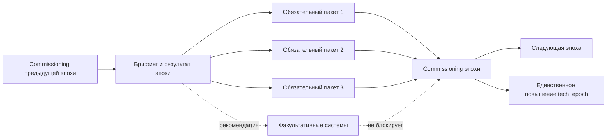
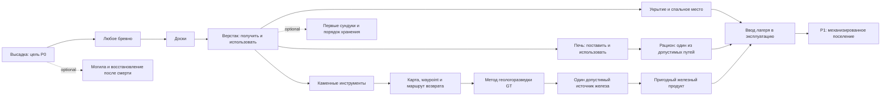

# Перестройка квестовой системы Recast

Статус: `STATIC_IMPLEMENTATION_COMPLETE / USER_TEST_PENDING`

Дата среза: 8 августа 2026 года  
Область: полная квестовая книга, P0–P9, исторический снимок 133 JAR и текущий охват 134 JAR

Ограничения: Minecraft/Forge не запускаются; общая локализация модов остаётся отдельной работой, но русский текст новой квестовой книги создаётся здесь как первичный авторский контент

Этот документ является нормативным планом замены текущей топологии квестбука. Он не предлагает переставить два стартовых узла и оставить остальную книгу прежней. Выявленные ошибки системные: граф часто проверяет предмет вместо способности, описание вместо действия, а отдельные эпохи можно закончить, обойдя заявленные обязательные отрасли.

## 1. Решение в одном абзаце

Новая книга будет построена как граф инженерных способностей. У каждой эпохи P0–P9 появится короткая центральная ось и ровно один узел ввода эпохи в эксплуатацию — `commissioning`. К нему сходятся все действительно обязательные производственные ветви этой эпохи; только он повышает командный `industrial_frontier:tech_epoch` и открывает следующую эпоху. Подробные уроки по геологии, машинам, химии, логистике, атомной отрасли, вооружению и космосу живут в предметных главах и подключаются к оси видимыми ссылками. Городская программа идёт рядом с этой осью, использует её продукцию, но никогда не становится условием смены эпохи. Функционально равноценные источники принимаются через явно проверенные `ONE_OF`-наборы или собственные теги сборки, а построить, запустить, посетить, перевезти и произвести больше нельзя подтверждать обычной галочкой.

Русский язык книги является исходным, а не переводным. Все заголовки, объяснения, задания, подсказки, предупреждения, диагностика и переходы пишутся естественным современным русским языком по `docs/QUEST_RU_EDITORIAL_STANDARD.md`. Компилятор выводит этот текст в generated SNBT напрямую; общие `ru_ru`/`en_us` других систем не переписываются. Английская версия в будущем создаётся отдельно и не определяет синтаксис русской фразы.

## 2. Что было проверено

### 2.1. Локальный срез

Статически просмотрены:

- все 24 compiled-главы в `config/ftbquests/quests/chapters`;
- все 214 квестов и их задачи, зависимости, позиции и ссылки;
- JSON-источники в `authoring/quests`, частичные `authoring/quests/specs`, schema и реестр стабильных ID;
- P0–P9 в реестрах прогрессии, паспортов веществ, worldgen-владельцев и grind-бюджета;
- KubeJS-рецепты и progression-скрипты, которые уже влияют на раннюю игру, эпохи и закрытие обходов;
- 133 активных JAR в `mods`, их локальные `mods.toml` и роль в продукте;
- доступные типы задач FTB Quests, Quests Additions и FTBQ Better Fluids;
- известные отключённые собственные машины и незакрытые runtime-gate.

### 2.2. Эталонные квестбуки

Разобраны официальные репозитории и реальные quest-файлы, а не пересказы и обзоры:

| Сборка | Что принимается | Что не переносится |
|---|---|---|
| Nomifactory | Подробное объяснение источников, назначения, интерфейса, ошибок и следующего потребителя; отдельная карта прогресса; раннее снятие ложной тревоги о гринде | Огромные перегруженные главы и коллекционные стопки вместо инженерной проверки |
| GT New Horizons | Эпохальная магистраль плюс предметные справочники; строгие редакторские правила; крафтовые задачи в основном только в начале; переходные ссылки | Исторически накопленный разный тон, произвольные большие количества и перегруженный старт |
| TerraFirmaGreg Modern | Буквальная причинность каждого ребра; `one_completed`; наблюдение мира; guide links; функционально равные сплавы и материалы | Чрезмерную плотность примитивной главы и незавершённые участки поздней игры |
| GregTech Community Pack Modern | Контекстное открытие справок; OR-фильтры железосодержащих руд; рекомендации без объявления единственного правильного пути | Крупные ранние списки ресурсов в одном квесте |
| Monifactory | Разделение Main Progression и Guides & Help; центральная панель ссылок; условные маршруты; главы по цели фабрики | Неаудированные расхождения текста между режимами |
| All The Mods 9 | Хорошая навигация, портальные квесты, discoverability и понятная таксономия | Kitchensink-главы как независимые острова и слабую причинность ранней игры |
| Enigmatica 2 Expert | Явную карту межмодовых ворот и переходные узлы между системами | Произвольный предмет-ключ без объяснённой производственной способности |
| Divine Journey 2 | Постоянную сверку OR/AND, NBT, рецептурной стоимости и текста при обновлениях | Использование старого task-паттерна без адаптации к FTB Quests 1.20.1 |
| HardTech | Только общую идею нескольких технологических возрастов и межмодовых рецептов | Название неоднозначно; публичный официальный quest-export нужной сборки не найден, поэтому конкретная топология не считается доказательством |

Особенно показателен ответ эталонов на проблему железа. Nomifactory, GTNH и GCP Modern перечисляют magnetite, limonite, pyrite, goethite, hematite и другие допустимые источники, но отделяют поиск железосодержащего сырья от получения конечного железа. Это и будет правилом Recast.

## 3. Диагноз текущей книги

### 3.1. Числа

| Показатель | Текущий результат | Вывод |
|---|---:|---|
| Глав | 24 | Покрытие визуально широкое, но топология не соответствует заявленной обязательности |
| Квестов / задач | 214 / 214 | Почти всегда один квест равен одной задаче, даже если текст описывает процесс |
| Checkmark | 154, или 72% | Основная книга преимущественно просит поверить игроку на слово |
| Item | 59 | Часть задач требует точный предмет там, где важна категория или результат процесса |
| Dimension | 1 | Мир, структуры, биомы и космос почти не подтверждаются подходящими задачами |
| Fluid / Energy / Structure / Kill / Location / Biome / Stage | 0 | Уже установленные возможности task-стека практически не используются |
| Item-задачи через теги | 8 | Функциональные альтернативы учитываются эпизодически |
| Квесты P0–P9 | 118 | До финала реально лежат только 94 из них |
| Текущий режим | `progression_mode: linear` | Он не исправляет неправильные зависимости и создаёт ложное впечатление строгости |

### 3.2. Стартовая ошибка — не одиночный дефект

Текущая последовательность вводной главы:

```text
welcome → reading → (JEI + team) → любой log → 4 сундука → переход
                                                     ↓
P0 brief → seasons → верстак → (8 хлеба + карта) → 8 raw iron → выход
```

Она нарушает причинность сразу в нескольких местах:

1. `if.quest.start.bulk_chest` требует четыре сундука до квеста на верстак. Его KubeJS-рецепт имеет форму 3×3 и без верстака не выполняется. Даже текст квеста говорит открыть верстак.
2. Bulk storage по собственному grind-документу относится к P1, но сейчас блокирует окончание onboarding.
3. P0 требует строго `minecraft:raw_iron`, хотя `removeVanillaOreGen=true`, общая геология принадлежит GTCEu, а мир предоставляет несколько железосодержащих минералов.
4. Требуется ровно восемь хлебов, хотя сборка уже предлагает рыбалку, охоту, культуры и семейство полевых рационов. Проверяется авторский рецепт, а не способность обеспечить экспедицию едой.
5. Построить лагерь, нанести маршрут и найти жилу частично подтверждается предметом или галочкой, а не наблюдаемым результатом.

Исправление только порядка «сундук ↔ верстак» оставило бы тот же дефект во всех следующих эпохах.

### 3.3. Другие подтверждённые семантические ошибки

| Место | Сейчас | Почему неверно | Целевое доказательство |
|---|---|---|---|
| P2 — углерод | Только coal | Углерод — роль в процессе, а не один предмет | Проверенный набор допустимых восстановителей/источников плюс продукт процесса |
| P3 — `machine` | Текст про LV-машину, задача на 8 steel plates | Предмет не доказывает сборку или работу машины | Наличие/размещение машины и малый результат её рецепта |
| P4 — raw water | Только vanilla water bucket | В книге заявлено несколько классов воды | FluidPlus/OR по реальным входным жидкостям, затем отдельная задача на пригодный продукт |
| P4 — fertiliser | Только Farmer's Delight compost | Допустимы органический и промышленный маршруты | `ONE_OF` для первого удобрения; industrial route как отдельное улучшение |
| P6 — fuel | Reactor solid fuel cell | Это оборудование/контейнер, а не доказательство готового топлива | Последовательность pellet → fuel form → assembly, проверяемая реальными продуктами |
| P6 — spent fuel | Fuel reprocessor | Машина не является отработанным топливом и не доказывает переработку | Spent-fuel product → reprocessing operation → recovered products/waste |
| P7–P9 — построить/запустить/поддерживать | В основном checkmark | Галочка не подтверждает сооружение, запуск, поток или обслуживание | Structure/Place/Use/Dimension/Fluid/Energy и узкие custom-proof только там, где штатной задачи нет |

### 3.4. Обходы обязательной линии

Финальный `p9.resolution` имеет 101 предка, но только 94 из 118 узлов P0–P9. Двадцать четыре квеста помечены как mainline, однако не требуются для завершения:

- `p0.loss`;
- P5: `bulk_processing`, `reserve`, `contracts`;
- P7: `hbm_entry`, `protected_zone`, `rbmk`, `purex`, `radiation_model`, `strategic_charge`, `domain_links`, `clearances`, `counterintel`, `return_flow`, `planetary`, `deep_path`;
- P8: `specialisation`, `flow`, `accelerator`, `target_chamber`, `fusion_split`, `plasma_forge`, `renewables`, `diagnosis`.

Причины:

- P6 начинается от `p5.balance`, а не от фактического завершения региональных контрактов;
- P8 начинается только от `p7.emergency`, обходя почти всю стратегическую ветвь;
- P9 начинается только от `p8.elevator`, обходя поток, колонию, ускоритель, fusion и диагностику;
- у эпох нет обязательного join-узла, который собирает все требуемые ветви.

### 3.5. Нарушения внутреннего порядка

- P3 вводит буфер после производственной линии, хотя стабильное питание и буфер должны предшествовать первой автоматизированной ячейке.
- P4 искусственно ставит серную, азотную и хлорную химии в одну линию. Это независимые сырьевые ветви, которые должны сходиться в общем промышленном процессе; город может использовать их продукцию только в необязательной кампании.
- P5 ставит массовую переработку после логистики и восстановления AE2. Сначала должен возникнуть измеримый поток и проблема масштаба, затем транспорт и цифровой контроль решают её.
- P6 смешивает материал, топливо, оборудование, реактор, тепло и отходы не в физической последовательности.
- P7 разделяет HBM и космос, но не собирает их в единый ввод стратегического/aerospace-комплекса.
- P8 разделяет орбитальный поток, ускоритель/fusion и энергетическую устойчивость, но не требует их совместной сдачи.
- P9 сейчас наследует один частный мегапроект вместо доказательства распределённой цивилизации.

### 3.6. Неправильное расположение боковых глав

| Глава | Проблема | Новое место |
|---|---|---|
| Material Passports | Открывается с P1, но сортируется как поздняя глава 70 | Всегда доступный контекстный справочник материалов |
| Academy of Elements | Открывается слишком рано целиком и спойлерит silicon/nuclear | Карточки открываются по первому реальному применению вещества |
| Marathon Choices | После P3 показывает атом, космос и финал | Каждый выбор появляется в своей эпохе; общий обзор не раскрывает закрытые ветви |
| Defence | После P2 сразу рассказывает артиллерию | Расщепить по оружейным эпохам P0–P9 |
| Pressure & Silicon | Объявлена необязательной после P4 | PneumaticCraft остаётся факультативным, но silicon/electronics, нужные AE2, входят в обязательные процессные пакеты |
| Oil | Спрятана после P5 contracts | Георазведка P4, перегонка и региональное распределение P4–P5 |
| Settlement | Короткая отдельная ветка без городского join | Сквозная, но необязательная городская программа P1–P9 с функциональными контрактами; её вехи не блокируют смену эпох основной линии |

### 3.7. Авторский контур не является единым источником истины

Сейчас одновременно существуют:

- упрощённые `authoring/quests/*.json`;
- неполный набор более подробных `authoring/quests/specs/*.json`;
- compiled SNBT;
- `stable_ids.json`;
- постобработчики `apply_quest_branches.py` и `apply_quest_gating.py`;
- relayout-скрипты и lint, часть которых предполагает только десятичные ID.

Следствия:

- specs отсутствуют для нескольких реально существующих глав;
- alias, stable ID и compiled-смысл могут разойтись;
- gating-скрипт способен добавить новый хвост, не убрав старую внешнюю зависимость;
- текущий генератор умеет в основном checkmark или один exact-item и потому подталкивает автора к неверной семантике;
- документация в одном месте называет авторитетным runtime SNBT, в другом — specs.

До переписывания сотен квестов это необходимо заменить одним декларативным источником и детерминированным компилятором.

## 4. Целевой закон причинности

Каждое ребро `A → B` разрешено только при наличии хотя бы одного доказанного основания:

1. продукт A является фактическим входом рецепта/процесса B;
2. инструмент или машина A необходимы, чтобы получить B;
3. инфраструктура A нужна для безопасной или устойчивой работы B;
4. A обучает понятию, которое B впервые обязуется применить;
5. A — утверждённый сюжетный или городской контракт, который создаёт измеримый спрос на B внутри своей необязательной кампании и не блокирует `commissioning` P0–P9;
6. A — commissioning предыдущей эпохи.

«Так красивее выглядит», «это тот же мод» и «обычно игрок уже это сделал» не являются основаниями зависимости.

Для каждого ребра источник будет хранить `reason`, `evidence_refs` и тип:

- `RECIPE_INPUT`;
- `MACHINE_PREREQUISITE`;
- `INFRASTRUCTURE_PREREQUISITE`;
- `KNOWLEDGE_BEFORE_USE`;
- `DEMAND_CREATES_NEED`;
- `EPOCH_TRANSITION`;
- `OPTIONAL_RECOMMENDATION` — никогда не блокирует mainline.

## 5. Архитектура новой книги

### 5.1. Семь уровней навигации

| Группа | Назначение |
|---|---|
| `00 — Начать здесь` | Интерфейс, JEI, Jade, квестовая геология, команда, карта, правила книги, помощь |
| `10 — Кампания P0–P9` | Короткий обязательный позвоночник и commissioning каждой эпохи |
| `20 — Производственные системы` | Геология, рудоподготовка, механика, металлургия, химия, нефть, материалы, nuclear, strategic |
| `30 — Энергия, управление и логистика` | Пар, SU/EU/FE, кабели, давление, storage, AE2, CC, ProjectRed, грузовые и пассажирские сети |
| `40 — Город и общество` | Вода, орошение, еда, MineColonies, архитектура, торговля, транспорт последней мили |
| `45 — Безопасность и внешние силы` | Оружейные эпохи, фракции, репутация, операции, базы, восстановление |
| `50/60 — Мир и космос` | Биомы, сезоны, фауна, структуры, измерения, запуск, планеты, колонии |
| `70 — Академия` | Материалы, химические элементы, электричество, давление, радиация, справочные карты |
| `80 — Мастерство` | Необязательные throughput-задачи, замкнутые циклы, красивое строительство, мегапроекты |
| `90 — Помощь` | Диагностика, recovery, известные ограничения и подготовка отчёта |

Глава города получает тег `optional_campaign`. Значение `requirement: required` внутри неё означает только «нужно для следующего шага этой городской кампании»; оно не делает квест обязательным для P0–P9. Валидатор отклоняет любой граф, где такой квест становится обязательным предком `commissioning`, а также любой обязательный технический узел с метками `city`, `city_*`, `settlement` или `minecolonies`.

Центральная «Карта прогресса» содержит только `quest_links` на реальные узлы. Она ничего не дублирует и не создаёт второй прогресс.

### 5.2. Устройство одной эпохи



Правила:

- в каждой эпохе ровно один root и один `commissioning`;
- все обязательные ветви — предки commissioning;
- следующий root зависит только от commissioning предыдущей эпохи;
- факультативные ветви явно имеют `optional: true` и не маскируются тегом `mainline`;
- справочник может открыться контекстно, но его чтение не блокирует производство;
- квест существует в одном домашнем разделе; в других местах показывается ссылкой;
- закрытая технология не раскрывается ранней «марафонской» главой.

### 5.3. Роли квестов

Каждый квест получает ровно одну первичную роль:

| Роль | Что доказывает |
|---|---|
| `ONBOARDING` | Игрок умеет пользоваться интерфейсом/инструментом книги |
| `KNOWLEDGE` | Объясняет понятие; checkmark допустим, но не заменяет производство |
| `SOURCE_DISCOVERY` | Найден один из допустимых источников |
| `MATERIAL_PRODUCTION` | Получен канонический пригодный продукт |
| `MACHINE_BUILD` | Собран/размещён механизм или структура |
| `FIRST_OPERATION` | Выполнена малая учебная партия |
| `AUTOMATION` | Процесс работает без ручного переноса каждого цикла |
| `INTEGRATION` | Выход одной системы реально питает другую |
| `DIAGNOSTICS` | Игрок умеет увидеть и исправить типичную неисправность |
| `COMMISSIONING` | Все обязательные способности эпохи объединены и введены в эксплуатацию |
| `RECOVERY` | Есть честный путь восстановления без сброса всей кампании |
| `MASTERY` | Необязательная эффективность, масштаб или эстетический проект |

### 5.4. Тип задачи обязан соответствовать глаголу

| Формулировка | Допустимое доказательство | Недопустимая подмена |
|---|---|---|
| «Получите материал» | Item/tag/OR по конечной форме | Checkmark |
| «Найдите источник» | Observation, biome, structure, item OR или location | Один произвольный exact-item, если источников несколько |
| «Соберите/поставьте машину» | Place/Use/Structure либо item для переносимой машины | Стопка её компонентов |
| «Запустите процесс» | Результат рецепта плюс при необходимости use/custom state | Наличие контроллера |
| «Получите жидкость» | Fluid/FluidPlus | Ведро/ячейка поздней игры, если игрок работает трубами |
| «Обеспечьте энергией» | Energy/stat/custom meter proof | Кабель в инвентаре |
| «Посетите» | Dimension/biome/location/structure | Checkmark |
| «Защитите/уничтожьте» | Kill/advancement/custom operation result | Checkmark |
| «Перевезите партию» | Endpoint/contract/custom transfer proof | Предмет в личном инвентаре |
| «Автоматизируйте» | Небольшой output-window/contract, не ручная сдача стопки | Checkmark или одна машина |
| «Прочитайте совет» | Checkmark | Производственный gate |

FTB Quests уже предоставляет item, fluid, energy, dimension, stat, kill, location, biome, structure, stage и observation. Quests Additions добавляет place/break/use/block-interaction/structure/time/day. FTBQ Better Fluids установлен специально для корректных жидкостных задач. Custom-proof создаётся только для throughput, замкнутого цикла, городского состояния или операции, которые штатные задачи не выражают.

## 6. Функциональные альтернативы и теги

### 6.1. Четыре разных вопроса

Нельзя смешивать в одну item-задачу:

1. **Источник:** из чего в принципе можно получить вещество?
2. **Продукт:** получена ли пригодная каноническая форма?
3. **Процесс:** освоена ли нужная машина/операция?
4. **Масштаб:** работает ли линия без ручного повторения?

Пример железа:

```text
любой статически подтверждённый iron-bearing source
              ↓ ONE_OF
«Я понял местную геологию»
              ↓
небольшое количество #forge:ingots/iron или pack-owned эквивалента
              ↓
«Я умею получать пригодное железо»
              ↓
первая машина/деталь, реально потребляющая железо
```

Список iron-bearing source не пишется вручную по памяти. Он генерируется из фактических ранних рецептов и паспортов вещества, затем проходит allowlist-аудит. Minerалы не объединяются глобальным Forge-тегом, если у них разные побочные продукты или ценность; создаётся quest-only фильтр `industrial_frontier:quest_sources/early_iron`.

### 6.2. Когда exact-item правилен

Exact-item остаётся, если смыслом квеста является:

- конкретный уникальный controller;
- конкретный инструмент интерфейса;
- компонент с уникальными NBT/чистотой/опасностью;
- первый экземпляр предмета, который действительно открывает новую способность;
- сюжетный или фракционный объект.

Во всех остальных случаях выбирается:

- tag — формы действительно взаимозаменяемы;
- `ONE_OF` — разные источники ведут к одной способности;
- несколько optional retrieval + одна обязательная конечная форма;
- отдельные ветви, если маршруты имеют существенные технологические различия.

### 6.3. AND/OR

- `ALL_OF` означает физически одновременные требования процесса или commissioning.
- `ANY_OF`/`one_completed` означает альтернативные источники, оборудование или специализации.
- Текст квеста обязан буквально называть логику: «нужно всё» либо «достаточно одного».
- Автоматический lint сравнивает текстовые маркеры с `dependency_requirement`.
- Ни одна скрытая ветвь не используется, чтобы тайно заставить игрока выполнить больше, чем обещает интерфейс.

## 7. Исправленный P0 — первый вертикальный срез

Onboarding всегда доступен и не смешивается с выживанием:

```text
Добро пожаловать
  ├─ Как читать книгу и связи
  ├─ JEI: рецепт, применение, @mod, теги, закладки
  ├─ Jade и квестовая геология: что показывает блок и где искать ресурс
  ├─ Команда, общий прогресс и tech_epoch
  └─ Карта помощи и восстановления
```

Новый P0:



Ключевые решения:

- сундук находится после верстака и не блокирует P0;
- bulk-рецепт на четыре сундука переезжает в P1 как антигринд-урок раннего склада;
- food принимает категорию полевого рациона, а не только восемь хлебов;
- источник железа и железный продукт — два разных квеста;
- карта не требует раскрывать внутренний API Xaero: инструкция может быть knowledge/checkmark, но реальная разведка подтверждается следующим observation/item-квестом;
- P0 завершается конкретным commissioning лагеря, а не общей галочкой «готово».

## 8. Новая кампания P0–P9

| Эпоха | Обязательные пакеты | Commissioning — что реально должно работать | Факультативные углубления |
|---|---|---|---|
| P0 — Экспедиция | Onboarding; ручное ремесло; пища; карта; GT-геология; первое пригодное железо | Укрытие, запас одного допустимого рациона, отмеченная рабочая жила и полученное железо | Рыбалка, ранняя фауна, руины, recovery |
| P1 — Механизированное поселение | Create power train; stress/speed; первая обработка; вода/орошение; Tom's Storage; раннее строительство | Непрерывная механическая линия базового материала, подача воды и доступный через terminal склад | Aquaculture, интерьер, декоративная палитра, Effortless Building после ручного здания |
| P2 — Промышленное тепло и металлургия | Углерод/кокс; boiler; GT Steam; Steam Additions; сталь; базовая рудоподготовка; дымоход/загрязнение; тяжёлая IE-инфраструктура | Стабильная партия стали, безопасный паровой контур, переработка руды и отвод выбросов | Little Logistics, ранний rail, Brewin & Chewin, расширенная броня/оружие |
| P3 — Электрифицированный район | LV generation; voltage/amperage; кабели; буфер; machine cell; signal/control; автоматизация результата | Минимум одна многомашинная линия работает от корректной сети, имеет буфер, контроль и наблюдаемый output | PneumaticCraft, CC:Tweaked, ProjectRed, TaCZ-тир, ранняя артиллерия |
| P4 — Промышленная химия | Независимые серная, азотная и хлорная ветви; вода/стоки; удобрения/орошение; нефтяная разведка и перегонка | Общий технический заказ получает воду, удобрение и продукт химической линии; каждый побочный продукт или отход имеет назначение | Необязательные городские службы, MTR, Ultimate Car, ферментация и серийное питание |
| P5 — Региональная фабрика | Массовая переработка; грузовые железнодорожные и водные маршруты; региональные буферы; AE2 storage→channels→patterns→autocraft→recovery | Производственный заказ проходит от удалённого сырья через массовый процесс и транспорт в автоматизированный склад без ручной перекладки каждого цикла | Необязательная городская логистика, Advanced Peripherals, ProjectRed fabrication, торговые специализации, Multi Builder Tool после ручного multiblock |
| P6 — Атомная индустрия | Ядерное сырьё; purification/conversion/enrichment; fuel fabrication; dosimetry; reactor; heat loop; turbine; spent fuel; reprocessing/storage | Гражданская АЭС выдаёт контролируемую полезную энергию, а отработанное топливо попадает в безопасный маршрут | Подключение города как необязательной нагрузки, изотопные продукты, альтернативные NuclearCraft-конфигурации, мастерство эффективности |
| P7 — Стратегический и аэрокосмический комплекс | Защищённая HBM-зона; один обязательный стратегический материал/процесс; shared materials/electronics; rocket fuel; spaceport; first launch; emergency protocol | Защищённый комплекс и первый полноценный запуск с подготовкой, telemetry, жизнеобеспечением и возвратом; обе обязательные ветви сходятся | Deep engine path, RBMK-специализация, advanced ordnance под лицензией, Creating Space orbital subpath |
| P8 — Орбитально-планетарная сеть | Регулярный межпланетный flow; навигация/спутник; жизнеспособная колония; high-energy materials; accelerator/fusion role; диагностика и резерв | Автоматический грузопоток обслуживает колонию и возвращает уникальный ресурс; высокоэнергетический процесс имеет питание и диагностику | Space elevator, power beam, специализация планет, plasma mastery |
| P9 — Межпланетная цивилизация | Локальная промышленность колонии; распределённая диспетчеризация; ремонт/износ; замкнутые материальные циклы; общий resilience-test | Система переживает заданное нарушение снабжения и восстанавливает производство; затем выполняется один из равноправных финальных мегапроектов | Swarm, автономная колония, quantum line и иные финалы как `ANY_OF`, но только после общего базиса |

### 8.1. Физический порядок P6

Чтобы не повторить нынешнюю ошибку, ядерная ветвь фиксируется отдельно:

```text
разведка → руда/концентрат → очистка → конверсия → обогащение
→ топливная форма → сборка топлива → дозиметрия/защита
→ реактор → теплоноситель → теплообмен/турбина → электрическая сеть
→ отработанное топливо → выдержка/переработка → возвращённые изотопы + отход
```

Наличие fuel reprocessor не может закрыть задачу на spent fuel; наличие fuel cell casing не может закрыть задачу на топливо.

### 8.2. Join P7–P9

- P7 commissioning требует не стратегическое оружие, а безопасно работающую стратегическую производственную способность плюс первый запуск. HBM остаётся глобальным модом, но не превращает оружие массового поражения в обязательный бытовой крафт.
- P8 не может завершиться одним elevator. Нужны flow, колония, энергетическая устойчивость и один high-energy material/process.
- P9 имеет общий обязательный фундамент, после которого `ANY_OF` выбирает финальную специализацию. Выбор финала не позволяет пропустить ремонт, локальную промышленность колонии и замкнутые циклы.

## 9. Стандарт одного содержательного квеста

Каждая первая встреча с механизмом отвечает в человеческом порядке:

1. **Что мы решаем сейчас.** Конкретная проблема фабрики/города.
2. **Что уже должно быть.** Материалы, энергия, инструменты, безопасность.
3. **Допустимые входы.** Все проверенные варианты и различия между ними.
4. **Как собрать.** Для multiblock — слои, ориентация, обязательные порты и свободное место.
5. **Как читать интерфейс.** Слоты, стороны, режимы, единицы, индикаторы.
6. **Первый запуск.** Одна малая безопасная партия с ожидаемым input/time/output.
7. **Как увидеть успех.** Не «нажмите галочку», а наблюдаемый результат.
8. **Что чаще всего сломано.** Три–пять конкретных симптомов и исправлений.
9. **Когда автоматизировать.** До какого спроса ручной путь допустим.
10. **Куда идёт продукт.** Прямой consumer и следующий открываемый узел.
11. **Глубже.** Химия, электротехника, расчёты, Ponder/GuideME/Patchouli-ссылка без обязательного внешнего wiki.

Повторное применение принципа не копирует весь учебник: квест кратко сообщает отличие и ссылается на исходный урок.

## 10. Anti-grind как часть графа

Квестовый граф и рецепт проверяются вместе. Действуют существующие лимиты:

| Метрика | Зелёная зона | Требует объяснения | Переработать |
|---|---:|---:|---:|
| Одинаковые ручные крафты подряд | 1–3 | 4–8 | >8 |
| Ручные переносы до автоматизации | 0–4 | 5–10 | >10 |
| Пассивное ожидание без параллельной цели | ≤3 мин | 3–8 мин | >8 мин |
| Обязательный RNG без pity | 100% | 50–99% | <50% |
| Повтор идентичной установки | 0–1 | 2 | >2 |

Дополнительные правила новой книги:

- учебная партия — 1–3 цикла;
- количество в item-задаче выводится из ближайшего реального строительства, а не выбирается «красивым» числом;
- массовый контракт открывается только после доступной автоматизации его компонентов;
- задачи по умолчанию не потребляют предметы;
- машина, дорогое оборудование, инструмент, форма и катализатор не сдаются квесту;
- common ore не заставляет игрока часами хранить ради будущего удвоения: книга честно объясняет, когда ранняя переработка не окупается;
- RNG-gate всегда имеет детерминированный маршрут, гарантию, контракт или pity;
- декоративные варианты принимаются семейством/палитрой/функцией помещения, а не перечнем каждого блока;
- throughput-задача измеряет устойчивый результат после автоматизации, а не ручное накопление стопки заранее.

## 11. Единый источник истины и компилятор

### 11.1. Quest Source v2

Вместо трёх расходящихся представлений вводится один JSON-контракт, условно `authoring/questbook_v2/**/*.json`:

```json
{
  "stable_id": "if.quest.p0.iron_product",
  "engine_id": "...preserved-or-migrated...",
  "chapter": "if.chapter.p0",
  "epoch": 0,
  "role": "MATERIAL_PRODUCTION",
  "required": true,
  "dependencies": {
    "mode": "ALL_OF",
    "quests": ["if.quest.p0.iron_source"],
    "reason": "RECIPE_INPUT",
    "evidence_refs": ["industrial_frontier:substance/iron"]
  },
  "proofs": [
    {
      "type": "ITEM_TAG",
      "tag": "forge:ingots/iron",
      "count": 2,
      "consume": false
    }
  ],
  "teaching_sections": [
    "purpose",
    "accepted_sources",
    "first_operation",
    "success",
    "diagnostics",
    "next_consumer"
  ],
  "content_refs": ["gtceu", "industrial_frontier:substance/iron"],
  "recipe_refs": ["generated:early_iron_routes"],
  "grind_ref": "industrial_frontier:grind/p0/first_iron",
  "layout": {"lane": "main", "order": 11}
}
```

Обязательные поля дополнительно включают localization keys, unlock policy, visibility, reward policy, migration alias, diagnostics refs и список прямых consumers.

### 11.2. Детерминированные выходы

Один компилятор создаёт:

- FTB Quests SNBT;
- chapter groups и порядок;
- stable ID registry;
- quest links и layout;
- пустой translation handoff-manifest с ключами, но **не изменяет текущие переводы на этом этапе**;
- machine-readable graph для lint;
- coverage ledger `mod/content → home quest → epoch → proof`;
- migration map `old quest ID → new semantic quest ID`.

Постобработчики, которые «угадывают хвост» или дописывают зависимости после компиляции, удаляются из цепочки сборки. Они не удаляются физически до миграции, но перестают быть авторитетными.

### 11.3. Авторитет эпохи

`industrial_frontier:tech_epoch` хранится по UUID команды и меняется только через завершение `commissioning`:

```text
FTB Quest commissioning complete
        ↓ server-side validation
Threat Director / progression bridge
        ↓ atomic team-state update
tech_epoch = N
        ↓ read-only mirrors: scoreboard/stage/predicates
```

Команда `/if_advance_epoch` остаётся только узким административным recovery-инструментом и не является штатным прогрессом. Username не используется как постоянный ключ состояния.

## 12. Автоматические проверки

Новая система не компилируется, если нарушено хотя бы одно правило:

### 12.1. Граф

- все stable alias и engine ID уникальны и взаимно разрешимы;
- нет циклов и осиротевших обязательных узлов;
- у каждой эпохи ровно один root и один commissioning;
- все `required=true` являются предками commissioning;
- следующий root зависит от commissioning предыдущей эпохи и только от него;
- optional-ветвь не становится скрытым обязательным предком;
- `ALL_OF`/`ANY_OF` совпадают с текстом и layout;
- cross-chapter ссылка ведёт к домашнему узлу, а не создаёт копию прогресса;
- финал имеет предками все общие обязательные результаты P0–P9.

### 12.2. Контент и рецепты

- каждый progression-relevant item/fluid/block ID существует в активном составе;
- каждый обязательный рецепт достижим из outputs его родителей;
- задача не требует продукт раньше инструмента/станции, необходимой для его производства;
- quest-only tag непуст, состоит только из allowlist-элементов и не объединяет технологически разные формы;
- все известные альтернативные источники либо приняты, либо имеют записанную причину исключения;
- награда не открывает материал, оружие, машину или измерение раньше эпохи;
- ни один отключённый собственный механизм не описывается как доступный;
- текстовые слова «постройте», «запустите», «перевезите», «посетите», «произведите жидкость» сопоставлены с подходящим proof-type;
- fluid не проверяется устаревшей тарой, если эпоха уже использует резервуары/трубы.

### 12.3. Покрытие и редактура

- каждый из 81 gameplay/content JAR имеет роль, home chapter и минимум один coverage contract;
- каждый обязательный machine/process, реально используемый рецептурной системой, имеет build/operate/diagnose coverage;
- все 52 infrastructure/client/library JAR классифицированы и не создают бессмысленные предметные квесты;
- ни один мод не является островом: для обязательного/интегрированного мода зафиксированы вход из другой системы и выход в другую систему;
- каждый квест с количеством имеет grind_ref или обоснование `NONE`;
- каждый содержательный квест имеет purpose, success proof, diagnostics и next consumer;
- русский quest-copy обязателен в source и компилируется в SNBT как первичный текст без зависимости от общей локализации;
- каждый содержательный узел имеет четыре редакторские отметки и получает `RU_READY` только после технической, стилевой и потоковой вычитки;
- временные английские строки, машинные кальки, одинаковые шаблонные абзацы и пустые заглушки блокируют сборку;
- translation handoff генерируется отдельно и не изменяет общие переводческие файлы.

### 12.4. Статическая и игровая граница

Я выполняю JSON/schema/DAG/ID/tag/recipe/evidence/coverage/lint-проверки без запуска игры. Пользователь проверяет в Minecraft:

- фактическое засчитывание задач;
- визуальную читаемость и линии;
- реальную доступность рецептов и NBT;
- длительность партий и субъективный гринд;
- корректность GUI, multiblock и межмодовых переносов;
- миграцию существующего мира.

Результат пользователя возвращается как конкретный gate; он не заменяется заявлением `PASS` по числу файлов.

## 13. План внедрения QR0–QR12

Это отдельный подпроект `Quest Rebuild`, чтобы не путать его с уже выполненными M0–M10.

### QR0 — Заморозить и описать текущий срез

Работы:

- сохранить hash/ID/alias/dependency baseline всех 214 квестов;
- выпустить machine-readable отчёт о 24 bypass/семантических дефектах;
- связать все текущие quest ID с одним из решений: `KEEP_MEANING`, `REWRITE`, `SPLIT`, `MERGE`, `REMOVE_TO_REFERENCE`;
- зафиксировать, какие изменения в dirty workspace принадлежат другим работам;
- текущий runtime-квестбук оставить нетронутым до готовности вертикального среза.

Выход: воспроизводимый baseline и migration ledger без изменения прохождения.

### QR1 — Quest Source v2 и компилятор

Работы:

- расширить schema ролями, proof-type, AND/OR, edge reasons, content/recipe/grind refs;
- реализовать детерминированную сборку SNBT, links, groups, stable IDs и layout;
- убрать semantic-gating из постобработчиков;
- поддержать штатные задачи FTBQ, Quests Additions, FluidPlus и фильтры тегов;
- добавить round-trip/semantic-parity audit source ↔ compiled.

Выход: один минимальный тестовый chapter компилируется без ручной правки SNBT.

### QR2 — Реестр функциональных способностей

Работы:

- построить recipe/process graph из локальных data/KubeJS и предоставленных owner-dump;
- создать allowlist-наборы раннего железа, еды, воды, углерода, пластин и других альтернатив;
- связать материалы с паспортами, формы — с фактическими registry IDs, процессы — с owners;
- создать полный coverage ledger 133/133 и mod-island audit;
- отметить все `BLOCKED_PENDING_OWNER_DUMP` честно, без выдуманных ID.

Выход: любой quest gate может сослаться на проверенную способность и evidence.

### QR3 — Onboarding + P0

Работы:

- вынести сундуки после верстака;
- разделить источник железа, готовое железо и его первый consumer;
- заменить bread-only на категорию допустимого рациона;
- применить observation/place/use там, где это возможно;
- собрать P0 commissioning и связать его с team tech_epoch bridge;
- сделать help/recovery доступными независимо от mainline.

Выход: первый полный вертикальный срез source → compiled → static audit. Игровую приёмку выполняет пользователь.

### QR4 — P1–P2: механика, пар и сталь

Работы:

- перестроить Create как причинную линию power → transmission → stress → operation → logistics;
- встроить Tom's Storage после реальной потребности в хранении;
- связать воду/орошение, раннее поселение и строительный контракт;
- перестроить carbon/coke → boiler → steam machines → steel → ore processing;
- встроить Steam Additions, IE, pollution/chimneys и ранний транспорт без дублирования owners;
- закончить каждую эпоху commissioning.

Выход: ни одна сталь, пластина, паровая машина или склад не появляются раньше своих средств производства.

### QR5 — P3: электрификация и управление

Работы:

- voltage/amperage/cable/buffer объяснить до первой обязательной электрической линии;
- machine build отделить от first operation;
- автоматизированную линию поставить после энергии, буфера и сигнала;
- контекстно открыть CC:Tweaked/ProjectRed, PneumaticCraft и оружейный тир;
- проверить границы SU/EU/FE/pressure и запрет бесплатных конверсионных обходов.

Выход: commissioning электрического района подтверждает рабочую линию, а не восемь пластин.

### QR6 — P4: промышленная химия и коммунальные процессы

Работы:

- серную, азотную и хлорную ветви распараллелить;
- fluid-задачами описать входы, продукты, побочные потоки и возврат;
- связать воду, стоки, удобрение, Agricultural Enhancements, пищу и Central Kitchen;
- нефтяную георазведку/перегонку перенести в P4–P5;
- общий технический заказ сделать узлом схождения химических ветвей; городской заказ оставить параллельным необязательным потребителем;
- отключённую авторскую water-treatment машину не обещать: использовать только доказанный установленный процесс либо оставить gate заблокированным до реализации.

Выход: химический комплекс работает как сеть входов, потребителей и возвратов, а не как три кислоты в ряд; городская кампания может пользоваться его продукцией, не блокируя P5.

### QR7 — P5: региональная фабрика

Работы:

- сначала ввести поток массовой обработки, затем задачу его перемещения и учёта;
- развести грузовой rail, water route, passenger transit и last mile;
- провести Tom's Storage → AE2 storage → channels → patterns → autocraft → recovery;
- связать MineColonies, Lightman's Currency и региональные контракты внутри необязательной городской кампании;
- сделать обязательными reserve, bulk processing и contracts через commissioning.

Выход: AE2 решает возникшую проблему масштаба, но не создаёт материал и не заменяет физическую логистику.

### QR8 — P6: гражданский атом

Работы:

- реализовать физический порядок топливного цикла;
- разделить материал, fuel form, assembly, reactor, heat loop, power и spent fuel;
- использовать fluid/energy/operation proofs;
- связать графит P2, воду и химию P4 с безопасным энергетическим контуром; подключение городской сети оставить необязательной задачей;
- HBM оставить за P7, исключив дублирующую радиационную модель.

Выход: commissioning АЭС требует полного безопасного цикла и маршрута отходов.

### QR9 — P7: стратегическая и первая космическая программа

Работы:

- сделать обязательный безопасный HBM-вход и protected zone без требования массового разрушительного оружия;
- связать специальные материалы, электронику, rocket fuel, spaceport, first launch и return flow;
- разделить роли GCYR и Creating Space;
- включить эпохальные loadout/bases/operations через единый tech_epoch;
- собрать обе программы в один commissioning.

Выход: P7 нельзя пройти одной аварийной памяткой или только ракетой.

### QR10 — P8–P9: сеть и финал

Работы:

- потребовать автоматический межпланетный flow, колонию, навигацию, энергию и диагностику;
- связать accelerator/fusion с реальными уникальными материалами и consumers;
- перенести elevator в роль одного инфраструктурного варианта, а не единственных ворот P9;
- собрать общий P9-базис closed loop, local industry, maintenance и resilience;
- после него открыть несколько финальных мегапроектов через честный `ANY_OF`.

Выход: финал проверяет цивилизацию, а не владение одним предметом.

### QR11 — Полное предметное покрытие и внешний мир

Работы:

- завершить home chapters всех 81 gameplay/content JAR;
- переписать storage, settlement, defence, oil, factions, diplomacy, ops, academy, mastery и help;
- исследовательские моды покрыть атласом/структурой/опасностями и loot ceiling, а не checklist каждой структуры;
- архитектуру/мебель покрыть функциональными зданиями и палитрами;
- dialog-систему пока оставить обозначенным проектным слоем, как ранее решено; не писать ключевые диалоги в этом этапе;
- выровнять layout: обязательная ось по центру, инфраструктура выше, optional/mastery ниже, cross-links без длинных пересечений.

Выход: coverage audit `133/133`, mod-island audit `0`, semantic-checkmark debt только в knowledge/recovery.

### QR12 — Редактура, миграция и приёмка

Работы:

- непрерывно прочитать P0–P9 как одну книгу и удалить повторы/канцелярит;
- непрерывно вычитать первичный русский текст по `docs/QUEST_RU_EDITORIAL_STANDARD.md` и сформировать отдельный translation handoff-manifest, не вмешиваясь в общую локализацию модов;
- проверить ID migration и правила сохранения прогресса существующей команды;
- выполнить все статические validators;
- передать пользователю короткие игровые протоколы по эпохам;
- по фактическим тестам корректировать задачи, рецепты и grind-budget.

Выход: release candidate квестбука. Статус `READY` возможен только после пользовательского прохождения, а не после генерации файлов.

## 14. Миграция существующей книги

- Перенос `carry` разрешён только тогда, когда старое исполняемое условие логически доказывает всё новое обязательное условие: совпадают смысл квеста, ID квеста и задания, тип проверки, предмет или тег, количество и усиливающие ограничения.
- Точные условия QR0 до замены runtime-файлов замораживаются в `docs/registries/quest_qr0_proof_contracts.json`; валидатор сравнивает миграцию с этим снимком, а не с воспоминанием о старом квесте.
- Если доказательство изменилось или несколько старых квестов сведены в одну цель, используется `review` с новым ID. Один выполненный предок не может автоматически закрыть объединённый результат.
- Каждый выведенный из обращения ID получает запись в `docs/registries/retired_ids.json` и никогда не возвращается в активную книгу с другим смыслом.
- Семантически неизменившийся квест сохраняет engine ID.
- Разделённый квест получает один primary successor; остальные новые узлы не автозакрываются без доказательства.
- Объединённый квест закрывается, если выполнен утверждённый набор старых предков.
- Старый checkmark не переносит автоматически commissioning, если он не доказывал работу системы.
- Existing team progress переносится по UUID команды, а не по имени игрока.
- Перед заменой сохраняется old→new map и процедура отката к предыдущему compiled snapshot.
- Удалённые/отложенные механизмы переводятся в reference/backlog, а не оставляются ложными обязательными задачами.

## 15. Критерии готовности

Новая система принимается только когда одновременно выполнено:

- P0 больше нигде не требует сундук до верстака;
- любой обязательный материал имеет доказанный доступный источник в момент открытия квеста;
- железо, углерод, вода, пища и другие категории принимают все функционально допустимые ранние варианты;
- 100% обязательных квестов эпохи являются предками её commissioning;
- 0 обязательных действий «построить/запустить/посетить/перевезти» подтверждаются голой галочкой;
- 0 островных gameplay-модов;
- 81/81 gameplay/content JAR имеют home и coverage contract;
- 52/52 инфраструктурных JAR классифицированы и не засоряют progression;
- каждый массовый спрос появляется после автоматизации;
- hard grind violations равны нулю;
- нет пустых quest-тегов, битых ID, циклов, двойных owners и преждевременных наград;
- ни один квест не обещает пять отключённых собственных машин как доступный контент;
- tech_epoch меняется только commissioning-мостом;
- 100% квестов имеют первичный естественный русский текст без машинного перевода и статус `RU_READY`;
- пользователь подтвердил проходимость и фактическое засчитывание в игре.

## 16. Первая реализация после утверждения плана

Первым изменением должен быть не ручной перенос сундука, а пакет QR0–QR3:

1. baseline и migration ledger;
2. Quest Source v2 + compiler + validators;
3. generated acceptance set для early iron/food;
4. новая глава onboarding;
5. новый P0 целиком;
6. один commissioning→tech_epoch bridge;
7. статический отчёт и отдельный пользовательский тест-протокол.

Только после того как этот вертикальный срез покажет, что source, compiled SNBT, задачи, зависимости, layout и migration согласованы, тем же шаблоном перестраиваются P1–P9.

## 17. Решение по каждой существующей главе

Это не список файлов, которые будут «слегка улучшены». Для каждой текущей главы указана судьба её смысла в новой архитектуре.

| Текущая глава | Результат аудита | Решение |
|---|---|---|
| `00_start_here` | Сундуки до верстака; onboarding смешан с ресурсным gate | Полностью переписать; оставить только интерфейс/команду/справку, производство перенести в P0/P1 |
| `10_p0_expedition` | Exact bread/raw iron; лагерь и разведка слабо доказаны; recovery висит хвостом | Полностью заменить графом из раздела 7 |
| `11_p1_mechanised` | Темы Create правильные, но список предметов не доказывает причинную механическую линию | Пересобрать power→transmission→stress→operation→logistics→commissioning |
| `12_p2_steam_metallurgy` | Exact coal; boiler/steam/steel частично проверяются предметами; pollution не интегрирован | Разделить source, тепло, пар, машину, сталь, руду и выбросы; собрать commissioning |
| `13_p3_electrification` | Буфер после линии; machine проверяется steel plates; сигнал предшествует не всем consumers | Перестроить energy source→network→buffer→machine→control→automated line |
| `14_p4_chemical_city` | Кислоты искусственно последовательны; exact water/fertiliser; disabled treatment обещан как доступный | Три параллельные химические ветви плюс вода и промышленные потребители; городские связи вынести только в необязательную кампанию, disabled-механику убрать из обязательного текста |
| `15_p5_regional_logistics` | Bulk processing, reserve и contracts обходятся; AE2 появляется раньше сформулированной проблемы потока | Сначала измеримый масштаб, затем физическая логистика и цифровой контроль; обязательный региональный commissioning |
| `16_p6_nuclear` | Fuel и spent fuel семантически подменены оборудованием; нет физически строгого join | Полностью перестроить по топливному циклу из 8.1 |
| `17_p7_strategic_space` | 12 mainline-узлов обходятся; HBM/space не имеют общего commissioning | Две обязательные программы с shared prerequisites и одним безопасным вводом комплекса |
| `18_p8_orbital_network` | 8 mainline-узлов обходятся; elevator один открывает P9 | Elevator сделать вариантом инфраструктуры; flow+colony+energy+high-energy process собрать в commissioning |
| `19_p9_finale` | Финал наследует неполный P8 и не доказывает устойчивость всей системы | Общий closed-loop/resilience-базис плюс несколько финалов `ANY_OF` |
| `20_storage_order` | Полезная тема, но позднее/раннее storage не привязаны к фактическому объёму и миграции | P0 сундуки → P1 Tom's → P5 AE2, одна домашняя глава с контекстными ссылками |
| `21_defence_gear` | Артиллерия раскрывается рядом с ранним боем; в основном checkmark | Разнести по P0–P9 и проверять training/use/operation; сохранить одну оружейную систему каждого класса |
| `22_settlement` | MineColonies сведён к пяти галочкам, снабжение не соединено с промышленностью | Сквозная необязательная городская программа с функциональными комнатами, складами, профессиями и энергией; внутри ветки есть собственная последовательность, но её завершение не входит в приёмку P0–P9 |
| `23_pressure_silicon` | В одну optional-карточку смешаны разные домены; silicon может быть фактически обязателен для P5 | PneumaticCraft оставить факультативным; обязательную electronics/silicon причинность вынести в process graph |
| `24_oil_line` | Открывается слишком поздно; machine/controller не доказывают fluid flow | Survey P4 → extraction/distillation P4 → regional distribution/consumers P5 |
| `25_factions_live` | Описывает будущую систему почти одними галочками | Оставить portal/reference до реализации Threat Director; затем operation/reputation proofs |
| `45_diplomacy_security` | Дублирует 25 и частично 46; affiliation/reputation/epoch смешиваются текстом | Единая домашняя глава состояния, видимые ссылки на контракты и операции; диалоги пока только design marker |
| `46_operations_and_defence` | Самопроверка результатов операций; роли и последствия не подтверждены | Подключить к серверным outcome flags Threat Director; до этого не блокировать эпоху |
| `70_material_passports` | Полезный справочник расположен слишком поздно | Всегда доступная Academy, контекстные ссылки из первого применения формы/вещества |
| `71_academy_of_elements` | Полная таблица рано раскрывает поздние вещества | Карточки открываются по эпохе; index виден, закрытые детали не спойлерят цепи |
| `72_mastery_distributed_factory` | Хорошие советы, но галочки выглядят как задания | Сделать reference/mastery без притворной обязательности; реальные throughput challenges вынести отдельно |
| `73_marathon_choices` | Ранний обзор спойлерит nuclear/space/finale и не хранит действительный выбор | Удалить раннее открытие; выборы показывать у соответствующих branch gate |
| `90_help` | Правильная домашняя роль, но не покрывает все новые proof-type и recovery | Сохранить, расширить по task diagnosis, epoch bridge, AE2, nuclear, city и operations |

## 18. Реестр полного покрытия активного состава

«Охватить весь контент» означает:

- каждый gameplay-мод имеет явную роль, домашнюю главу, точку первого применения и хотя бы один осмысленный учебный контракт;
- каждый используемый в прогрессии механизм получает build/operate/diagnose coverage;
- варианты блоков, еды, оружия и структур группируются по функции, а не превращаются в сотни бессмысленных retrieval-квестов;
- библиотеки и оптимизационные моды учитываются в составе, но не получают фальшивую игровую ветку.

Обозначения: `ОП` — обязательный позвоночник; `ОИ` — обязательная интеграция хотя бы одного реального процесса; `ФС` — полноценная факультативная система; `АМ` — атмосферный мир/исследование; `ИБ` — инфраструктура без самостоятельной прогрессии.

### 18.1. Промышленный позвоночник — 17 JAR

| Мод | Класс | Домашняя программа и минимальный контракт |
|---|---|---|
| GregTech CEu Modern (`gtceu`) | ОП | P0–P9: GT-геология, формы, рудоподготовка, пар, EU, circuits, cleanroom и каждый реально обязательный multiblock |
| Create (`create`) | ОП | P1–P5: вращение, stress/speed, обработка, транспорт и массовая линия; явная граница с точностью GT |
| GregTech Extended Chemistry (`gtec`) | ОП | P3–P9: реагенты, состояния, температура/давление, PGM/rare earth, waste/recycle; fluid/output proofs |
| NuclearCraft: Neoteric (`nuclearcraft`) | ОП | P6: полный гражданский топливный цикл, тепло, энергия, защита, spent fuel и waste |
| HBM NTM: Rebirth (`hbm_ntm_rebirth`) | ОП | P7–P9: стратегические материалы/установки, защищённая зона и поздняя индустрия; без второй radiation authority |
| Gregicality Rocketry (`gcyr`) | ОП | P7–P9: компоненты, fuel, launch, planets, life support, resource return и colony |
| Applied Energistics 2 (`ae2`) | ОИ | P5–P9: certus/meteorite, power, channels, storage, subnet, autocrafting, recovery; capstone — выполненный заказ |
| GregTech Steam Additions (`steamadditions`) | ОИ | P2: Steam Foundry/Separator, реальные входы/выходы и переход к EU |
| GT-- (`gtnn`) | ОИ | P2–P9: отдельный process contract для каждого выбранного multiblock, не каталог машин |
| GregTech Molecule Drawings (`gtmoldraw`/`moldraw`) | ОИ | P3+: как читать молекулярную/сплавную схему; затем изображения в химических уроках |
| Immersive Engineering (`immersiveengineering`) | ОИ | P2–P6: coke, treated wood, conveyors, selected multiblocks и FE-интерфейс без обхода GT steel |
| Immersive Petroleum (`immersivepetroleum`) | ОИ | P4–P5: survey, extraction, fluid transport, distillation, products и consumers |
| Pollution of the Realms (`adpother`) | ОИ | P2–P9: emission source, spread, measurement и mitigation; устойчивый промышленный район |
| Advanced Chimneys (`adchimneys`) | ОИ | P2–P6: material/height/source compatibility и перенос выбросов |
| Create: Power Grid (`powergrid`) | ОИ | P2–P5: generation components, distribution/protection и battery loop без смешения SU/EU/FE |
| Create: Creating Space (`creatingspace`) | ОИ | P7–P8: stage preparation, launch и orbital logistics; планеты остаются ролью GCYR |
| PneumaticCraft: Repressurized (`pneumaticcraft`) | ФС | P3–P7: pressure, heat, safety, plastic/PCB, logistics и один programmable/drone process |

### 18.2. Еда, город и архитектура — 17 JAR

| Мод | Класс | Домашняя программа и минимальный контракт |
|---|---|---|
| Farmer's Delight | ОИ | P0–P5: категории рациона, кухня, разделка, серийное снабжение; не exact bread |
| Agricultural Enhancements | ОИ | P1–P5: water→irrigation→fertiliser→crop management→harvest |
| Cooking for Blockheads | ОИ | P1–P4: кухонная сеть и рабочее помещение; не новый owner рецептов |
| Create Central Kitchen | ОИ | P2–P5: автоматизация Farmer's Delight, buffers, packaging и ration contract |
| MineColonies | ОИ | P2–P9: основание, builder, professions, warehouse, food, security, levels и off-world colony |
| Structurize | ОИ | P1–P9: Build Tool, preview/rotation, Scan Tool, resource list и recovery |
| Domum Ornamentum | ОИ | P2–P9: архитектурные формы колонии и один функциональный building contract |
| Aquaculture 2 | ФС | P0–P4: tackle, catch roles, food processing и редкий loot без требования полного каталога |
| Brewin' and Chewin' | ФС | P2–P5: fermentation, time/storage/effects и городская партия |
| Create Deco | ФС | P1–P9: индустриальные отделки, signs/railings и проект цеха |
| FramedBlocks | ФС | P1–P9: geometry/material application и один сложный строительный узел |
| Handcrafted | ФС | P1–P9: интерьер по функции комнаты, не checklist каждого стула |
| Rechiseled | ФС | P1–P9: группы фактур и палитры материалов |
| Rechiseled: Create | ФС | P1–P9: палитра завершённого производственного зала |
| Supplementaries | ФС | P0–P9: signs, lighting, storage и функциональные городские детали |
| Effortless Building | ФС | P1+: только после первого ручного здания; selection/replace/undo/safety |
| Multi Builder Tool | ФС | P5–P9: только после ручного multiblock; blueprint, energy, missing blocks и limits |

### 18.3. Управление, торговля, хранение и транспорт — 14 JAR

| Мод/JAR | Класс | Домашняя программа и минимальный контракт |
|---|---|---|
| CC:Tweaked | ФС | P3–P9: terminal/Lua, redstone I/O, peripheral, network, monitoring и recovery |
| Advanced Peripherals | ФС | P4–P9: factory/warehouse/colony reading, dashboard и automatic alarm |
| ProjectRed Core | ФС | P3+: materials и модель сигнальной системы |
| ProjectRed Transmission | ФС | P3–P5: wire/color/bundled line и diagnosis |
| ProjectRed Integration | ФС | P3–P5: gates и реальная interlock линии |
| ProjectRed Fabrication | ФС | P4–P6: design/test/fabricate IC для конкретного контроллера |
| ProjectRed Illumination | ФС | P2–P9: управляемое освещение factory/city/perimeter |
| CBMultipart JAR | ФС | P3–P6: covers/microblocks внутри ProjectRed и архитектуры, без отдельной большой главы |
| Tom's Simple Storage | ОИ | P1–P4: connector, terminal, search, expansion, limits и миграция в AE2 |
| Lightman's Currency | ОИ | P2–P9: currency, secure shop, contracts и reputation/epoch-limited stock |
| Little Logistics | ФС | P2–P5: tug/barge, route, loading/fuel и регулярный водный flow |
| Create: Steam 'n' Rails | ФС | P2–P6: coupling, station, schedule/signals и freight delivery |
| Minecraft Transit Railway | ФС | P4–P8: stations, route/depot и пассажирская сеть без подмены freight |
| Ultimate Car Mod | ФС | P4–P6: fuel, road, garage/service и last-mile delivery |

### 18.4. Оборона, оружие и NPC — 6 JAR

| Мод | Класс | Домашняя программа и минимальный контракт |
|---|---|---|
| Better Combat | ОИ | P0: безопасная тренировка distance/timing/combo и совместимость оружия |
| Epic Knights (`magistuarmory`) | ОИ | P0–P3: material classes, shields, repair и GT-material gates |
| TaCZ | ОИ | P2–P9: ammunition, magazine, reload, optics, maintenance, range и эпохальные классы |
| Create Big Cannons | ОИ | P3–P9: manufacture/load/crew/safety и оборонительная роль с tech ceiling |
| TaCZ: NPCs | ОИ | P2–P9: loadout `faction+epoch+role`, guards, patrols и raids; не craft-глава |
| Easy NPC | ОИ | P0–P9: interaction, contracts и последствия; editor UI не является прогрессией, тексты диалогов отложены |

### 18.5. Игровые вспомогательные системы — 9 активных JAR

| Мод | Класс | Покрытие |
|---|---|---|
| Just Enough Items | ФС | Onboarding: recipe/use/category/tag/bookmark/@mod |
| Jade | ФС | Field tools: block/fluid/energy/direction/progress reading |
| AppleSkin | ФС | P0: hunger/saturation и сравнение пищи |
| Carry On | ФС | P0–P1: допустимый перенос и граница с промышленной логистикой |
| Gravestone | ФС | Help/recovery: найти могилу и вернуть инвентарь |
| ImmersiveUI | ФС | Interface: нестандартное взаимодействие с GUI |
| Inventory Essentials | ФС | Interface: sorting/stack transfer без обязательной задачи |
| Xaero's Minimap | ФС | P0: waypoint, coordinates, death point и sharing |
| Xaero's World Map | ФС | P0–P8: regional/dimensional route planning |

### 18.6. Мир, экология и исследование — 17 JAR

Для этих модов формат одинаков: atlas/опасность/loot ceiling/одно репрезентативное открытие. Посещать каждую структуру ради галочки не нужно.

| Мод/JAR | Класс | Домашнее покрытие |
|---|---|---|
| Biomes O' Plenty | АМ | Климат, ресурсы и пригодность территории для agriculture/city |
| Serene Seasons | АМ | Growth calendar, reserves и protected production |
| Alex's Mobs | АМ | Полезные/опасные виды и только реально используемые уникальные ресурсы |
| Moog's Voyager Structures | АМ | Roadside/world exploration и консервативный loot ceiling |
| Moog's End Structures | АМ | P8 End expedition без готового high-tech loot |
| Philip's Ruins | АМ | History, intel и damaged components |
| Repurposed Structures | АМ | Единый атлас вариаций вместо сотен задач |
| Towns and Towers | АМ | External settlements/trade и отличие от MineColonies |
| YUNG's Better Caves | АМ | Underground navigation и связь с GT prospecting |
| YUNG's Better Desert Temples | АМ | Traps, preparation и material/intel loot |
| YUNG's Better Dungeons | АМ | Risk preparation и ограничение добычи эпохой |
| YUNG's Better End Island | АМ | P8 End transition и поздняя программа |
| YUNG's Better Jungle Temples | АМ | Traps и expedition readiness |
| YUNG's Better Nether Fortresses | АМ | P4–P7 Nether expedition и chemistry/energy resources |
| YUNG's Better Ocean Monuments | АМ | Water expedition со связью Little Logistics/Aquaculture |
| YUNG's Better Strongholds | АМ | Regional expedition и подготовка End |
| YUNG's Better Witch Huts | АМ | Swamp/reagents и ранняя chemical reconnaissance |

Контрольная сумма gameplay/content: `17 + 17 + 14 + 6 + 10 + 17 = 81 JAR`.

### 18.7. Authoring/runtime — 18 JAR

Все имеют класс ИБ. Они используются компилятором или игровыми механизмами, но не получают самостоятельную предметную ветку:

`easy_npc_bundle`, `easy_npc_config_ui`, FTB Filter System, FTB Library, FTBQ Better Fluids, FTB Quests, FTB Teams, FTB XMod Compat, GuideME, KubeJS Additions, KubeJS Create, KubeJS, LootJS, Patchouli, Paxi, PonderJS, Quests Additions, Rhino.

Их обязательное системное применение проверяется статически. В частности, Filter System должен обслуживать функциональные item-теги, Better Fluids — воду/нефть/химию/nuclear, а Quests Additions — place/use/structure proofs.

### 18.8. Библиотеки — 26 JAR

Все имеют класс ИБ и не получают квестов:

Architectury, Balm, BlockUI, Botarium, Citadel, Cloth Config, CodeChickenLib, Cristel Lib, ForgeEndertech, Fusion, GlitchCore, Konkrete, Melody, базовый Moog's Structures, Moonlight, OctoLib, Player Animation Library, Resourceful Config, Resourceful Lib, Ritchie's Projectile Library, Sodium Options API, SuperMartijn642 Config Lib, SuperMartijn642 Core Lib, TerraBlender, VapourWare и YUNG's API.

VapourWare является библиотекой/общим слоем Agricultural Enhancements; его Handyman's Wrench объясняется врезкой внутри аграрной главы, а не отдельной кампанией.

### 18.9. Клиент, оптимизация и брендинг — 8 JAR

AI Improvements, Drippy Loading Screen, Embeddium, FancyMenu, Fast Leaf Decay, ModernUI, Mouse Tweaks и Sodium Dynamic Lights получают только общую страницу настроек, доступности и диагностики. Они не влияют на `tech_epoch`.

Итог: `81 gameplay/content + 18 authoring/runtime + 26 libraries + 8 client = 133/133`.

В `minecraftinstance.json` зарегистрировано 132 CurseForge-проекта; дополнительный активный JAR — CC:Tweaked. Это не дефект квестовой архитектуры, но его происхождение должно попасть в отдельный release-manifest audit.

## 19. Первичные источники исследования

### Квестбуки

- [Nomifactory — официальный репозиторий](https://github.com/Nomifactory/Nomifactory) и [реальный DefaultQuests.json](https://github.com/Nomifactory/Nomifactory/blob/dev/overrides/config/betterquesting/DefaultQuests.json).
- [GT New Horizons — правила авторов квестов](https://github.com/GTNewHorizons/GT-New-Horizons-Modpack/blob/master/config/betterquesting/Readme.md), [порядок глав](https://github.com/GTNewHorizons/GT-New-Horizons-Modpack/blob/master/config/betterquesting/DefaultQuests/QuestLinesOrder.txt) и [Getting Iron](https://github.com/GTNewHorizons/GT-New-Horizons-Modpack/blob/master/config/betterquesting/DefaultQuests/Quests/Tier0StoneAge-AAAAAAAAAAAAAAAAAAAAAQ%3D%3D/GettingIron-AAAAAAAAAAAAAAAAAAAAJQ%3D%3D.json).
- [TerraFirmaGreg Modern — главы](https://github.com/TerraFirmaGreg-Team/Modpack-Modern/tree/dev/config/ftbquests/quests/chapters), [Stone Age](https://raw.githubusercontent.com/TerraFirmaGreg-Team/Modpack-Modern/dev/config/ftbquests/quests/chapters/questsstoneage.snbt), [Progression Table](https://raw.githubusercontent.com/TerraFirmaGreg-Team/Modpack-Modern/dev/config/ftbquests/quests/chapters/progression.snbt) и [Ore Processing](https://raw.githubusercontent.com/TerraFirmaGreg-Team/Modpack-Modern/dev/config/ftbquests/quests/chapters/ore_processing.snbt).
- [GregTech Community Pack Modern](https://github.com/GregTechCEu/GregTech-Modern-Community-Pack) и [его chapter groups](https://github.com/GregTechCEu/GregTech-Modern-Community-Pack/blob/main/config/ftbquests/quests/chapter_groups.snbt).
- [Monifactory — главы](https://github.com/Omicron-Industries/Monifactory/tree/main/config/ftbquests/quests/chapters) и [dependency chain](https://github.com/Omicron-Industries/Monifactory/blob/main/config/ftbquests/quests/chapters/dependency_chain.snbt).
- [All The Mods 9 — главы](https://github.com/AllTheMods/ATM-9/tree/main/config/ftbquests/quests/chapters) и [chapter groups](https://raw.githubusercontent.com/AllTheMods/ATM-9/main/config/ftbquests/quests/chapter_groups.snbt).
- [Divine Journey 2 — официальный quest-каталог](https://github.com/Divine-Journey-2/Divine-Journey-2/tree/main/overrides/config/betterquesting).
- [Enigmatica 2 Expert — официальный DefaultQuests.json](https://github.com/EnigmaticaModpacks/Enigmatica2Expert/blob/master/config/betterquesting/DefaultQuests.json).
- [HARDTECH Craft на CurseForge](https://www.curseforge.com/minecraft/modpacks/hardtech-craft) — зафиксирован только как неоднозначный кандидат без публичного официального quest-source нужного проекта.

### Инструменты

- [FTB Quests — типы задач](https://docs.feed-the-beast.com/mod-docs/mods/suite/Quests/Developer/Quests/Types/).
- [FTB Quests — создание квестов и item tags](https://docs.feed-the-beast.com/mod-docs/mods/suite/Quests/Developer/Quests/).
- [FTB Quests — официальный исходный код и changelog](https://github.com/FTBTeam/FTB-Quests).

Эти источники используются как сравнительные доказательства принципов. Точные ID, рецепты, теги и доступность для Recast всегда берутся из текущего локального состава и его подтверждённых owner-dump, а не копируются из другой версии Minecraft.
