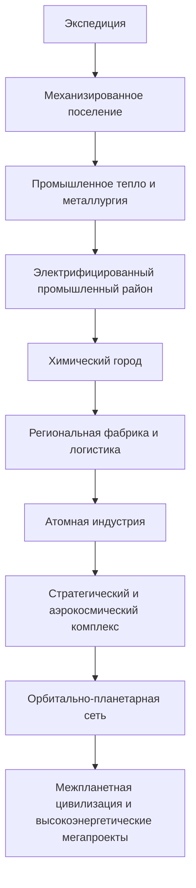

# Федеративная технологическая архитектура

Версия: **0.4 / IF-M2-0001**  
Дата среза: **2 августа 2026 года**  
Платформа: **Minecraft 1.20.1, Forge 47.4.22**  
Статус: **обязательное архитектурное приложение к `MASTER_DESIGN_DOCUMENT.md`**

Этот документ отменяет прежнюю GT-центричную модель. Количество крупных технологических модов не ограничивается искусственным числом. Ограничивается только количество необъяснённых дублей, бесплатных обходов, несовместимых систем и контента без места в общей кампании.

> Каждый глобальный мод владеет самостоятельным инженерным доменом, а сборка владеет контрактами между доменами.

Create и GTCEu важны, но не являются «главными слоями», которым подчиняется весь остальной контент. NuclearCraft, HBM, космический, городской и будущие подходящие стеки могут быть столь же крупными, если вместе образуют единую промышленную цивилизацию.

Minecraft не запускается Codex. Codex выполняет исследование CurseForge, статический аудит файлов, интеграцию, рецепты, конфигурации, квесты и переводы. Загрузку игры, мир и игровой баланс проверяет владелец сборки.

### Зафиксированный baseline M2

- pack/Forge-теги задают только допустимые входы; канонический output всегда является точным ID владельца процесса;
- GTCEu владеет текущей земной геологией, точной металлургией, сталью, цинком, латунью, промышленной химией и паром; это не делает его владельцем будущих реакторов, города или космоса;
- Create сохраняет SU, видимые линии, сборку и массовую механику, но stock raw-ore beneficiation и добыча металлов из туфа отключены до курируемого концентрата M3;
- латунь имеет единый состав `Cu₃Zn`; Create mixing сохраняется с материальным балансом `3 Cu + 1 Zn → 4 gtceu:brass_ingot`;
- AE2 остаётся доменом P5: семь vendor-корней раннего входа закрыты и получат полную замену только вместе с P5-квестами;
- `nativeEUToFE=true` допускается как односторонний compatibility-output, `enableFEConverters=false`; фактический коэффициент и отсутствие обратного цикла проверяет владелец;
- NuclearCraft, HBM, город и космос присутствуют в реестрах только как `GATED_NOT_INSTALLED`: ни один будущий ID не выдумывается заранее;
- все решения, формы, контракты, ворота и доказательства ведутся в `docs/registries/m2_*.json`; человеческий diff находится в [`M2_SUBSTANCE_AND_BYPASS_AUDIT.md`](M2_SUBSTANCE_AND_BYPASS_AUDIT.md).

---

## 1. Домены и их суверенные роли

| Домен | Основной владелец | Сохраняемая идентичность | Обязательные связи |
|---|---|---|---|
| Механическая инженерия | Create и отобранные аддоны | Кинетика, видимые линии, массовая обработка, поезда, городские механизмы | Сырьё для химии, транспорт города, сборочные линии космодрома |
| Тяжёлая гражданская промышленность | Immersive Engineering + Immersive Petroleum | Большие агрегаты, промышленная архитектура, ЛЭП, экскавация, нефтяные резервуары, pumpjack и первичная перегонка | Отдаёт сырьё/фракции химии; строит дороги, энергетику, транспорт и космодром |
| Промышленная химия и точная металлургия | GTCEu + GTEC:E и профильные дополнения | Электролиз, дистилляция, давление, температура, чистые вещества, сплавы, электроника | Агрохимия, атомное топливо, ракеты, очистка выбросов |
| Пневматика и роботизация | PneumaticCraft: Repressurized | Давление, тепло, компрессоры, pressure chamber, датчики, лифты и программируемые дроны | Получает общие нефтепродукты/пластики; обслуживает фабрики, город и опасные зоны |
| Гражданская электросеть | Create: Power Grid после пилота; IE только локальная промышленная FE-инфраструктура | Напряжение, ток, потери, нагрузка, подстанции, аварии и печатные платы | Связывает электростанции, районы, транспорт, фабрики и диспетчерскую без бесплатных циклов |
| Гражданская атомная промышленность | NuclearCraft: Neoteric | Топливные циклы, SFR/MSR, теплообмен, турбины, синтез, ускорители, ОЯТ | Химические прекурсоры, городская энергия, изотопы для космоса и HBM |
| Исследовательская ядерная техника | Dea's Fission, если пройдёт overlap-аудит | Первый исследовательский реактор, технологическое тепло, отдельные продукты облучения | Мост от промышленной химии к большой атомной отрасли |
| Стратегическая атомная программа | Один выбранный порт HBM | Опасная химия, специальные материалы, вооружение, ракеты, заражение, бункеры и поздние мегапроекты | Получает реакторные материалы и электронику; отдаёт экзотические продукты и стратегические технологии |
| Планетарная космонавтика | Creating Space + Ad Astra + compatibility datapack после пользовательского gate | Физически собираемые ракеты; планеты, атмосфера, кислород, гравитация и колонии | Топлива из химии, сплавы/электроника, атомные источники, городской космодром и регулярная логистика |
| Живой город | MineColonies + собственный современный Structurize-style | Население, профессии, стройка, районы, образование, склад, запросы и услуги | Создаёт постоянный, ограниченный спрос; не производит бесплатно высокоуровневые материалы |
| Городской транспорт | MTR для пассажиров; Create/S'n'R для грузов; Little Logistics для портов | Метро/пригород, промышленная железная дорога, каналы и транспортные узлы | Соединяет жильё, производство, рынок, порт, АЭС и космодром |
| Цифровая фабрика | AE2 + CC:Tweaked + Advanced Peripherals | Хранение, заказы, диспетчеризация, мониторинг, тревоги и отказоустойчивость | Управляет потоками, но не создаёт материалы и энергию из ничего |
| Экология | Pollution и совместимые системы | Воздух, вода, почва, фильтрация и последствия индустрии | Химическая очистка, городское здоровье, землепользование |
| Коммунальная вода и стоки | Pack-native рецепты и контракты поверх GT/IE/PNC/IF/труб | Водоподготовка, канализация, осадок, биогаз и оборотная вода | Потребности города, химия, агрономия и загрязнение среды |
| Интеграция и обучение | KubeJS, datapack/resource pack, FTB Quests, Ponder | Рецепты, теги, баланс, русская локализация, справочник и диагностика | Соединяет все домены и является источником истины сборки |

Новый крупный мод допускается, если у него есть уникальная инженерная задача и минимум два полезных контракта с другими доменами. Сам размер мода не является причиной отказа.

Точный shortlist, версии CurseForge, статусы `TARGET/PILOT/RESERVE`, транспортное разделение и запреты обходов зафиксированы в [`docs/GLOBAL_TECH_CITY_CURSEFORGE_AUDIT.md`](GLOBAL_TECH_CITY_CURSEFORGE_AUDIT.md). Первая целевая волна — IE/IP, PneumaticCraft, MineColonies, MTR, Little Logistics, CC/AP и связка Ad Astra/Creating Space. Mekanism и Industrial Foregoing исключены как дубли основы GregTech; XNet остаётся только отдельным ограниченным пилотом.

---

## 2. Решение по NuclearCraft

В основную целевую архитектуру принимается [NuclearCraft: Neoteric](https://www.curseforge.com/minecraft/mc-mods/nuclearcraft-neoteric), проект CurseForge `840010`. Зафиксированный кандидат для 1.20.1 — [`NuclearCraft-1.20.1-1.2.32.jar`](https://www.curseforge.com/minecraft/mc-mods/nuclearcraft-neoteric/files/8508829), Release, Forge/NeoForge, 25 июля 2026 года.

Почему это глобальный слой, а не дополнение к GT:

- твёрдотопливные и жидкосолевые реакторы;
- теплообменники, паровые турбины и полноценные тепловые контуры;
- термоядерный реактор;
- линейные и кольцевые ускорители, камеры столкновений/распада и Kugelblitz;
- облучение, изотопы, отработанное топливо и радиация;
- JSON/datapack-рецепты, Forge-теги, конфигурации и возможности интеграции;
- собственная инженерная задача: проектирование реактора, теплоотвод, безопасность и замыкание топливного цикла.

Целевая ядерная вертикаль:

```text
геологоразведка
→ концентрат урана/тория
→ химическое выщелачивание и очистка
→ реакторная чистота
→ разделение изотопов
→ изготовление топлива
→ исследовательский реактор
→ промышленный SFR
→ замкнутый теплоноситель / пар / турбина
→ выдержка и переработка ОЯТ
→ MSR и продвинутые топлива
→ синтез
→ ускорители и высокоэнергетическая физика
```

Обязательные интеграционные решения:

1. Для урана, тория, лития, бора, свинца, графита и флюорита назначается одно основное мировое происхождение; лишний worldgen отключается.
2. In Situ Leaching до `×4` переносится в позднюю атомную индустрию либо ограничивается, чтобы не уничтожить раннюю рудопереработку.
3. Торговля Nuclear Scientist не может продавать обязательные высокоуровневые изотопы, катушки или нейтроний в обход промышленной цепочки.
4. Универсальные трубы, накопители и Engineer's Crafting Table не открывают ранний обход логистической прогрессии.
5. Обычные процессоры NuclearCraft получают конкретные ниши; дешёвые дубли машин не остаются без балансировочного решения.
6. NuclearCraft становится кандидатом на единую игровую модель радиационной дозы. До проверки совместимости HBM параллельные невидимые шкалы радиации не допускаются.
7. Версия закрепляется; обновления проходят повторный diff рецептов, материалов, радиации, worldgen и переводов.

Dea's Fission не удаляется автоматически. Он остаётся только при уникальной роли исследовательского GT-реактора и раннего источника отдельных продуктов облучения/тепла. Если после статического overlap-аудита он лишь повторяет NuclearCraft, его место пересматривается.

[Multi Builder Tool](https://www.curseforge.com/minecraft/mc-mods/multi-builder-tool) рассматривается как вспомогательный инструмент для повторного строительства крупных мультиблоков. Первый реактор игрок собирает по подробному уроку сам; инструмент открывается после доказательства понимания конструкции.

---

## 3. Решение по HBM

HBM входит в **целевую** архитектуру как самостоятельная стратегическая и высокорисковая отрасль. Он не является аддоном GTCEu, Create или NuclearCraft. Одновременно допускается только один порт HBM.

Текущая ситуация CurseForge для 1.20.1:

| Кандидат | Проверенный файл | Сильные стороны | Блокирующие риски | Текущий статус |
|---|---|---|---|---|
| [HBM's Nuclear Tech Modernized](https://www.curseforge.com/minecraft/mc-mods/hbms-nuclear-tech-modernized) | `hbm_m-0.2.0-alpha+1.20.1-forge.jar`, project `1319588`, file `8230649` | Активная кодовая база, Cloth Config, заявленный русский перевод, радиация/опасности, машины и материалы | Страница прямо указывает Pre-Alpha, отсутствующие крафты, временно недоступный survival, возможные вылеты/порчу мира | Экспериментальный кандидат, не stable-mainline |
| [HBM-NTM: Rebirth](https://www.curseforge.com/minecraft/mc-mods/hbm-ntm-rebirth) | `hbm_ntm_rebirth-0.4.1beta.jar`, project `1566557`, file `8339756` | Beta-файл, порт основных систем, нет обязательных зависимостей на CurseForge | Молодой проект, неполный паритет, целевой Forge проекта `47.2.32`, русский перевод не подтверждён | Экспериментальный кандидат для сравнительного аудита |
| [HBM's Nuclear Tech — Muddy Edition](https://www.curseforge.com/minecraft/mc-mods/hbms-nuclear-tech-muddy-edition) | `2.0.0-alpha` | Порт 1.20.1 | Автор указывает неиграбельный survival и несовместимость с Forge `47.4.9+`; сборка использует `47.4.22` | Отклонён для текущего профиля |

Архитектурное решение не зависит от того, какой из первых двух портов созреет раньше. Для HBM заранее резервируется стабильный межмодовый интерфейс:

- входы: реакторно-чистые вещества, изотопы, жаропрочные сплавы, взрывчатые прекурсоры, точная электроника, системы управления;
- уникальные процессы: особо опасная химия, стратегические материалы, специальные реакторы, боеприпасы, ракеты, заражение территории;
- выходы: экзотические сплавы/изотопы, компоненты поздней энергетики и космоса, системы защиты и аварийной инфраструктуры;
- городская связь: закрытые промышленные зоны, бункеры, санитарные периметры, мониторинг и дезактивация;
- экологическая связь: радиация не заменяет обычное загрязнение, но радиоактивная пыль/осадки связывают обе системы.

До выбора порта выполняется сравнительный статический аудит обоих JAR: `mods.toml`, точный Forge-диапазон, mixins, registries, материалы, жидкости, worldgen, recipe types, конфиги радиации, локализация, сетевой код и возможность управлять рецептами. После этого владельцу передаётся A/B-сценарий проверки в одноразовом мире. В основной долгоживущий мир HBM входит только после прохождения release-gate.

Release-gate HBM:

- один выбранный порт, второй отсутствует;
- survival-путь существует либо полностью достроен интеграционным слоем;
- нет подтверждённых world-corruption/blocker-проблем в пользовательской проверке;
- все обязательные рецепты контролируемы;
- worldgen можно отключить/унифицировать;
- радиация сведена к одной понятной дозе и одной системе защиты;
- нет бесплатных энергетических и материальных циклов;
- обязательные строки полностью переведены на русский;
- порт виден в CurseForge-профиле и версия закреплена.

---

## 4. Паспорт вещества вместо «главного реестра мода»

Нельзя назначать один мод владельцем всей таблицы Менделеева. Для каждой химической сущности создаётся паспорт.

| Поле паспорта | Содержание |
|---|---|
| Сущность | Химическое название, формула, агрегатное состояние |
| Классы чистоты | Сырьё, техническая, химически чистая, электронная, реакторная, аэрокосмическая |
| Мировое происхождение | Единственный основной worldgen либо промышленный источник |
| Представления | Все допустимые ID слитков, пыли, растворов, газов, таблеток и специальных деталей |
| Теги | Разрешённые Forge-теги для входов и совместимости |
| Владельцы процессов | Какая машина логично производит конкретную форму/чистоту |
| Коэффициенты | Разрешённые конверсии без материальной прибыли |
| Потребители | Обязательные и дополнительные ветви использования |
| Отходы | Побочные продукты, хранение, нейтрализация и переработка |
| Эпоха и автоматизация | Первый доступ, первая автоматическая линия, массовый уровень |
| Русский термин | Единое написание во всех интерфейсах, JEI, квестах и подсказках |

Пример для урана:

```text
урановая руда
→ механически обогащённый концентрат
→ урановый раствор после выщелачивания
→ очищенное соединение урана
→ реакторный материал
→ обогащённый изотопный состав
→ NuclearCraft-топливо
→ облучённое топливо
→ выдержанные продукты деления
→ рециклированное топливо + изотопы для HBM/космоса/медицины
```

Обычные взаимозаменяемые слитки и пыль принимаются тегами и при необходимости конвертируются `1:1` без прибыли. Специализированные формы сохраняют идентичность домена: топливная таблетка NuclearCraft, высокочистый химический продукт GTCEu, уникальная HBM-деталь или аэрокосмический композит не обязаны превращаться в один универсальный предмет.

---

## 5. Политика пересекающихся машин

Дублирование интерфейса не означает автоматическое удаление всего контента. Каждой машине назначается профиль преимуществ:

| Домен | Сильная сторона | Типичное ограничение |
|---|---|---|
| Create | Большой видимый поток, низкая стоимость, механическая логистика | Низкая чистота/точность, ограниченные химические условия |
| GTCEu | Чистота, сложные реакции, давление/температура, точная металлургия | Более сложная инфраструктура и электроника |
| NuclearCraft | Изотопы, облучение, теплоносители, реакторные материалы | Радиационная безопасность, тепловая инженерия, отходы |
| HBM | Опасные/экзотические процессы и стратегическое производство | Высокий риск, защищённая зона, поздние материалы и контроль |

Для каждого пересечения выбирается одно из решений:

1. обе машины сохраняются с разными эффективностью, чистотой, масштабом или условиями;
2. один рецепт переносится в логически правильный домен;
3. дешёвый обход блокируется входом, эпохой или ограничением мощности;
4. лишняя машина скрывается/отключается, если уникальной роли нет;
5. формы связываются тегами или безопасной конверсией.

Случайный компонент другого мода не считается интеграцией. Межмодовый вход должен объясняться физически: чистота, давление, радиационная стойкость, тепло, точность, каталитическая функция, масштаб или требования безопасности.

---

## 6. Энергетическая конституция

- SU, EU, FE и энергия выбранного HBM-порта остаются различимыми сетями.
- Универсальный бесконечный кабель для всех систем запрещён.
- Конвертеры редкие, ограничены по мощности/эпохе, имеют понятные потери и проверяются на обратный цикл.
- Тепло, пар и теплоносители являются предпочтительными физическими мостами между реакторами и энергетикой.
- Производитель энергии балансируется не только по пиковой мощности, но и по стоимости топлива, запуску, обслуживанию, площади, риску и отходам.
- АЭС должна быть привлекательной городской базовой генерацией, но не отменять раннюю энергетику и поздние специализированные источники.
- В квестах явно показываются единицы, направление преобразования, предельная мощность и типичная ошибка подключения.

---

## 7. Радиация, загрязнение и безопасность

Игрок должен видеть одну понятную модель накопленной дозы, один согласованный набор единиц и предсказуемые ступени защиты. Несколько внутренних систем допустимы только если интеграционный слой синхронизирует их без двойного урона.

Обязательные уровни обучения:

1. источник радиации и расстояние;
2. загрязнение предметов/территории;
3. измерение фона и личной дозы;
4. экранирование и индивидуальная защита;
5. безопасное хранение и транспорт;
6. дезактивация;
7. аварийное отключение и восстановление;
8. долгосрочное обращение с отходами.

Обычное промышленное загрязнение и радиация не объединяются в одну абстрактную полоску. Это разные явления с общими последствиями для воды, почвы, городского здоровья и пригодности территории.

---

## 8. Квестовая топология

Основные главы называются цивилизационными проектами, а не модами:



Внутри проекта ветви разных модов расходятся и снова сходятся на работающем объекте. Например, глава «Атомная индустрия» включает химию очистки, изготовление топлива, реакторную физику, тепловой контур, турбину, городскую подстанцию, защиту, склад ОЯТ и переработку отходов.

Каждый механизм проходит одну учебную лестницу:

`зачем нужен → физический принцип → компоненты → строительство → интерфейс → первый безопасный запуск → нормальные показатели → типичные ошибки → автоматизация → применение в общем проекте → оптимизация`

Квестбук не требует знания внешней wiki. Название мода указывается как справочная метка, но не определяет место главы.

---

## 9. Anti-grind для федерации доменов

- До автоматизации допускается не более `1–3` осмысленных ручных партий нового процесса.
- Автоматизация открывается до необходимости повторить одинаковую операцию более `6–8` раз.
- Межмодовый gateway выдаёт или позволяет быстро произвести новую машину и небольшой рабочий запас, но не пропускает обучение.
- Катализаторы возвращаются; растворители, кислоты и теплоносители получают замкнутые контуры до массового спроса.
- Каждый обязательный побочный продукт имеет полезного потребителя, переработку или безопасную автоматическую утилизацию.
- Обязательные ключи не зависят только от RNG, редкого лута или торговли.
- Сложность строится на проектировании потока, чистоте, тепле, безопасности, мощности и логистике, а не на сотнях одинаковых пластин.
- Новая крупная отрасль должна уменьшать часть старой рутины за счёт масштаба, не обнуляя ценность старой инфраструктуры.

---

## 10. Порядок внедрения атомно-стратегического контура

1. Завершить паспорта урана, тория, лития, бора, свинца, графита, флюорита, дейтерия, трития и базовых теплоносителей.
2. Зафиксировать владельцев worldgen и отключаемые дубли.
3. Статически исследовать NuclearCraft 1.2.32 и подготовить полный diff с текущими регистрами/рецептами.
4. Ввести NuclearCraft как гражданскую атомную отрасль: конфигурации, теги, рецепты, переводы, затем квесты.
5. Провести overlap-аудит Dea's Fission и оставить ему только самостоятельную исследовательскую роль.
6. Спроектировать единую радиационную модель и проверить возможность подключения HBM.
7. Статически сравнить Modernized и Rebirth; выбрать один порт по функциональности, управляемости, стабильности и русифицируемости.
8. Ввести HBM сначала в отдельный экспериментальный профиль с готовым планом миграции, затем передать владельцу сценарий проверки.
9. После пользовательского подтверждения встроить HBM-квесты, рецепты, стратегические городские проекты и связи с космосом.
10. Выполнить сквозной аудит бесконечных циклов, ручных повторов, производительности, переводов и CurseForge manifest.

Фактическое присутствие в стабильном релизе определяется не авторитетом отдельного мода, а прохождением этих ворот. Архитектурно обе отрасли — NuclearCraft и HBM — уже зарезервированы как полноценные глобальные части сборки.
